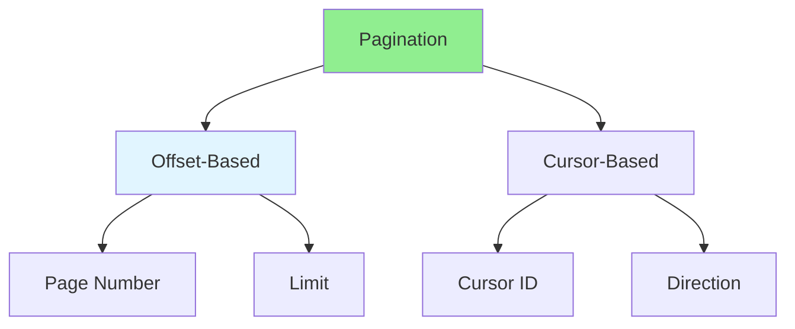

# 02.05 Pagination: Data Paging / Phân trang: Phân trang dữ liệu

## Table of Contents / Mục lục
1. [Introduction / Giới thiệu](#introduction--giới-thiệu)
2. [Offset-Based Pagination / Phân trang dựa trên Offset](#offset-based-pagination--phân-trang-dựa-trên-offset)
3. [Cursor-Based Pagination / Phân trang dựa trên Cursor](#cursor-based-pagination--phân-trang-dựa-trên-cursor)
4. [Best Practices / Thực hành tốt nhất](#best-practices--thực-hành-tốt-nhất)
5. [Summary / Tóm tắt](#summary--tóm-tắt)

---

## Introduction / Giới thiệu

### Overview / Tổng quan

**English**: Pagination divides large datasets into manageable pages. Learn offset-based and cursor-based pagination for efficient data loading.

**Vietnamese**: Phân trang chia tập dữ liệu lớn thành các trang quản lý được. Học phân trang dựa trên offset và cursor để tải dữ liệu hiệu quả.

### Pagination Types / Loại phân trang



---

## Offset-Based Pagination / Phân trang dựa trên Offset

### Example 1: Offset Pagination / Ví dụ 1: Phân trang Offset

```typescript
// Offset-based pagination / Phân trang dựa trên offset
async function getUsers(page: number = 1, limit: number = 10) {
  const skip = (page - 1) * limit;
  
  const [users, total] = await Promise.all([
    prisma.user.findMany({
      skip,
      take: limit,
      orderBy: { createdAt: 'desc' }
    }),
    prisma.user.count()
  ]);
  
  return {
    data: users,
    pagination: {
      page,
      limit,
      total,
      totalPages: Math.ceil(total / limit),
      hasNext: page < Math.ceil(total / limit),
      hasPrev: page > 1
    }
  };
}

// Express endpoint / Endpoint Express
app.get('/users', async (req, res) => {
  const page = Number(req.query.page) || 1;
  const limit = Number(req.query.limit) || 10;
  
  const result = await getUsers(page, limit);
  res.json(result);
});
```

### Example 2: React Pagination Component / Ví dụ 2: Component phân trang React

```typescript
// React pagination component / Component phân trang React
function UserList() {
  const [page, setPage] = useState(1);
  const [data, setData] = useState<any>(null);
  const [loading, setLoading] = useState(false);
  
  useEffect(() => {
    setLoading(true);
    fetch(`/api/users?page=${page}&limit=10`)
      .then(res => res.json())
      .then(result => {
        setData(result);
        setLoading(false);
      });
  }, [page]);
  
  if (loading) return <div>Loading...</div>;
  if (!data) return null;
  
  return (
    <div>
      <ul>
        {data.data.map((user: User) => (
          <li key={user.id}>{user.name}</li>
        ))}
      </ul>
      
      <div>
        <button 
          disabled={!data.pagination.hasPrev}
          onClick={() => setPage(page - 1)}
        >
          Previous
        </button>
        <span>Page {data.pagination.page} of {data.pagination.totalPages}</span>
        <button 
          disabled={!data.pagination.hasNext}
          onClick={() => setPage(page + 1)}
        >
          Next
        </button>
      </div>
    </div>
  );
}
```

---

## Cursor-Based Pagination / Phân trang dựa trên Cursor

### Example 3: Cursor Pagination / Ví dụ 3: Phân trang Cursor

```typescript
// Cursor-based pagination / Phân trang dựa trên cursor
async function getUsersCursor(cursor?: string, limit: number = 10) {
  const where = cursor ? { id: { gt: cursor } } : {};
  
  const users = await prisma.user.findMany({
    where,
    take: limit + 1, // Get one extra to check if there's more
    orderBy: { id: 'asc' }
  });
  
  const hasNext = users.length > limit;
  const data = hasNext ? users.slice(0, limit) : users;
  const nextCursor = hasNext ? data[data.length - 1].id : null;
  
  return {
    data,
    cursor: nextCursor,
    hasNext
  };
}

// Express endpoint / Endpoint Express
app.get('/users', async (req, res) => {
  const cursor = req.query.cursor as string | undefined;
  const limit = Number(req.query.limit) || 10;
  
  const result = await getUsersCursor(cursor, limit);
  res.json(result);
});
```

---

## Best Practices / Thực hành tốt nhất

1. **Use cursor for large datasets** - Better performance
2. **Set max limit** - Prevent excessive data loading
3. **Index sorted columns** - For efficient pagination
4. **Return metadata** - Include pagination info
5. **Handle edge cases** - Empty results, invalid pages

---

## Summary / Tóm tắt

### Key Takeaways / Điểm chính

- **Offset**: Simple, page-based, good for small datasets
- **Cursor**: Better performance, good for large datasets
- **Metadata**: Include pagination info in response
- **Performance**: Index sorted columns
- **UX**: Show page info and navigation

### Next Steps / Bước tiếp theo

- [02.06 File Upload](./02.06_File_Upload_Server.md) - Next: File Upload

---

**Last Updated / Cập nhật lần cuối**: 2024

