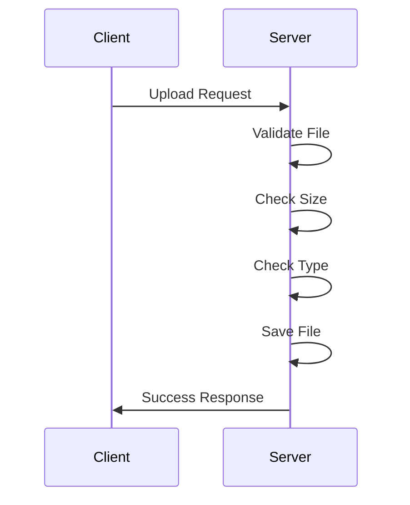

# 02.06 File Upload: Server / Tải file lên: Server

## Table of Contents / Mục lục
1. [Introduction / Giới thiệu](#introduction--giới-thiệu)
2. [File Upload Implementation / Triển khai tải file lên](#file-upload-implementation--triển-khai-tải-file-lên)
3. [File Validation / Xác thực file](#file-validation--xác-thực-file)
4. [Best Practices / Thực hành tốt nhất](#best-practices--thực-hành-tốt-nhất)
5. [Summary / Tóm tắt](#summary--tóm-tắt)

---

## Introduction / Giới thiệu

### Overview / Tổng quan

**English**: File upload allows users to upload files to the server. Learn to handle file uploads securely with validation, storage, and error handling.

**Vietnamese**: Tải file lên cho phép người dùng tải file lên server. Học cách xử lý tải file lên an toàn với xác thực, lưu trữ và xử lý lỗi.

### File Upload Process / Quy trình tải file lên



---

## File Upload Implementation / Triển khai tải file lên

### Example 1: Express.js File Upload (multer) / Ví dụ 1: Tải file Express.js (multer)

```typescript
// Express.js file upload with multer
import multer from 'multer';
import path from 'path';
import fs from 'fs';

// Configure storage / Cấu hình lưu trữ
const storage = multer.diskStorage({
  destination: (req, file, cb) => {
    const uploadDir = 'uploads/';
    if (!fs.existsSync(uploadDir)) {
      fs.mkdirSync(uploadDir, { recursive: true });
    }
    cb(null, uploadDir);
  },
  filename: (req, file, cb) => {
    const uniqueSuffix = Date.now() + '-' + Math.round(Math.random() * 1E9);
    cb(null, file.fieldname + '-' + uniqueSuffix + path.extname(file.originalname));
  }
});

const upload = multer({ 
  storage,
  limits: { fileSize: 5 * 1024 * 1024 }, // 5MB
  fileFilter: (req, file, cb) => {
    const allowedTypes = /jpeg|jpg|png|gif|pdf/;
    const extname = allowedTypes.test(path.extname(file.originalname).toLowerCase());
    const mimetype = allowedTypes.test(file.mimetype);
    
    if (extname && mimetype) {
      cb(null, true);
    } else {
      cb(new Error('Invalid file type'));
    }
  }
});

// Upload endpoint / Endpoint tải lên
app.post('/upload', upload.single('file'), (req, res) => {
  if (!req.file) {
    return res.status(400).json({ error: 'No file uploaded' });
  }
  
  res.json({
    message: 'File uploaded successfully',
    file: {
      filename: req.file.filename,
      originalName: req.file.originalname,
      size: req.file.size,
      path: req.file.path
    }
  });
});

// Multiple files / Nhiều file
app.post('/upload-multiple', upload.array('files', 5), (req, res) => {
  const files = req.files as Express.Multer.File[];
  res.json({ message: 'Files uploaded', files });
});
```

### Example 2: NestJS File Upload / Ví dụ 2: Tải file NestJS

```typescript
// NestJS file upload
import { UseInterceptors, UploadedFile, UploadedFiles } from '@nestjs/common';
import { FileInterceptor, FilesInterceptor } from '@nestjs/platform-express';
import { diskStorage } from 'multer';

@Post('upload')
@UseInterceptors(FileInterceptor('file', {
  storage: diskStorage({
    destination: './uploads',
    filename: (req, file, cb) => {
      const uniqueSuffix = Date.now() + '-' + Math.round(Math.random() * 1E9);
      cb(null, `${file.fieldname}-${uniqueSuffix}${path.extname(file.originalname)}`);
    }
  }),
  limits: { fileSize: 5 * 1024 * 1024 },
  fileFilter: (req, file, cb) => {
    if (file.mimetype.match(/\/(jpg|jpeg|png|gif|pdf)$/)) {
      cb(null, true);
    } else {
      cb(new Error('Invalid file type'), false);
    }
  }
}))
uploadFile(@UploadedFile() file: Express.Multer.File) {
  return {
    message: 'File uploaded',
    filename: file.filename,
    originalName: file.originalname,
    size: file.size
  };
}
```

---

## File Validation / Xác thực file

### Example 3: File Validation / Ví dụ 3: Xác thực file

```typescript
// File validation / Xác thực file
interface FileValidation {
  maxSize: number; // bytes
  allowedTypes: string[];
  allowedExtensions: string[];
}

function validateFile(file: Express.Multer.File, rules: FileValidation): { valid: boolean; error?: string } {
  // Check size / Kiểm tra kích thước
  if (file.size > rules.maxSize) {
    return { valid: false, error: `File size exceeds ${rules.maxSize} bytes` };
  }
  
  // Check type / Kiểm tra loại
  if (!rules.allowedTypes.includes(file.mimetype)) {
    return { valid: false, error: 'File type not allowed' };
  }
  
  // Check extension / Kiểm tra phần mở rộng
  const ext = path.extname(file.originalname).toLowerCase();
  if (!rules.allowedExtensions.includes(ext)) {
    return { valid: false, error: 'File extension not allowed' };
  }
  
  return { valid: true };
}
```

---

## Best Practices / Thực hành tốt nhất

1. **Validate file type** - Check MIME type and extension
2. **Limit file size** - Set maximum file size
3. **Sanitize filename** - Remove dangerous characters
4. **Store securely** - Outside public directory
5. **Scan for viruses** - In production

---

## Summary / Tóm tắt

### Key Takeaways / Điểm chính

- **Multer**: Use multer for Express.js
- **Validation**: Validate type, size, extension
- **Storage**: Configure storage location
- **Security**: Sanitize filenames
- **Error handling**: Handle upload errors

### Next Steps / Bước tiếp theo

- [02.07 File Download](./02.07_File_Download_Server.md) - Next: File Download

---

**Last Updated / Cập nhật lần cuối**: 2024

