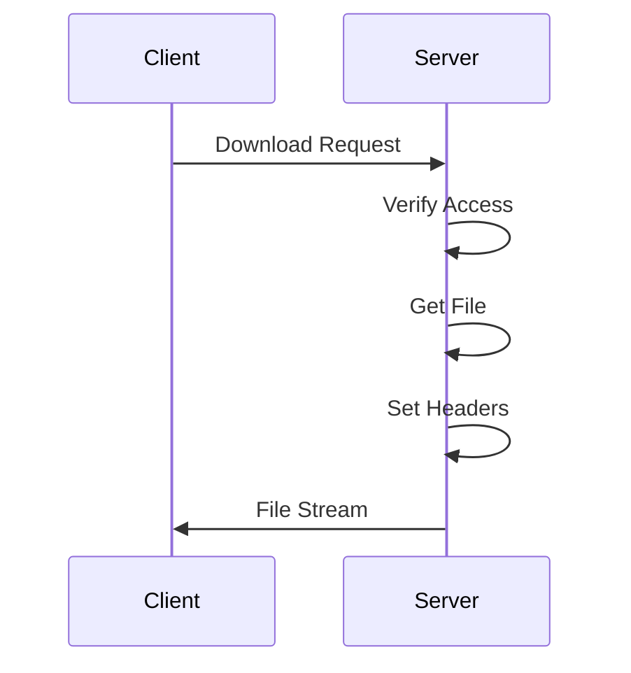

# 02.07 File Download: Server / Tải file xuống: Server

## Table of Contents / Mục lục
1. [Introduction / Giới thiệu](#introduction--giới-thiệu)
2. [File Download Implementation / Triển khai tải file xuống](#file-download-implementation--triển-khai-tải-file-xuống)
3. [Security Considerations / Cân nhắc bảo mật](#security-considerations--cân-nhắc-bảo-mật)
4. [Best Practices / Thực hành tốt nhất](#best-practices--thực-hành-tốt-nhất)
5. [Summary / Tóm tắt](#summary--tóm-tắt)

---

## Introduction / Giới thiệu

### Overview / Tổng quan

**English**: File download allows users to download files from the server. Learn to implement secure file downloads with proper headers and access control.

**Vietnamese**: Tải file xuống cho phép người dùng tải file từ server. Học cách triển khai tải file xuống an toàn với headers và kiểm soát truy cập phù hợp.

### File Download Process / Quy trình tải file xuống



---

## File Download Implementation / Triển khai tải file xuống

### Example 1: Express.js File Download / Ví dụ 1: Tải file Express.js

```typescript
// Express.js file download
import express from 'express';
import fs from 'fs';
import path from 'path';

app.get('/download/:filename', (req, res) => {
  const filename = req.params.filename;
  const filePath = path.join(__dirname, 'uploads', filename);
  
  // Check if file exists / Kiểm tra file tồn tại
  if (!fs.existsSync(filePath)) {
    return res.status(404).json({ error: 'File not found' });
  }
  
  // Set headers / Đặt headers
  res.setHeader('Content-Disposition', `attachment; filename="${filename}"`);
  res.setHeader('Content-Type', 'application/octet-stream');
  
  // Stream file / Stream file
  const fileStream = fs.createReadStream(filePath);
  fileStream.pipe(res);
});

// Download with custom filename / Tải với tên file tùy chỉnh
app.get('/download/:id', async (req, res) => {
  const file = await prisma.file.findUnique({
    where: { id: req.params.id }
  });
  
  if (!file) {
    return res.status(404).json({ error: 'File not found' });
  }
  
  const filePath = path.join(__dirname, 'uploads', file.filename);
  res.download(filePath, file.originalName);
});
```

### Example 2: NestJS File Download / Ví dụ 2: Tải file NestJS

```typescript
// NestJS file download
import { Res, Param } from '@nestjs/common';
import { Response } from 'express';
import * as fs from 'fs';
import * as path from 'path';

@Get('download/:filename')
downloadFile(@Param('filename') filename: string, @Res() res: Response) {
  const filePath = path.join(process.cwd(), 'uploads', filename);
  
  if (!fs.existsSync(filePath)) {
    throw new NotFoundException('File not found');
  }
  
  res.setHeader('Content-Disposition', `attachment; filename="${filename}"`);
  res.setHeader('Content-Type', 'application/octet-stream');
  
  const fileStream = fs.createReadStream(filePath);
  fileStream.pipe(res);
}
```

---

## Security Considerations / Cân nhắc bảo mật

### Example 3: Secure File Download / Ví dụ 3: Tải file an toàn

```typescript
// Secure file download with access control
app.get('/download/:id', authenticate, async (req, res) => {
  const file = await prisma.file.findUnique({
    where: { id: req.params.id },
    include: { owner: true }
  });
  
  // Check access / Kiểm tra quyền truy cập
  if (file.ownerId !== req.user.id && !req.user.isAdmin) {
    return res.status(403).json({ error: 'Access denied' });
  }
  
  // Validate file path / Xác thực đường dẫn file
  const filePath = path.join(__dirname, 'uploads', file.filename);
  const resolvedPath = path.resolve(filePath);
  const uploadsDir = path.resolve(__dirname, 'uploads');
  
  if (!resolvedPath.startsWith(uploadsDir)) {
    return res.status(400).json({ error: 'Invalid file path' });
  }
  
  res.download(filePath, file.originalName);
});
```

---

## Best Practices / Thực hành tốt nhất

1. **Validate access** - Check user permissions
2. **Sanitize paths** - Prevent path traversal
3. **Set headers** - Content-Disposition, Content-Type
4. **Stream files** - Use streams for large files
5. **Log downloads** - Track file access

---

## Summary / Tóm tắt

### Key Takeaways / Điểm chính

- **res.download()**: Express method for downloads
- **Streaming**: Use streams for large files
- **Security**: Validate access and paths
- **Headers**: Set proper content headers
- **Access control**: Check permissions

### Next Steps / Bước tiếp theo

- [02.08 Authentication: JWT & Session](./02.08_Authentication_JWT_Session.md) - Next: Authentication

---

**Last Updated / Cập nhật lần cuối**: 2024

