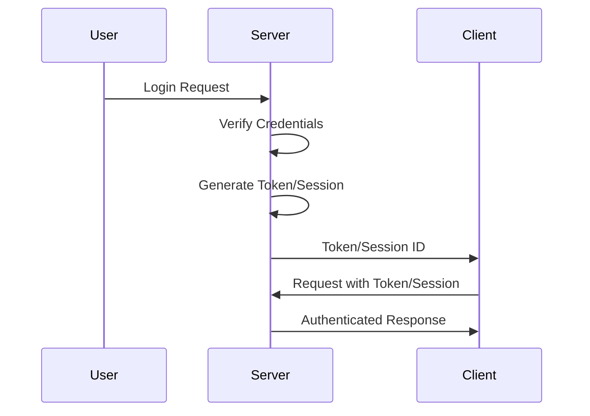

# 02.08 Authentication: JWT & Session / Xác thực: JWT & Session

## Table of Contents / Mục lục
1. [Introduction / Giới thiệu](#introduction--giới-thiệu)
2. [JWT Authentication / Xác thực JWT](#jwt-authentication--xác-thực-jwt)
3. [Session Authentication / Xác thực Session](#session-authentication--xác-thực-session)
4. [Best Practices / Thực hành tốt nhất](#best-practices--thực-hành-tốt-nhất)
5. [Summary / Tóm tắt](#summary--tóm-tắt)

---

## Introduction / Giới thiệu

### Overview / Tổng quan

**English**: Authentication verifies user identity. Learn JWT (JSON Web Tokens) and session-based authentication for secure user login.

**Vietnamese**: Xác thực xác minh danh tính người dùng. Học xác thực JWT (JSON Web Tokens) và dựa trên session cho đăng nhập người dùng an toàn.

### Authentication Flow / Luồng xác thực



---

## JWT Authentication / Xác thực JWT

### Example 1: JWT Implementation / Ví dụ 1: Triển khai JWT

```typescript
// JWT authentication / Xác thực JWT
import jwt from 'jsonwebtoken';

const JWT_SECRET = process.env.JWT_SECRET || 'secret-key';

// Generate token / Tạo token
function generateToken(userId: string, email: string): string {
  return jwt.sign(
    { userId, email },
    JWT_SECRET,
    { expiresIn: '24h' }
  );
}

// Verify token / Xác minh token
function verifyToken(token: string): any {
  try {
    return jwt.verify(token, JWT_SECRET);
  } catch (error) {
    throw new Error('Invalid token');
  }
}

// Login endpoint / Endpoint đăng nhập
app.post('/login', async (req, res) => {
  const { email, password } = req.body;
  
  const user = await prisma.user.findUnique({ where: { email } });
  if (!user || !await bcrypt.compare(password, user.password)) {
    return res.status(401).json({ error: 'Invalid credentials' });
  }
  
  const token = generateToken(user.id, user.email);
  res.json({ token, user: { id: user.id, email: user.email } });
});

// Protected route middleware / Middleware route được bảo vệ
function authenticateToken(req: any, res: any, next: any) {
  const authHeader = req.headers['authorization'];
  const token = authHeader && authHeader.split(' ')[1];
  
  if (!token) {
    return res.status(401).json({ error: 'No token provided' });
  }
  
  try {
    const decoded = verifyToken(token);
    req.user = decoded;
    next();
  } catch (error) {
    return res.status(403).json({ error: 'Invalid token' });
  }
}

app.get('/profile', authenticateToken, (req, res) => {
  res.json({ user: req.user });
});
```

### Example 2: NestJS JWT / Ví dụ 2: JWT NestJS

```typescript
// NestJS JWT
import { JwtModule } from '@nestjs/jwt';
import { PassportModule } from '@nestjs/passport';
import { JwtStrategy } from './jwt.strategy';

@Module({
  imports: [
    PassportModule,
    JwtModule.register({
      secret: process.env.JWT_SECRET,
      signOptions: { expiresIn: '24h' }
    })
  ],
  providers: [JwtStrategy]
})
export class AuthModule {}

// Strategy / Chiến lược
@Injectable()
export class JwtStrategy extends PassportStrategy(Strategy) {
  constructor() {
    super({
      jwtFromRequest: ExtractJwt.fromAuthHeaderAsBearerToken(),
      secretOrKey: process.env.JWT_SECRET
    });
  }
  
  async validate(payload: any) {
    return { userId: payload.userId, email: payload.email };
  }
}

// Controller / Bộ điều khiển
@Controller('auth')
export class AuthController {
  constructor(private authService: AuthService) {}
  
  @Post('login')
  async login(@Body() loginDto: LoginDto) {
    return this.authService.login(loginDto);
  }
  
  @UseGuards(JwtAuthGuard)
  @Get('profile')
  getProfile(@Request() req) {
    return req.user;
  }
}
```

---

## Session Authentication / Xác thực Session

### Example 3: Session Implementation / Ví dụ 3: Triển khai Session

```typescript
// Session authentication / Xác thực session
import session from 'express-session';
import RedisStore from 'connect-redis';
import { createClient } from 'redis';

const redisClient = createClient();
redisClient.connect();

app.use(session({
  store: new RedisStore({ client: redisClient }),
  secret: process.env.SESSION_SECRET || 'secret',
  resave: false,
  saveUninitialized: false,
  cookie: {
    secure: process.env.NODE_ENV === 'production',
    httpOnly: true,
    maxAge: 24 * 60 * 60 * 1000 // 24 hours
  }
}));

// Login / Đăng nhập
app.post('/login', async (req, res) => {
  const { email, password } = req.body;
  
  const user = await prisma.user.findUnique({ where: { email } });
  if (!user || !await bcrypt.compare(password, user.password)) {
    return res.status(401).json({ error: 'Invalid credentials' });
  }
  
  req.session.userId = user.id;
  req.session.email = user.email;
  res.json({ message: 'Logged in', user: { id: user.id, email: user.email } });
});

// Protected route / Route được bảo vệ
function requireAuth(req: any, res: any, next: any) {
  if (req.session.userId) {
    next();
  } else {
    res.status(401).json({ error: 'Not authenticated' });
  }
}

app.get('/profile', requireAuth, async (req, res) => {
  const user = await prisma.user.findUnique({
    where: { id: req.session.userId }
  });
  res.json({ user });
});

// Logout / Đăng xuất
app.post('/logout', (req, res) => {
  req.session.destroy((err) => {
    if (err) {
      return res.status(500).json({ error: 'Logout failed' });
    }
    res.json({ message: 'Logged out' });
  });
});
```

---

## Best Practices / Thực hành tốt nhất

1. **Use HTTPS** - In production
2. **Secure tokens** - Store in httpOnly cookies or secure storage
3. **Token expiration** - Set reasonable expiration
4. **Refresh tokens** - For long-lived sessions
5. **Password hashing** - Use bcrypt or similar

---

## Summary / Tóm tắt

### Key Takeaways / Điểm chính

- **JWT**: Stateless, good for APIs
- **Session**: Stateful, good for web apps
- **Security**: Use HTTPS, secure storage
- **Expiration**: Set token/session expiration
- **Hashing**: Hash passwords

### Next Steps / Bước tiếp theo

- [02.09 Authorization: User Permissions](./02.09_Authorization_User_Permissions.md) - Next: Authorization

---

**Last Updated / Cập nhật lần cuối**: 2024

