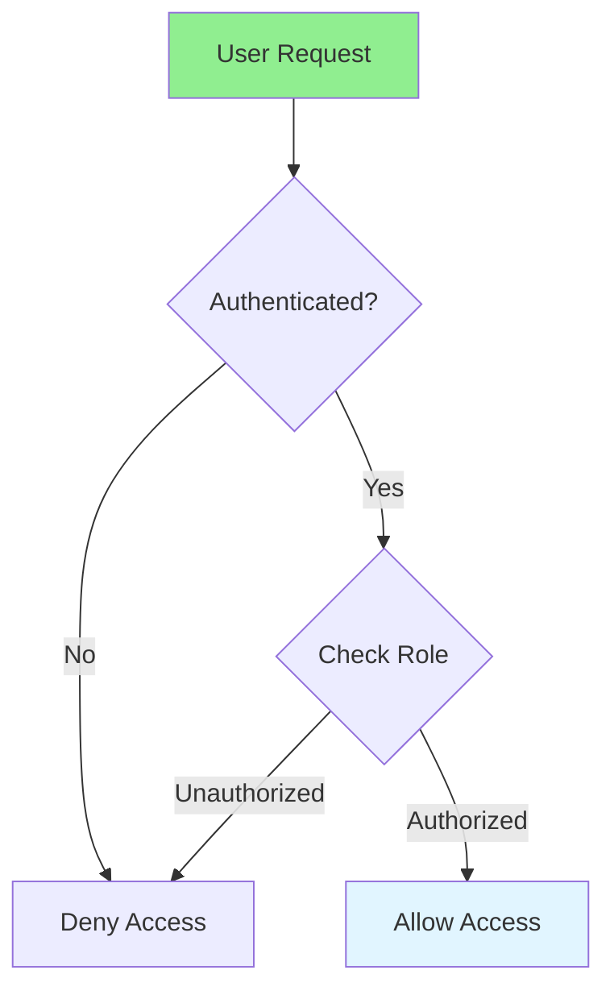

# 02.09 Authorization: User Permissions / Phân quyền: Quyền người dùng

## Table of Contents / Mục lục
1. [Introduction / Giới thiệu](#introduction--giới-thiệu)
2. [Role-Based Access Control / Kiểm soát truy cập dựa trên vai trò](#role-based-access-control--kiểm-soát-truy-cập-dựa-trên-vai-trò)
3. [Permission-Based Access / Truy cập dựa trên quyền](#permission-based-access--truy-cập-dựa-trên-quyền)
4. [Best Practices / Thực hành tốt nhất](#best-practices--thực-hành-tốt-nhất)
5. [Summary / Tóm tắt](#summary--tóm-tắt)

---

## Introduction / Giới thiệu

### Overview / Tổng quan

**English**: Authorization controls what users can do. Learn role-based and permission-based access control to secure your application.

**Vietnamese**: Phân quyền kiểm soát những gì người dùng có thể làm. Học kiểm soát truy cập dựa trên vai trò và quyền để bảo mật ứng dụng.

### Authorization Flow / Luồng phân quyền



---

## Role-Based Access Control / Kiểm soát truy cập dựa trên vai trò

### Example 1: Role-Based Authorization / Ví dụ 1: Phân quyền dựa trên vai trò

```typescript
// Role-based authorization / Phân quyền dựa trên vai trò
enum UserRole {
  ADMIN = 'admin',
  USER = 'user',
  MODERATOR = 'moderator'
}

// Middleware / Middleware
function requireRole(...roles: UserRole[]) {
  return (req: any, res: any, next: any) => {
    if (!req.user) {
      return res.status(401).json({ error: 'Not authenticated' });
    }
    
    if (!roles.includes(req.user.role)) {
      return res.status(403).json({ error: 'Insufficient permissions' });
    }
    
    next();
  };
}

// Usage / Sử dụng
app.get('/admin/users', authenticateToken, requireRole(UserRole.ADMIN), async (req, res) => {
  const users = await prisma.user.findMany();
  res.json(users);
});

app.delete('/users/:id', authenticateToken, requireRole(UserRole.ADMIN, UserRole.MODERATOR), async (req, res) => {
  await prisma.user.delete({ where: { id: req.params.id } });
  res.json({ message: 'User deleted' });
});
```

### Example 2: NestJS Guards / Ví dụ 2: Guards NestJS

```typescript
// NestJS role guard / Guard vai trò NestJS
@Injectable()
export class RolesGuard implements CanActivate {
  constructor(private reflector: Reflector) {}
  
  canActivate(context: ExecutionContext): boolean {
    const requiredRoles = this.reflector.getAllAndOverride<UserRole[]>(ROLES_KEY, [
      context.getHandler(),
      context.getClass()
    ]);
    
    if (!requiredRoles) {
      return true;
    }
    
    const { user } = context.switchToHttp().getRequest();
    return requiredRoles.some(role => user.role === role);
  }
}

// Decorator / Decorator
export const Roles = (...roles: UserRole[]) => SetMetadata(ROLES_KEY, roles);

// Usage / Sử dụng
@Roles(UserRole.ADMIN)
@UseGuards(JwtAuthGuard, RolesGuard)
@Get('admin/users')
getAllUsers() {
  return this.userService.findAll();
}
```

---

## Permission-Based Access / Truy cập dựa trên quyền

### Example 3: Permission-Based Authorization / Ví dụ 3: Phân quyền dựa trên quyền

```typescript
// Permission-based authorization / Phân quyền dựa trên quyền
interface Permission {
  resource: string;
  action: string;
}

const permissions = {
  users: ['create', 'read', 'update', 'delete'],
  posts: ['create', 'read', 'update', 'delete'],
  comments: ['create', 'read', 'delete']
};

// Check permission / Kiểm tra quyền
function hasPermission(user: User, resource: string, action: string): boolean {
  const userPermissions = user.permissions || [];
  return userPermissions.some(
    (p: Permission) => p.resource === resource && p.action === action
  );
}

// Middleware / Middleware
function requirePermission(resource: string, action: string) {
  return (req: any, res: any, next: any) => {
    if (!hasPermission(req.user, resource, action)) {
      return res.status(403).json({ error: 'Insufficient permissions' });
    }
    next();
  };
}

// Usage / Sử dụng
app.post('/users', authenticateToken, requirePermission('users', 'create'), async (req, res) => {
  const user = await prisma.user.create({ data: req.body });
  res.json(user);
});
```

---

## Best Practices / Thực hành tốt nhất

1. **Principle of least privilege** - Grant minimum necessary permissions
2. **Check permissions** - Always verify on server
3. **Use middleware** - Centralize authorization logic
4. **Cache permissions** - For performance
5. **Audit logs** - Track permission changes

---

## Summary / Tóm tắt

### Key Takeaways / Điểm chính

- **RBAC**: Role-based access control
- **Permissions**: Fine-grained access control
- **Server-side**: Always verify on server
- **Middleware**: Centralize authorization
- **Security**: Principle of least privilege

### Next Steps / Bước tiếp theo

- [02.10 Soft Delete](./02.10_Soft_Delete_Database.md) - Next: Soft Delete

---

**Last Updated / Cập nhật lần cuối**: 2024

