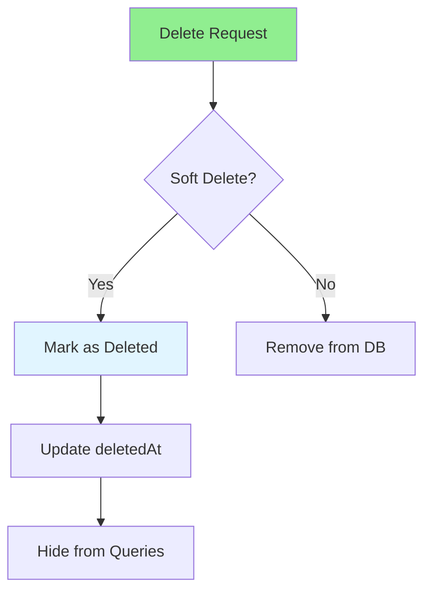

# 02.10 Soft Delete: Database / Xóa mềm: Database

## Table of Contents / Mục lục
1. [Introduction / Giới thiệu](#introduction--giới-thiệu)
2. [Soft Delete Implementation / Triển khai xóa mềm](#soft-delete-implementation--triển-khai-xóa-mềm)
3. [Querying Soft Deleted Records / Truy vấn bản ghi đã xóa mềm](#querying-soft-deleted-records--truy-vấn-bản-ghi-đã-xóa-mềm)
4. [Best Practices / Thực hành tốt nhất](#best-practices--thực-hành-tốt-nhất)
5. [Summary / Tóm tắt](#summary--tóm-tắt)

---

## Introduction / Giới thiệu

### Overview / Tổng quan

**English**: Soft delete marks records as deleted without removing them. Learn to implement soft delete for data recovery and audit trails.

**Vietnamese**: Xóa mềm đánh dấu bản ghi là đã xóa mà không xóa chúng. Học cách triển khai xóa mềm để khôi phục dữ liệu và theo dõi kiểm toán.

### Soft Delete Flow / Luồng xóa mềm



---

## Soft Delete Implementation / Triển khai xóa mềm

### Example 1: Prisma Soft Delete / Ví dụ 1: Xóa mềm Prisma

```typescript
// Prisma schema / Schema Prisma
model User {
  id        String   @id @default(uuid())
  name      String
  email     String   @unique
  deletedAt DateTime?
  
  @@index([deletedAt])
}

// Soft delete function / Hàm xóa mềm
async function softDeleteUser(id: string) {
  return await prisma.user.update({
    where: { id },
    data: { deletedAt: new Date() }
  });
}

// Restore function / Hàm khôi phục
async function restoreUser(id: string) {
  return await prisma.user.update({
    where: { id },
    data: { deletedAt: null }
  });
}

// Hard delete / Xóa cứng
async function hardDeleteUser(id: string) {
  return await prisma.user.delete({
    where: { id }
  });
}
```

### Example 2: Querying with Soft Delete / Ví dụ 2: Truy vấn với xóa mềm

```typescript
// Query non-deleted records / Truy vấn bản ghi chưa xóa
async function getActiveUsers() {
  return await prisma.user.findMany({
    where: {
      deletedAt: null
    }
  });
}

// Query including deleted / Truy vấn bao gồm đã xóa
async function getAllUsers() {
  return await prisma.user.findMany({
    where: {}
  });
}

// Query only deleted / Chỉ truy vấn đã xóa
async function getDeletedUsers() {
  return await prisma.user.findMany({
    where: {
      deletedAt: { not: null }
    }
  });
}

// Prisma middleware for automatic filtering / Middleware Prisma để lọc tự động
prisma.$use(async (params, next) => {
  if (params.action === 'findMany' || params.action === 'findFirst') {
    if (!params.args.where) {
      params.args.where = {};
    }
    if (!params.args.where.deletedAt) {
      params.args.where.deletedAt = null;
    }
  }
  return next(params);
});
```

### Example 3: NestJS Soft Delete / Ví dụ 3: Xóa mềm NestJS

```typescript
// NestJS soft delete service / Dịch vụ xóa mềm NestJS
@Injectable()
export class UserService {
  async softDelete(id: string) {
    return this.prisma.user.update({
      where: { id },
      data: { deletedAt: new Date() }
    });
  }
  
  async restore(id: string) {
    return this.prisma.user.update({
      where: { id },
      data: { deletedAt: null }
    });
  }
  
  async findAll(includeDeleted: boolean = false) {
    const where: any = {};
    if (!includeDeleted) {
      where.deletedAt = null;
    }
    
    return this.prisma.user.findMany({ where });
  }
}
```

---

## Best Practices / Thực hành tốt nhất

1. **Index deletedAt** - For query performance
2. **Default filter** - Automatically filter deleted records
3. **Cascade soft delete** - Handle related records
4. **Cleanup job** - Periodically hard delete old records
5. **Audit trail** - Track who deleted and when

---

## Summary / Tóm tắt

### Key Takeaways / Điểm chính

- **Soft delete**: Mark as deleted, don't remove
- **deletedAt field**: Track deletion timestamp
- **Filtering**: Exclude deleted from queries
- **Recovery**: Can restore deleted records
- **Performance**: Index deletedAt column

### Next Steps / Bước tiếp theo

- [02.11 Audit Log](./02.11_Audit_Log_User_Actions.md) - Next: Audit Log

---

**Last Updated / Cập nhật lần cuối**: 2024


