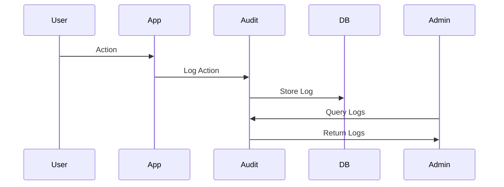

# 02.11 Audit Log: User Actions / Nhật ký kiểm toán: Hành động người dùng

## Table of Contents / Mục lục
1. [Introduction / Giới thiệu](#introduction--giới-thiệu)
2. [Audit Log Implementation / Triển khai nhật ký kiểm toán](#audit-log-implementation--triển-khai-nhật-ký-kiểm-toán)
3. [Logging User Actions / Ghi log hành động người dùng](#logging-user-actions--ghi-log-hành-động-người-dùng)
4. [Best Practices / Thực hành tốt nhất](#best-practices--thực-hành-tốt-nhất)
5. [Summary / Tóm tắt](#summary--tóm-tắt)

---

## Introduction / Giới thiệu

### Overview / Tổng quan

**English**: Audit logs track user actions for security and compliance. Learn to implement audit logging for user activities, data changes, and system events.

**Vietnamese**: Nhật ký kiểm toán theo dõi hành động người dùng cho bảo mật và tuân thủ. Học cách triển khai ghi log kiểm toán cho hoạt động người dùng, thay đổi dữ liệu và sự kiện hệ thống.

### Audit Log Flow / Luồng nhật ký kiểm toán



---

## Audit Log Implementation / Triển khai nhật ký kiểm toán

### Example 1: Audit Log Model / Ví dụ 1: Mô hình nhật ký kiểm toán

```typescript
// Audit log model / Mô hình nhật ký kiểm toán
interface AuditLog {
  id: string;
  userId: string;
  action: string;
  resource: string;
  resourceId: string;
  changes?: any;
  ipAddress?: string;
  userAgent?: string;
  timestamp: Date;
}

// Prisma schema / Schema Prisma
model AuditLog {
  id         String   @id @default(uuid())
  userId     String
  action     String   // create, update, delete, login, etc.
  resource   String   // user, order, product, etc.
  resourceId String
  changes    Json?
  ipAddress  String?
  userAgent  String?
  createdAt  DateTime @default(now())
  
  user User @relation(fields: [userId], references: [id])
  
  @@index([userId])
  @@index([resource, resourceId])
  @@index([createdAt])
}
```

### Example 2: Audit Log Service / Ví dụ 2: Dịch vụ nhật ký kiểm toán

```typescript
// Audit log service / Dịch vụ nhật ký kiểm toán
class AuditLogService {
  async log(action: string, resource: string, resourceId: string, userId: string, changes?: any, req?: any) {
    return await prisma.auditLog.create({
      data: {
        userId,
        action,
        resource,
        resourceId,
        changes,
        ipAddress: req?.ip,
        userAgent: req?.get('user-agent')
      }
    });
  }
  
  async getLogs(filters: {
    userId?: string;
    resource?: string;
    action?: string;
    startDate?: Date;
    endDate?: Date;
  }) {
    const where: any = {};
    
    if (filters.userId) where.userId = filters.userId;
    if (filters.resource) where.resource = filters.resource;
    if (filters.action) where.action = filters.action;
    if (filters.startDate || filters.endDate) {
      where.createdAt = {};
      if (filters.startDate) where.createdAt.gte = filters.startDate;
      if (filters.endDate) where.createdAt.lte = filters.endDate;
    }
    
    return await prisma.auditLog.findMany({
      where,
      orderBy: { createdAt: 'desc' },
      include: { user: { select: { id: true, email: true } } }
    });
  }
}
```

### Example 3: Middleware for Audit Logging / Ví dụ 3: Middleware cho ghi log kiểm toán

```typescript
// Audit logging middleware / Middleware ghi log kiểm toán
function auditLog(action: string, resource: string) {
  return async (req: any, res: any, next: any) => {
    const originalSend = res.json;
    
    res.json = function(data: any) {
      // Log after response / Ghi log sau response
      if (req.user && res.statusCode < 400) {
        const resourceId = req.params.id || req.body.id || 'unknown';
        auditLogService.log(
          action,
          resource,
          resourceId,
          req.user.id,
          { body: req.body },
          req
        ).catch(console.error);
      }
      
      return originalSend.call(this, data);
    };
    
    next();
  };
}

// Usage / Sử dụng
app.post('/users', authenticateToken, auditLog('create', 'user'), async (req, res) => {
  const user = await prisma.user.create({ data: req.body });
  res.json(user);
});

app.put('/users/:id', authenticateToken, auditLog('update', 'user'), async (req, res) => {
  const user = await prisma.user.update({
    where: { id: req.params.id },
    data: req.body
  });
  res.json(user);
});
```

---

## Best Practices / Thực hành tốt nhất

1. **Log all critical actions** - Create, update, delete, login
2. **Include context** - User, IP, timestamp, changes
3. **Index properly** - For fast queries
4. **Retention policy** - Archive old logs
5. **Privacy** - Don't log sensitive data

---

## Summary / Tóm tắt

### Key Takeaways / Điểm chính

- **Track actions**: Log create, update, delete, login
- **Include context**: User, IP, timestamp, changes
- **Query logs**: Search by user, resource, date
- **Security**: Audit trail for compliance
- **Performance**: Index log tables

### Next Steps / Bước tiếp theo

- [02.12 Backend-Frontend Integration](./02.12_Backend_Frontend_Integration.md) - Next: Integration

---

**Last Updated / Cập nhật lần cuối**: 2024


