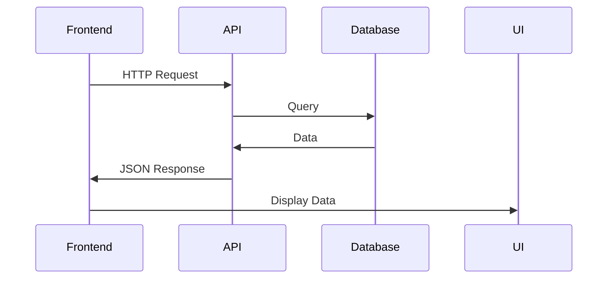

# 02.12 Backend-Frontend Integration / Tích hợp Backend-Frontend

## Table of Contents / Mục lục
1. [Introduction / Giới thiệu](#introduction--giới-thiệu)
2. [API Integration / Tích hợp API](#api-integration--tích-hợp-api)
3. [Error Handling / Xử lý lỗi](#error-handling--xử-lý-lỗi)
4. [Best Practices / Thực hành tốt nhất](#best-practices--thực-hành-tốt-nhất)
5. [Summary / Tóm tắt](#summary--tóm-tắt)

---

## Introduction / Giới thiệu

### Overview / Tổng quan

**English**: Backend-frontend integration connects client and server. Learn to integrate React/Next.js frontend with Node.js/NestJS backend APIs.

**Vietnamese**: Tích hợp backend-frontend kết nối client và server. Học cách tích hợp frontend React/Next.js với backend API Node.js/NestJS.

### Integration Flow / Luồng tích hợp



---

## API Integration / Tích hợp API

### Example 1: React API Integration / Ví dụ 1: Tích hợp API React

```typescript
// React API integration / Tích hợp API React
import { useState, useEffect } from 'react';

function UserList() {
  const [users, setUsers] = useState<User[]>([]);
  const [loading, setLoading] = useState(false);
  const [error, setError] = useState<string | null>(null);
  
  useEffect(() => {
    fetchUsers();
  }, []);
  
  const fetchUsers = async () => {
    setLoading(true);
    setError(null);
    try {
      const response = await fetch('http://localhost:3000/api/users');
      if (!response.ok) {
        throw new Error('Failed to fetch users');
      }
      const data = await response.json();
      setUsers(data);
    } catch (err) {
      setError(err instanceof Error ? err.message : 'An error occurred');
    } finally {
      setLoading(false);
    }
  };
  
  if (loading) return <div>Loading...</div>;
  if (error) return <div>Error: {error}</div>;
  
  return (
    <ul>
      {users.map(user => (
        <li key={user.id}>{user.name} - {user.email}</li>
      ))}
    </ul>
  );
}
```

### Example 2: API Client with Axios / Ví dụ 2: Client API với Axios

```typescript
// API client with Axios / Client API với Axios
import axios from 'axios';

const apiClient = axios.create({
  baseURL: 'http://localhost:3000/api',
  headers: {
    'Content-Type': 'application/json'
  }
});

// Add auth token / Thêm token xác thực
apiClient.interceptors.request.use((config) => {
  const token = localStorage.getItem('token');
  if (token) {
    config.headers.Authorization = `Bearer ${token}`;
  }
  return config;
});

// Handle errors / Xử lý lỗi
apiClient.interceptors.response.use(
  (response) => response,
  (error) => {
    if (error.response?.status === 401) {
      // Handle unauthorized / Xử lý không được phép
      localStorage.removeItem('token');
      window.location.href = '/login';
    }
    return Promise.reject(error);
  }
);

// Usage / Sử dụng
export const userService = {
  getAll: () => apiClient.get('/users'),
  getById: (id: string) => apiClient.get(`/users/${id}`),
  create: (data: CreateUserDto) => apiClient.post('/users', data),
  update: (id: string, data: UpdateUserDto) => apiClient.put(`/users/${id}`, data),
  delete: (id: string) => apiClient.delete(`/users/${id}`)
};
```

### Example 3: Next.js API Routes / Ví dụ 3: Route API Next.js

```typescript
// Next.js API route / Route API Next.js
// pages/api/users/index.ts
import type { NextApiRequest, NextApiResponse } from 'next';

export default async function handler(
  req: NextApiRequest,
  res: NextApiResponse
) {
  if (req.method === 'GET') {
    const users = await prisma.user.findMany();
    res.status(200).json(users);
  } else if (req.method === 'POST') {
    const user = await prisma.user.create({ data: req.body });
    res.status(201).json(user);
  } else {
    res.setHeader('Allow', ['GET', 'POST']);
    res.status(405).end(`Method ${req.method} Not Allowed`);
  }
}
```

---

## Error Handling / Xử lý lỗi

### Example 4: Error Handling / Ví dụ 4: Xử lý lỗi

```typescript
// Error handling / Xử lý lỗi
interface ApiError {
  message: string;
  status: number;
  errors?: Record<string, string[]>;
}

function handleApiError(error: any): ApiError {
  if (error.response) {
    return {
      message: error.response.data.message || 'An error occurred',
      status: error.response.status,
      errors: error.response.data.errors
    };
  }
  return {
    message: error.message || 'Network error',
    status: 0
  };
}

// Usage in component / Sử dụng trong component
const createUser = async (data: CreateUserDto) => {
  try {
    const response = await userService.create(data);
    return { success: true, data: response.data };
  } catch (error) {
    const apiError = handleApiError(error);
    return { success: false, error: apiError };
  }
};
```

---

## Best Practices / Thực hành tốt nhất

1. **Use API client** - Centralize API calls
2. **Handle errors** - Proper error handling
3. **Loading states** - Show loading indicators
4. **Type safety** - Use TypeScript
5. **CORS** - Configure CORS properly

---

## Summary / Tóm tắt

### Key Takeaways / Điểm chính

- **API client**: Centralize API calls
- **Error handling**: Handle errors gracefully
- **Loading states**: Show loading indicators
- **Type safety**: Use TypeScript
- **CORS**: Configure for cross-origin

### Next Steps / Bước tiếp theo

- [02.13 API Documentation](./02.13_API_Documentation_Swagger_OpenAPI.md) - Next: API Documentation

---

**Last Updated / Cập nhật lần cuối**: 2024

