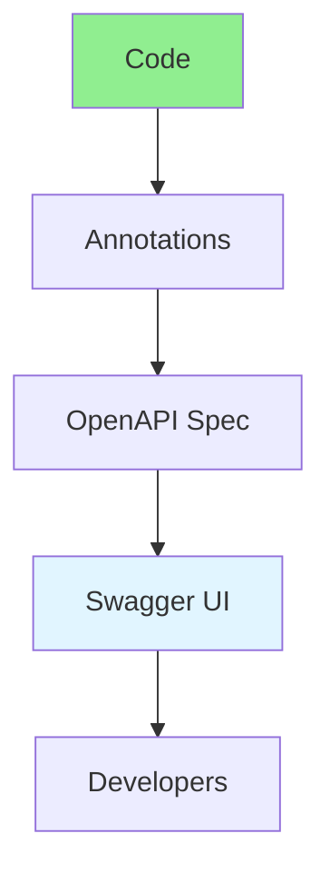

# 02.13 API Documentation: Swagger & OpenAPI / Tài liệu API: Swagger & OpenAPI

## Table of Contents / Mục lục
1. [Introduction / Giới thiệu](#introduction--giới-thiệu)
2. [OpenAPI Specification / Đặc tả OpenAPI](#openapi-specification--đặc-tả-openapi)
3. [Swagger Implementation / Triển khai Swagger](#swagger-implementation--triển-khai-swagger)
4. [Best Practices / Thực hành tốt nhất](#best-practices--thực-hành-tốt-nhất)
5. [Summary / Tóm tắt](#summary--tóm-tắt)

---

## Introduction / Giới thiệu

### Overview / Tổng quan

**English**: API documentation helps developers understand and use APIs. Learn to document APIs with Swagger/OpenAPI for interactive documentation.

**Vietnamese**: Tài liệu API giúp developer hiểu và sử dụng API. Học cách tài liệu hóa API với Swagger/OpenAPI cho tài liệu tương tác.

### API Documentation Flow / Luồng tài liệu API



---

## OpenAPI Specification / Đặc tả OpenAPI

### Example 1: OpenAPI Spec / Ví dụ 1: Đặc tả OpenAPI

```yaml
# openapi.yaml
openapi: 3.0.0
info:
  title: User API
  version: 1.0.0
  description: API for user management

paths:
  /users:
    get:
      summary: Get all users
      responses:
        '200':
          description: List of users
          content:
            application/json:
              schema:
                type: array
                items:
                  $ref: '#/components/schemas/User'
    post:
      summary: Create user
      requestBody:
        required: true
        content:
          application/json:
            schema:
              $ref: '#/components/schemas/CreateUser'
      responses:
        '201':
          description: User created
          content:
            application/json:
              schema:
                $ref: '#/components/schemas/User'

components:
  schemas:
    User:
      type: object
      properties:
        id:
          type: string
        name:
          type: string
        email:
          type: string
    CreateUser:
      type: object
      required:
        - name
        - email
      properties:
        name:
          type: string
        email:
          type: string
```

---

## Swagger Implementation / Triển khai Swagger

### Example 2: Swagger with Express.js / Ví dụ 2: Swagger với Express.js

```typescript
// Swagger with Express.js / Swagger với Express.js
import swaggerJsdoc from 'swagger-jsdoc';
import swaggerUi from 'swagger-ui-express';

const options = {
  definition: {
    openapi: '3.0.0',
    info: {
      title: 'User API',
      version: '1.0.0',
      description: 'API for user management'
    },
    servers: [
      {
        url: 'http://localhost:3000',
        description: 'Development server'
      }
    ]
  },
  apis: ['./routes/*.ts']
};

const specs = swaggerJsdoc(options);

app.use('/api-docs', swaggerUi.serve, swaggerUi.setup(specs));

// Route with Swagger annotations / Route với chú thích Swagger
/**
 * @swagger
 * /users:
 *   get:
 *     summary: Get all users
 *     tags: [Users]
 *     responses:
 *       200:
 *         description: List of users
 */
app.get('/users', async (req, res) => {
  const users = await prisma.user.findMany();
  res.json(users);
});
```

### Example 3: Swagger with NestJS / Ví dụ 3: Swagger với NestJS

```typescript
// Swagger with NestJS / Swagger với NestJS
import { SwaggerModule, DocumentBuilder } from '@nestjs/swagger';

const config = new DocumentBuilder()
  .setTitle('User API')
  .setDescription('API for user management')
  .setVersion('1.0')
  .addBearerAuth()
  .build();

const document = SwaggerModule.createDocument(app, config);
SwaggerModule.setup('api', app, document);

// Controller with decorators / Controller với decorators
@ApiTags('users')
@Controller('users')
export class UserController {
  @Get()
  @ApiOperation({ summary: 'Get all users' })
  @ApiResponse({ status: 200, description: 'List of users' })
  findAll() {
    return this.userService.findAll();
  }
  
  @Post()
  @ApiOperation({ summary: 'Create user' })
  @ApiBody({ type: CreateUserDto })
  @ApiResponse({ status: 201, description: 'User created' })
  create(@Body() createUserDto: CreateUserDto) {
    return this.userService.create(createUserDto);
  }
}
```

---

## Best Practices / Thực hành tốt nhất

1. **Keep updated** - Update docs with code changes
2. **Examples** - Include request/response examples
3. **Descriptions** - Clear, concise descriptions
4. **Versioning** - Document API versions
5. **Test in Swagger** - Use Swagger UI for testing

---

## Summary / Tóm tắt

### Key Takeaways / Điểm chính

- **OpenAPI**: Standard API specification
- **Swagger**: Interactive API documentation
- **Annotations**: Document endpoints in code
- **UI**: Swagger UI for testing
- **Maintenance**: Keep docs updated

### Next Steps / Bước tiếp theo

- [02.14 Rate Limiting](./02.14_Rate_Limiting_Request_Limits.md) - Next: Rate Limiting

---

**Last Updated / Cập nhật lần cuối**: 2024

