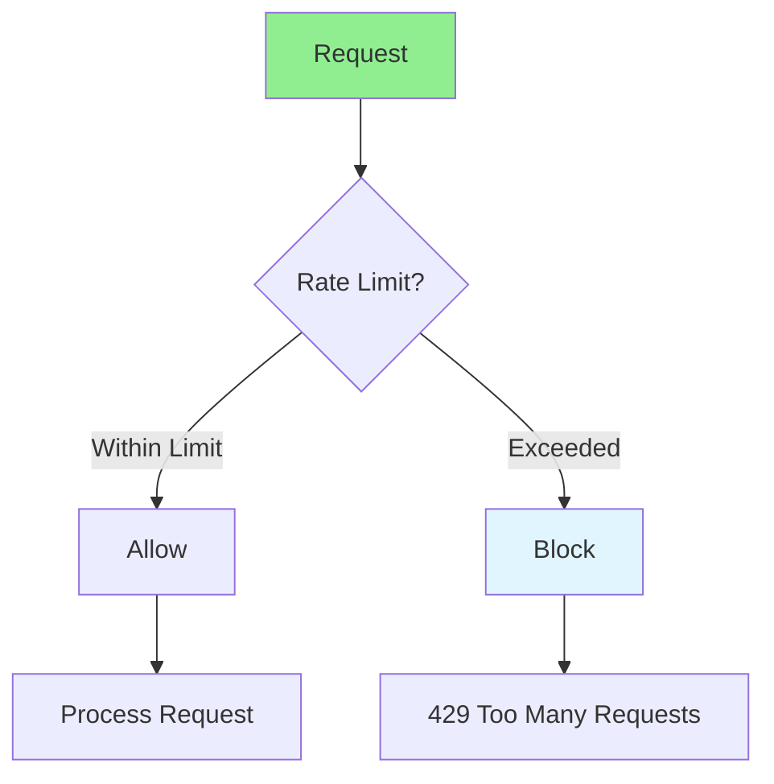

# 02.14 Rate Limiting: Request Limits / Giới hạn tốc độ: Giới hạn yêu cầu

## Table of Contents / Mục lục
1. [Introduction / Giới thiệu](#introduction--giới-thiệu)
2. [Rate Limiting Implementation / Triển khai giới hạn tốc độ](#rate-limiting-implementation--triển-khai-giới-hạn-tốc-độ)
3. [Rate Limiting Strategies / Chiến lược giới hạn tốc độ](#rate-limiting-strategies--chiến-lược-giới-hạn-tốc-độ)
4. [Best Practices / Thực hành tốt nhất](#best-practices--thực-hành-tốt-nhất)
5. [Summary / Tóm tắt](#summary--tóm-tắt)

---

## Introduction / Giới thiệu

### Overview / Tổng quan

**English**: Rate limiting prevents API abuse and ensures fair resource usage. Learn to implement rate limiting to protect your APIs from excessive requests.

**Vietnamese**: Giới hạn tốc độ ngăn chặn lạm dụng API và đảm bảo sử dụng tài nguyên công bằng. Học cách triển khai giới hạn tốc độ để bảo vệ API khỏi yêu cầu quá mức.

### Rate Limiting Flow / Luồng giới hạn tốc độ



---

## Rate Limiting Implementation / Triển khai giới hạn tốc độ

### Example 1: Express.js Rate Limiting / Ví dụ 1: Giới hạn tốc độ Express.js

```typescript
// Express.js rate limiting with express-rate-limit
import rateLimit from 'express-rate-limit';

// Basic rate limiter / Giới hạn tốc độ cơ bản
const limiter = rateLimit({
  windowMs: 15 * 60 * 1000, // 15 minutes
  max: 100, // Limit each IP to 100 requests per windowMs
  message: 'Too many requests from this IP, please try again later.',
  standardHeaders: true,
  legacyHeaders: false
});

app.use('/api/', limiter);

// Custom rate limiter / Giới hạn tốc độ tùy chỉnh
const authLimiter = rateLimit({
  windowMs: 15 * 60 * 1000,
  max: 5, // 5 login attempts per 15 minutes
  skipSuccessfulRequests: true
});

app.use('/api/auth/login', authLimiter);

// Per-user rate limiter / Giới hạn tốc độ theo người dùng
const userLimiter = rateLimit({
  windowMs: 60 * 1000, // 1 minute
  max: (req) => {
    // Different limits for different users / Giới hạn khác cho người dùng khác
    if (req.user?.isPremium) return 1000;
    return 100;
  },
  keyGenerator: (req) => req.user?.id || req.ip
});

app.use('/api/users', authenticateToken, userLimiter);
```

### Example 2: Redis-Based Rate Limiting / Ví dụ 2: Giới hạn tốc độ dựa trên Redis

```typescript
// Redis-based rate limiting / Giới hạn tốc độ dựa trên Redis
import { createClient } from 'redis';

const redis = createClient();
redis.connect();

async function rateLimit(key: string, limit: number, window: number): Promise<boolean> {
  const current = await redis.incr(key);
  
  if (current === 1) {
    await redis.expire(key, window);
  }
  
  return current <= limit;
}

// Middleware / Middleware
async function rateLimitMiddleware(req: any, res: any, next: any) {
  const key = `rate_limit:${req.ip}`;
  const allowed = await rateLimit(key, 100, 60); // 100 requests per minute
  
  if (!allowed) {
    return res.status(429).json({
      error: 'Too many requests',
      retryAfter: 60
    });
  }
  
  next();
}
```

### Example 3: NestJS Rate Limiting / Ví dụ 3: Giới hạn tốc độ NestJS

```typescript
// NestJS rate limiting / Giới hạn tốc độ NestJS
import { ThrottlerModule, ThrottlerGuard } from '@nestjs/throttler';
import { APP_GUARD } from '@nestjs/core';

@Module({
  imports: [
    ThrottlerModule.forRoot({
      ttl: 60,
      limit: 100
    })
  ],
  providers: [
    {
      provide: APP_GUARD,
      useClass: ThrottlerGuard
    }
  ]
})
export class AppModule {}

// Controller with custom limits / Controller với giới hạn tùy chỉnh
@Controller('users')
@UseGuards(ThrottlerGuard)
export class UserController {
  @Throttle(10, 60) // 10 requests per minute
  @Get()
  findAll() {
    return this.userService.findAll();
  }
}
```

---

## Rate Limiting Strategies / Chiến lược giới hạn tốc độ

### Example 4: Different Strategies / Ví dụ 4: Chiến lược khác nhau

```typescript
// Rate limiting strategies / Chiến lược giới hạn tốc độ
// Fixed window / Cửa sổ cố định
const fixedWindowLimiter = rateLimit({
  windowMs: 60 * 1000,
  max: 100
});

// Sliding window / Cửa sổ trượt
// Use Redis with sorted sets / Sử dụng Redis với sorted sets
async function slidingWindowLimit(key: string, limit: number, window: number): Promise<boolean> {
  const now = Date.now();
  const pipeline = redis.pipeline();
  
  // Remove old entries / Xóa mục cũ
  pipeline.zremrangebyscore(key, 0, now - window);
  
  // Count current requests / Đếm yêu cầu hiện tại
  pipeline.zcard(key);
  
  // Add current request / Thêm yêu cầu hiện tại
  pipeline.zadd(key, now, `${now}-${Math.random()}`);
  
  // Set expiry / Đặt hết hạn
  pipeline.expire(key, Math.ceil(window / 1000));
  
  const results = await pipeline.exec();
  const count = results[1][1] as number;
  
  return count < limit;
}
```

---

## Best Practices / Thực hành tốt nhất

1. **Set appropriate limits** - Based on API usage
2. **Different limits** - For different endpoints
3. **Return headers** - X-RateLimit-* headers
4. **Graceful degradation** - Handle rate limit errors
5. **Monitor** - Track rate limit hits

---

## Summary / Tóm tắt

### Key Takeaways / Điểm chính

- **Rate limiting**: Prevent API abuse
- **Strategies**: Fixed window, sliding window
- **Redis**: For distributed rate limiting
- **Headers**: Return rate limit info
- **Monitoring**: Track limit hits

### Next Steps / Bước tiếp theo

- [02.15 Caching API Responses](./02.15_Caching_API_Responses.md) - Next: Caching

---

**Last Updated / Cập nhật lần cuối**: 2024

