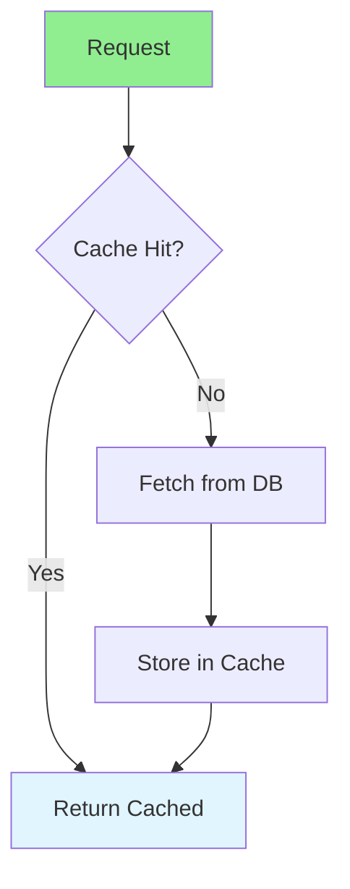

# 02.15 Caching: API Responses / Cache: Response API

## Table of Contents / Mục lục
1. [Introduction / Giới thiệu](#introduction--giới-thiệu)
2. [Caching Strategies / Chiến lược cache](#caching-strategies--chiến-lược-cache)
3. [Cache Implementation / Triển khai cache](#cache-implementation--triển-khai-cache)
4. [Best Practices / Thực hành tốt nhất](#best-practices--thực-hành-tốt-nhất)
5. [Summary / Tóm tắt](#summary--tóm-tắt)

---

## Introduction / Giới thiệu

### Overview / Tổng quan

**English**: Caching improves API performance by storing frequently accessed data. Learn to implement caching strategies for faster responses.

**Vietnamese**: Cache cải thiện hiệu suất API bằng cách lưu trữ dữ liệu thường truy cập. Học cách triển khai chiến lược cache cho response nhanh hơn.

### Caching Strategies / Chiến lược cache



---

## Caching Strategies / Chiến lược cache

### Example 1: In-Memory Caching / Ví dụ 1: Cache trong bộ nhớ

```typescript
// In-memory cache / Cache trong bộ nhớ
class MemoryCache {
  private cache: Map<string, { data: any; expiry: number }> = new Map();
  
  set(key: string, data: any, ttl: number = 3600) {
    const expiry = Date.now() + ttl * 1000;
    this.cache.set(key, { data, expiry });
  }
  
  get(key: string): any | null {
    const item = this.cache.get(key);
    if (!item) return null;
    
    if (Date.now() > item.expiry) {
      this.cache.delete(key);
      return null;
    }
    
    return item.data;
  }
  
  delete(key: string) {
    this.cache.delete(key);
  }
  
  clear() {
    this.cache.clear();
  }
}

const cache = new MemoryCache();

// Usage / Sử dụng
app.get('/users/:id', async (req, res) => {
  const cacheKey = `user:${req.params.id}`;
  const cached = cache.get(cacheKey);
  
  if (cached) {
    return res.json(cached);
  }
  
  const user = await prisma.user.findUnique({
    where: { id: req.params.id }
  });
  
  if (user) {
    cache.set(cacheKey, user, 300); // Cache for 5 minutes
  }
  
  res.json(user);
});
```

### Example 2: Redis Caching / Ví dụ 2: Cache Redis

```typescript
// Redis caching / Cache Redis
import { createClient } from 'redis';

const redis = createClient();
redis.connect();

async function getCached(key: string): Promise<any | null> {
  const data = await redis.get(key);
  return data ? JSON.parse(data) : null;
}

async function setCache(key: string, data: any, ttl: number = 3600) {
  await redis.setEx(key, ttl, JSON.stringify(data));
}

async function deleteCache(key: string) {
  await redis.del(key);
}

// Usage / Sử dụng
app.get('/users/:id', async (req, res) => {
  const cacheKey = `user:${req.params.id}`;
  
  // Try cache / Thử cache
  const cached = await getCached(cacheKey);
  if (cached) {
    return res.json(cached);
  }
  
  // Fetch from DB / Lấy từ DB
  const user = await prisma.user.findUnique({
    where: { id: req.params.id }
  });
  
  if (user) {
    await setCache(cacheKey, user, 300);
  }
  
  res.json(user);
});

// Invalidate on update / Vô hiệu hóa khi cập nhật
app.put('/users/:id', async (req, res) => {
  const user = await prisma.user.update({
    where: { id: req.params.id },
    data: req.body
  });
  
  await deleteCache(`user:${req.params.id}`);
  res.json(user);
});
```

### Example 3: HTTP Caching / Ví dụ 3: Cache HTTP

```typescript
// HTTP caching / Cache HTTP
app.get('/users/:id', async (req, res) => {
  const user = await prisma.user.findUnique({
    where: { id: req.params.id }
  });
  
  if (!user) {
    return res.status(404).json({ error: 'User not found' });
  }
  
  // Set cache headers / Đặt headers cache
  res.set('Cache-Control', 'public, max-age=300'); // 5 minutes
  res.set('ETag', `"${user.updatedAt.getTime()}"`);
  
  // Check If-None-Match / Kiểm tra If-None-Match
  const ifNoneMatch = req.headers['if-none-match'];
  if (ifNoneMatch === `"${user.updatedAt.getTime()}"`) {
    return res.status(304).end(); // Not Modified
  }
  
  res.json(user);
});
```

---

## Best Practices / Thực hành tốt nhất

1. **Cache frequently accessed data** - Users, products, etc.
2. **Set appropriate TTL** - Balance freshness and performance
3. **Invalidate on updates** - Clear cache when data changes
4. **Use Redis** - For distributed caching
5. **Monitor cache hit rate** - Track cache effectiveness

---

## Summary / Tóm tắt

### Key Takeaways / Điểm chính

- **In-memory**: Fast, simple, single server
- **Redis**: Distributed, scalable
- **HTTP caching**: Browser/CDN caching
- **TTL**: Time to live for cache entries
- **Invalidation**: Clear cache on updates

### Next Steps / Bước tiếp theo

- [02.16 Deployment](./02.16_Deployment_Application_Server.md) - Next: Deployment

---

**Last Updated / Cập nhật lần cuối**: 2024

