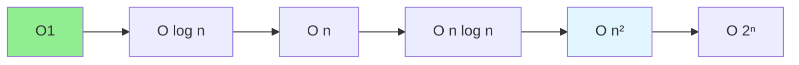

# 03.01 Big O Notation: Algorithm Complexity / Big O: Độ phức tạp thuật toán

## Table of Contents / Mục lục
1. [Introduction / Giới thiệu](#introduction--giới-thiệu)
2. [Big O Notation / Ký hiệu Big O](#big-o-notation--ký-hiệu-big-o)
3. [Common Complexities / Độ phức tạp phổ biến](#common-complexities--độ-phức-tạp-phổ-biến)
4. [Best Practices / Thực hành tốt nhất](#best-practices--thực-hành-tốt-nhất)
5. [Summary / Tóm tắt](#summary--tóm-tắt)

---

## Introduction / Giới thiệu

### Overview / Tổng quan

**English**: Big O notation describes algorithm efficiency. Learn to analyze time and space complexity to write efficient code.

**Vietnamese**: Ký hiệu Big O mô tả hiệu quả thuật toán. Học cách phân tích độ phức tạp thời gian và không gian để viết code hiệu quả.

### Complexity Growth / Tăng trưởng độ phức tạp



---

## Big O Notation / Ký hiệu Big O

### Example 1: Time Complexity Examples / Ví dụ 1: Ví dụ độ phức tạp thời gian

```typescript
// O(1) - Constant time / Thời gian hằng số
function getFirst(arr: number[]): number {
  return arr[0]; // Always one operation / Luôn một thao tác
}

// O(n) - Linear time / Thời gian tuyến tính
function findMax(arr: number[]): number {
  let max = arr[0];
  for (let i = 1; i < arr.length; i++) { // n operations / n thao tác
    if (arr[i] > max) max = arr[i];
  }
  return max;
}

// O(n²) - Quadratic time / Thời gian bậc hai
function bubbleSort(arr: number[]): number[] {
  for (let i = 0; i < arr.length; i++) { // n iterations
    for (let j = 0; j < arr.length - i - 1; j++) { // n iterations
      if (arr[j] > arr[j + 1]) {
        [arr[j], arr[j + 1]] = [arr[j + 1], arr[j]];
      }
    }
  }
  return arr; // n * n = n² operations
}

// O(log n) - Logarithmic time / Thời gian logarit
function binarySearch(arr: number[], target: number): number {
  let left = 0, right = arr.length - 1;
  while (left <= right) {
    const mid = Math.floor((left + right) / 2);
    if (arr[mid] === target) return mid;
    if (arr[mid] < target) left = mid + 1;
    else right = mid - 1;
  }
  return -1; // log n operations
}
```

### Example 2: Space Complexity / Ví dụ 2: Độ phức tạp không gian

```typescript
// O(1) - Constant space / Không gian hằng số
function sum(arr: number[]): number {
  let total = 0; // One variable / Một biến
  for (let num of arr) {
    total += num;
  }
  return total;
}

// O(n) - Linear space / Không gian tuyến tính
function copyArray(arr: number[]): number[] {
  const copy = []; // n elements / n phần tử
  for (let num of arr) {
    copy.push(num);
  }
  return copy;
}

// O(n²) - Quadratic space / Không gian bậc hai
function generatePairs(arr: number[]): number[][] {
  const pairs = [];
  for (let i = 0; i < arr.length; i++) {
    for (let j = i + 1; j < arr.length; j++) {
      pairs.push([arr[i], arr[j]]); // n² pairs
    }
  }
  return pairs;
}
```

---

## Common Complexities / Độ phức tạp phổ biến

### Example 3: Complexity Comparison / Ví dụ 3: So sánh độ phức tạp

```typescript
// Complexity comparison / So sánh độ phức tạp
const complexities = {
  'O(1)': 'Constant - Best / Hằng số - Tốt nhất',
  'O(log n)': 'Logarithmic - Excellent / Logarit - Xuất sắc',
  'O(n)': 'Linear - Good / Tuyến tính - Tốt',
  'O(n log n)': 'Linearithmic - Acceptable / Tuyến tính log - Chấp nhận được',
  'O(n²)': 'Quadratic - Poor / Bậc hai - Kém',
  'O(2ⁿ)': 'Exponential - Very Poor / Mũ - Rất kém',
  'O(n!)': 'Factorial - Worst / Giai thừa - Tệ nhất'
};

// Examples / Ví dụ
// O(1): Array access, hash table lookup
// O(log n): Binary search, balanced tree operations
// O(n): Linear search, array iteration
// O(n log n): Merge sort, heap sort
// O(n²): Bubble sort, nested loops
// O(2ⁿ): Recursive Fibonacci
// O(n!): Permutations
```

---

## Best Practices / Thực hành tốt nhất

1. **Analyze before coding** - Understand complexity
2. **Choose right algorithm** - Based on data size
3. **Optimize bottlenecks** - Focus on slow parts
4. **Measure** - Profile actual performance
5. **Balance** - Time vs space complexity

---

## Summary / Tóm tắt

### Key Takeaways / Điểm chính

- **Big O**: Describes worst-case complexity
- **Time complexity**: How runtime grows
- **Space complexity**: How memory grows
- **Common**: O(1), O(log n), O(n), O(n²)
- **Optimize**: Choose efficient algorithms

### Next Steps / Bước tiếp theo

- [03.02 Time Complexity](./03.02_Time_Complexity_Execution_Time.md) - Next: Time Complexity

---

**Last Updated / Cập nhật lần cuối**: 2024


