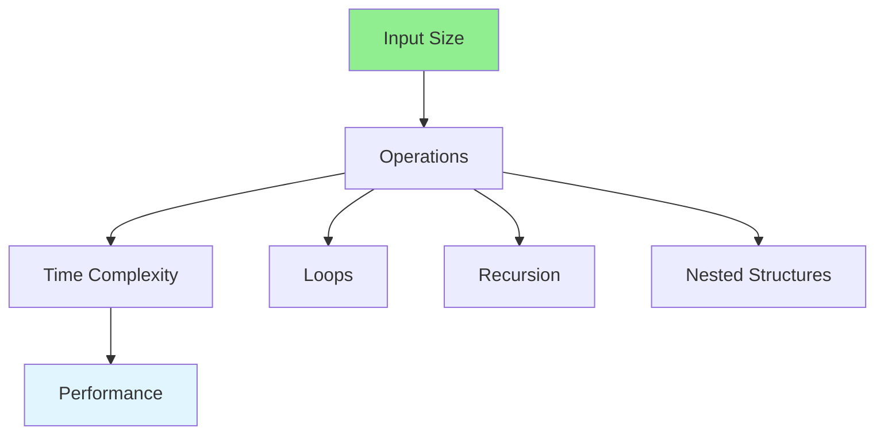

# 03.02 Time Complexity: Execution Time / Độ phức tạp thời gian: Thời gian thực thi

## Table of Contents / Mục lục
1. [Introduction / Giới thiệu](#introduction--giới-thiệu)
2. [Time Complexity Analysis / Phân tích độ phức tạp thời gian](#time-complexity-analysis--phân-tích-độ-phức-tạp-thời-gian)
3. [Measuring Execution Time / Đo thời gian thực thi](#measuring-execution-time--đo-thời-gian-thực-thi)
4. [Best Practices / Thực hành tốt nhất](#best-practices--thực-hành-tốt-nhất)
5. [Summary / Tóm tắt](#summary--tóm-tắt)

---

## Introduction / Giới thiệu

### Overview / Tổng quan

**English**: Time complexity measures how execution time grows with input size. Learn to analyze and measure execution time for algorithm optimization.

**Vietnamese**: Độ phức tạp thời gian đo lường cách thời gian thực thi tăng với kích thước đầu vào. Học cách phân tích và đo thời gian thực thi để tối ưu thuật toán.

### Time Complexity Factors / Yếu tố độ phức tạp thời gian



---

## Time Complexity Analysis / Phân tích độ phức tạp thời gian

### Example 1: Analyzing Time Complexity / Ví dụ 1: Phân tích độ phức tạp thời gian

```typescript
// O(1) - Constant / Hằng số
function getItem(arr: any[], index: number): any {
  return arr[index]; // One operation / Một thao tác
}

// O(n) - Linear / Tuyến tính
function linearSearch(arr: number[], target: number): number {
  for (let i = 0; i < arr.length; i++) { // n iterations
    if (arr[i] === target) return i;
  }
  return -1;
}

// O(n²) - Quadratic / Bậc hai
function findDuplicates(arr: number[]): number[] {
  const duplicates = [];
  for (let i = 0; i < arr.length; i++) { // n iterations
    for (let j = i + 1; j < arr.length; j++) { // n iterations
      if (arr[i] === arr[j]) {
        duplicates.push(arr[i]);
      }
    }
  }
  return duplicates; // n * n = n²
}

// O(log n) - Logarithmic / Logarit
function binarySearch(arr: number[], target: number): number {
  let left = 0, right = arr.length - 1;
  while (left <= right) {
    const mid = Math.floor((left + right) / 2);
    if (arr[mid] === target) return mid;
    if (arr[mid] < target) left = mid + 1;
    else right = mid - 1;
  }
  return -1; // log n operations
}
```

### Example 2: Nested Complexity / Ví dụ 2: Độ phức tạp lồng nhau

```typescript
// O(n * m) - Different input sizes / Kích thước đầu vào khác nhau
function findCommon(arr1: number[], arr2: number[]): number[] {
  const common = [];
  for (let i = 0; i < arr1.length; i++) { // n iterations
    for (let j = 0; j < arr2.length; j++) { // m iterations
      if (arr1[i] === arr2[j]) {
        common.push(arr1[i]);
      }
    }
  }
  return common; // n * m operations
}

// O(n log n) - Linearithmic / Tuyến tính log
function mergeSort(arr: number[]): number[] {
  if (arr.length <= 1) return arr;
  
  const mid = Math.floor(arr.length / 2);
  const left = mergeSort(arr.slice(0, mid)); // O(log n) depth
  const right = mergeSort(arr.slice(mid)); // O(log n) depth
  return merge(left, right); // O(n) merge at each level
}
```

---

## Measuring Execution Time / Đo thời gian thực thi

### Example 3: Performance Measurement / Ví dụ 3: Đo hiệu suất

```typescript
// Measure execution time / Đo thời gian thực thi
function measureTime(fn: () => void): number {
  const start = performance.now();
  fn();
  const end = performance.now();
  return end - start;
}

// Compare algorithms / So sánh thuật toán
function compareSearchAlgorithms(arr: number[], target: number) {
  const linearTime = measureTime(() => {
    linearSearch(arr, target);
  });
  
  const sortedArr = [...arr].sort((a, b) => a - b);
  const binaryTime = measureTime(() => {
    binarySearch(sortedArr, target);
  });
  
  console.log(`Linear search: ${linearTime}ms`);
  console.log(`Binary search: ${binaryTime}ms`);
  console.log(`Speedup: ${(linearTime / binaryTime).toFixed(2)}x`);
}

// Benchmark function / Hàm benchmark
function benchmark(fn: Function, iterations: number = 1000): number {
  const times: number[] = [];
  
  for (let i = 0; i < iterations; i++) {
    const start = performance.now();
    fn();
    const end = performance.now();
    times.push(end - start);
  }
  
  const avg = times.reduce((a, b) => a + b, 0) / times.length;
  const min = Math.min(...times);
  const max = Math.max(...times);
  
  return { avg, min, max };
}
```

---

## Best Practices / Thực hành tốt nhất

1. **Analyze worst case** - Consider worst-case complexity
2. **Measure actual performance** - Profile real code
3. **Consider input size** - Different algorithms for different sizes
4. **Optimize bottlenecks** - Focus on slow parts
5. **Use appropriate data structures** - Choose efficient structures

---

## Summary / Tóm tắt

### Key Takeaways / Điểm chính

- **Time complexity**: How runtime grows with input
- **Common complexities**: O(1), O(log n), O(n), O(n²)
- **Measurement**: Use performance.now() to measure
- **Analysis**: Count operations in loops
- **Optimization**: Choose efficient algorithms

### Next Steps / Bước tiếp theo

- [03.03 Space Complexity](./03.03_Space_Complexity_Memory_Usage.md) - Next: Space Complexity

---

**Last Updated / Cập nhật lần cuối**: 2024


