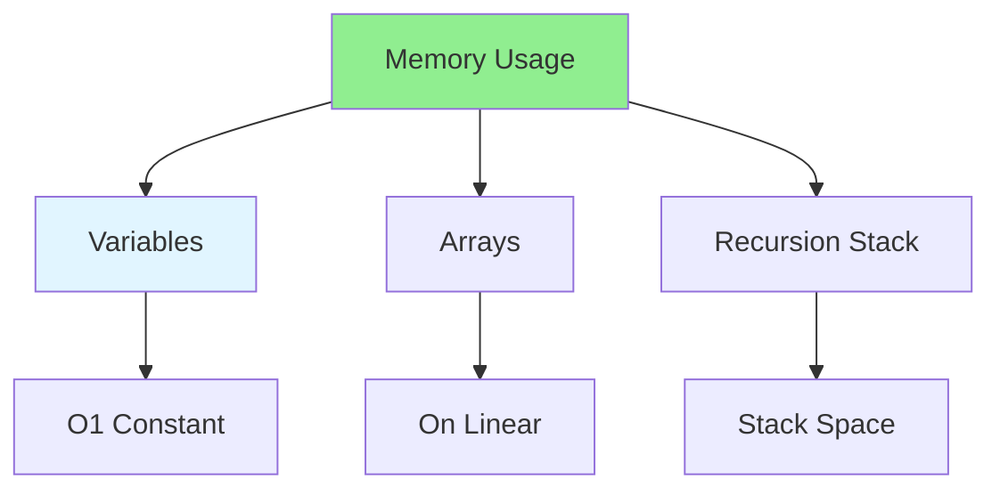

# 03.03 Space Complexity: Memory Usage / Độ phức tạp không gian: Sử dụng bộ nhớ

## Table of Contents / Mục lục
1. [Introduction / Giới thiệu](#introduction--giới-thiệu)
2. [Space Complexity Analysis / Phân tích độ phức tạp không gian](#space-complexity-analysis--phân-tích-độ-phức-tạp-không-gian)
3. [Memory Optimization / Tối ưu bộ nhớ](#memory-optimization--tối-ưu-bộ-nhớ)
4. [Best Practices / Thực hành tốt nhất](#best-practices--thực-hành-tốt-nhất)
5. [Summary / Tóm tắt](#summary--tóm-tắt)

---

## Introduction / Giới thiệu

### Overview / Tổng quan

**English**: Space complexity measures how memory usage grows with input size. Learn to analyze and optimize memory usage in algorithms.

**Vietnamese**: Độ phức tạp không gian đo lường cách sử dụng bộ nhớ tăng với kích thước đầu vào. Học cách phân tích và tối ưu sử dụng bộ nhớ trong thuật toán.

### Space Complexity Factors / Yếu tố độ phức tạp không gian



---

## Space Complexity Analysis / Phân tích độ phức tạp không gian

### Example 1: Space Complexity Examples / Ví dụ 1: Ví dụ độ phức tạp không gian

```typescript
// O(1) - Constant space / Không gian hằng số
function sum(arr: number[]): number {
  let total = 0; // One variable / Một biến
  for (let num of arr) {
    total += num;
  }
  return total;
}

// O(n) - Linear space / Không gian tuyến tính
function copyArray(arr: number[]): number[] {
  const copy = []; // n elements / n phần tử
  for (let num of arr) {
    copy.push(num);
  }
  return copy;
}

// O(n²) - Quadratic space / Không gian bậc hai
function generateMatrix(n: number): number[][] {
  const matrix = [];
  for (let i = 0; i < n; i++) {
    matrix[i] = [];
    for (let j = 0; j < n; j++) {
      matrix[i][j] = i * n + j; // n * n elements
    }
  }
  return matrix;
}

// O(log n) - Logarithmic space / Không gian logarit
function binarySearchRecursive(arr: number[], target: number, left = 0, right = arr.length - 1): number {
  if (left > right) return -1;
  
  const mid = Math.floor((left + right) / 2);
  if (arr[mid] === target) return mid;
  
  if (arr[mid] < target) {
    return binarySearchRecursive(arr, target, mid + 1, right); // log n stack frames
  } else {
    return binarySearchRecursive(arr, target, left, mid - 1);
  }
}
```

### Example 2: In-Place vs Extra Space / Ví dụ 2: Tại chỗ vs Không gian thêm

```typescript
// O(n) space - Extra array / Không gian thêm - Mảng thêm
function reverseArray(arr: number[]): number[] {
  const reversed = []; // Extra space / Không gian thêm
  for (let i = arr.length - 1; i >= 0; i--) {
    reversed.push(arr[i]);
  }
  return reversed;
}

// O(1) space - In-place / Tại chỗ
function reverseArrayInPlace(arr: number[]): void {
  let left = 0, right = arr.length - 1;
  while (left < right) {
    [arr[left], arr[right]] = [arr[right], arr[left]];
    left++;
    right--;
  }
  // No extra space / Không có không gian thêm
}
```

---

## Memory Optimization / Tối ưu bộ nhớ

### Example 3: Memory-Efficient Algorithms / Ví dụ 3: Thuật toán tiết kiệm bộ nhớ

```typescript
// Memory-efficient filtering / Lọc tiết kiệm bộ nhớ
function filterInPlace<T>(arr: T[], predicate: (item: T) => boolean): T[] {
  let writeIndex = 0;
  for (let i = 0; i < arr.length; i++) {
    if (predicate(arr[i])) {
      arr[writeIndex++] = arr[i];
    }
  }
  arr.length = writeIndex; // Truncate array / Cắt mảng
  return arr; // O(1) extra space
}

// Generator for large datasets / Generator cho tập dữ liệu lớn
function* processLargeArray<T>(arr: T[], batchSize: number = 1000): Generator<T[]> {
  for (let i = 0; i < arr.length; i += batchSize) {
    yield arr.slice(i, i + batchSize); // Process in batches / Xử lý theo lô
  }
}

// Usage / Sử dụng
for (const batch of processLargeArray(largeArray)) {
  processBatch(batch); // Process without loading all into memory
}
```

---

## Best Practices / Thực hành tốt nhất

1. **Minimize extra space** - Use in-place algorithms when possible
2. **Reuse variables** - Don't create unnecessary variables
3. **Stream processing** - Process data in chunks
4. **Clear references** - Help garbage collection
5. **Monitor memory** - Use memory profiling tools

---

## Summary / Tóm tắt

### Key Takeaways / Điểm chính

- **Space complexity**: How memory grows with input
- **Auxiliary space**: Extra space beyond input
- **In-place**: Algorithms using O(1) extra space
- **Trade-offs**: Time vs space complexity
- **Optimization**: Minimize memory usage

### Next Steps / Bước tiếp theo

- [03.04 Loop Optimization](./03.04_Loop_Optimization.md) - Next: Loop Optimization

---

**Last Updated / Cập nhật lần cuối**: 2024


