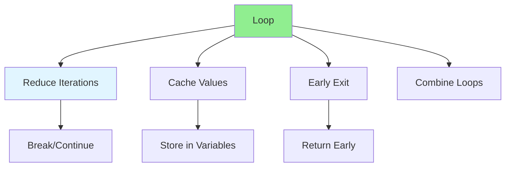

# 03.04 Loop Optimization / Tối ưu vòng lặp

## Table of Contents / Mục lục
1. [Introduction / Giới thiệu](#introduction--giới-thiệu)
2. [Loop Optimization Techniques / Kỹ thuật tối ưu vòng lặp](#loop-optimization-techniques--kỹ-thuật-tối-ưu-vòng-lặp)
3. [Common Patterns / Mẫu phổ biến](#common-patterns--mẫu-phổ-biến)
4. [Best Practices / Thực hành tốt nhất](#best-practices--thực-hành-tốt-nhất)
5. [Summary / Tóm tắt](#summary--tóm-tắt)

---

## Introduction / Giới thiệu

### Overview / Tổng quan

**English**: Loop optimization improves performance by reducing iterations and operations. Learn techniques to optimize loops for better performance.

**Vietnamese**: Tối ưu vòng lặp cải thiện hiệu suất bằng cách giảm số lần lặp và thao tác. Học kỹ thuật tối ưu vòng lặp để có hiệu suất tốt hơn.

### Loop Optimization Techniques / Kỹ thuật tối ưu vòng lặp



---

## Loop Optimization Techniques / Kỹ thuật tối ưu vòng lặp

### Example 1: Cache Array Length / Ví dụ 1: Cache độ dài mảng

```typescript
// Slow / Chậm
function sumArray(arr: number[]): number {
  let sum = 0;
  for (let i = 0; i < arr.length; i++) { // arr.length checked each iteration
    sum += arr[i];
  }
  return sum;
}

// Fast / Nhanh
function sumArrayOptimized(arr: number[]): number {
  let sum = 0;
  const length = arr.length; // Cache length / Cache độ dài
  for (let i = 0; i < length; i++) {
    sum += arr[i];
  }
  return sum;
}
```

### Example 2: Early Exit / Ví dụ 2: Thoát sớm

```typescript
// Without early exit / Không thoát sớm
function findUser(users: User[], id: string): User | null {
  let found: User | null = null;
  for (const user of users) {
    if (user.id === id) {
      found = user;
    }
  }
  return found; // Continues even after finding / Tiếp tục sau khi tìm thấy
}

// With early exit / Với thoát sớm
function findUserOptimized(users: User[], id: string): User | null {
  for (const user of users) {
    if (user.id === id) {
      return user; // Exit immediately / Thoát ngay lập tức
    }
  }
  return null;
}
```

### Example 3: Combine Loops / Ví dụ 3: Kết hợp vòng lặp

```typescript
// Multiple loops / Nhiều vòng lặp
function processUsers(users: User[]): { active: User[]; inactive: User[] } {
  const active: User[] = [];
  for (const user of users) {
    if (user.active) active.push(user);
  }
  
  const inactive: User[] = [];
  for (const user of users) {
    if (!user.active) inactive.push(user);
  }
  
  return { active, inactive }; // O(2n) - Two passes
}

// Combined loop / Vòng lặp kết hợp
function processUsersOptimized(users: User[]): { active: User[]; inactive: User[] } {
  const active: User[] = [];
  const inactive: User[] = [];
  
  for (const user of users) {
    if (user.active) {
      active.push(user);
    } else {
      inactive.push(user);
    }
  }
  
  return { active, inactive }; // O(n) - One pass
}
```

### Example 4: Reduce Nested Loops / Ví dụ 4: Giảm vòng lặp lồng nhau

```typescript
// Nested loops / Vòng lặp lồng nhau
function findCommon(arr1: number[], arr2: number[]): number[] {
  const common: number[] = [];
  for (const num1 of arr1) {
    for (const num2 of arr2) {
      if (num1 === num2) {
        common.push(num1);
      }
    }
  }
  return common; // O(n * m)
}

// Optimized with Set / Tối ưu với Set
function findCommonOptimized(arr1: number[], arr2: number[]): number[] {
  const set2 = new Set(arr2); // O(m)
  const common: number[] = [];
  
  for (const num1 of arr1) { // O(n)
    if (set2.has(num1)) { // O(1) lookup
      common.push(num1);
    }
  }
  return common; // O(n + m) - Much faster
}
```

---

## Best Practices / Thực hành tốt nhất

1. **Cache values** - Store frequently accessed values
2. **Early exit** - Return/break when condition met
3. **Combine loops** - Merge multiple passes
4. **Use appropriate data structures** - Sets, Maps for lookups
5. **Avoid unnecessary iterations** - Skip when possible

---

## Summary / Tóm tắt

### Key Takeaways / Điểm chính

- **Cache length**: Store array.length in variable
- **Early exit**: Return/break when found
- **Combine loops**: Merge multiple passes
- **Data structures**: Use Sets/Maps for lookups
- **Reduce nesting**: Use better algorithms

### Next Steps / Bước tiếp theo

- [03.05 Database Query Optimization](./03.05_Database_Query_Optimization.md) - Next: Query Optimization

---

**Last Updated / Cập nhật lần cuối**: 2024


