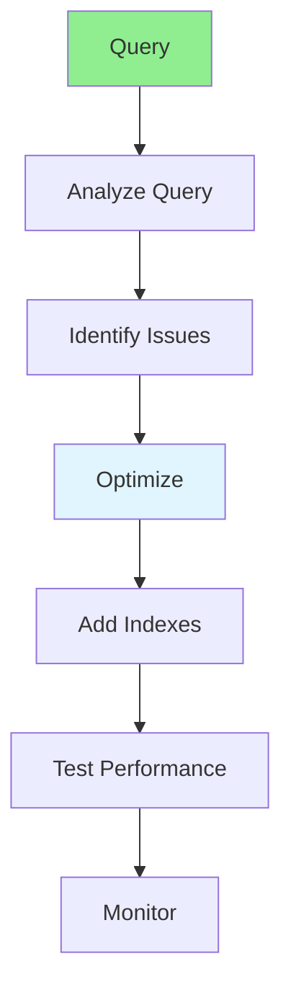

# 03.05 Database Query Optimization / Tối ưu truy vấn Database

## Table of Contents / Mục lục
1. [Introduction / Giới thiệu](#introduction--giới-thiệu)
2. [Query Optimization Techniques / Kỹ thuật tối ưu truy vấn](#query-optimization-techniques--kỹ-thuật-tối-ưu-truy-vấn)
3. [Index Optimization / Tối ưu Index](#index-optimization--tối-ưu-index)
4. [Best Practices / Thực hành tốt nhất](#best-practices--thực-hành-tốt-nhất)
5. [Summary / Tóm tắt](#summary--tóm-tắt)

---

## Introduction / Giới thiệu

### Overview / Tổng quan

**English**: Database query optimization improves application performance. Learn to optimize SQL queries, use indexes, and avoid common performance pitfalls.

**Vietnamese**: Tối ưu truy vấn database cải thiện hiệu suất ứng dụng. Học cách tối ưu truy vấn SQL, sử dụng index và tránh các lỗi hiệu suất phổ biến.

### Query Optimization Process / Quy trình tối ưu truy vấn



---

## Query Optimization Techniques / Kỹ thuật tối ưu truy vấn

### Example 1: Select Only Needed Columns / Ví dụ 1: Chọn chỉ cột cần thiết

```typescript
// Slow - Select all / Chậm - Chọn tất cả
const users = await prisma.user.findMany();
// SELECT * FROM users

// Fast - Select specific columns / Nhanh - Chọn cột cụ thể
const users = await prisma.user.findMany({
  select: {
    id: true,
    name: true,
    email: true
  }
});
// SELECT id, name, email FROM users
```

### Example 2: Use Indexes / Ví dụ 2: Sử dụng Index

```sql
-- Create index / Tạo index
CREATE INDEX idx_user_email ON users(email);
CREATE INDEX idx_user_created_at ON users(created_at);

-- Query using index / Truy vấn sử dụng index
SELECT * FROM users WHERE email = 'user@example.com'; -- Uses idx_user_email
SELECT * FROM users WHERE created_at > '2024-01-01'; -- Uses idx_user_created_at

-- Composite index / Index tổng hợp
CREATE INDEX idx_user_status_created ON users(status, created_at);
SELECT * FROM users WHERE status = 'active' AND created_at > '2024-01-01';
```

### Example 3: Avoid N+1 Queries / Ví dụ 3: Tránh truy vấn N+1

```typescript
// N+1 Problem / Vấn đề N+1
const users = await prisma.user.findMany();
for (const user of users) {
  const orders = await prisma.order.findMany({
    where: { userId: user.id }
  }); // N queries for N users
}

// Optimized with include / Tối ưu với include
const users = await prisma.user.findMany({
  include: {
    orders: true
  }
}); // Single query with JOIN
```

### Example 4: Limit Results / Ví dụ 4: Giới hạn kết quả

```typescript
// Without limit / Không giới hạn
const users = await prisma.user.findMany();
// Returns all users / Trả về tất cả users

// With limit / Với giới hạn
const users = await prisma.user.findMany({
  take: 10,
  skip: 0,
  orderBy: { createdAt: 'desc' }
});
// Returns only 10 most recent / Chỉ trả về 10 mới nhất
```

---

## Index Optimization / Tối ưu Index

### Example 5: Index Best Practices / Ví dụ 5: Thực hành tốt nhất Index

```sql
-- Index frequently queried columns / Index cột thường truy vấn
CREATE INDEX idx_user_email ON users(email);
CREATE INDEX idx_order_user_id ON orders(user_id);
CREATE INDEX idx_order_status ON orders(status);

-- Composite index for multiple conditions / Index tổng hợp cho nhiều điều kiện
CREATE INDEX idx_user_status_created ON users(status, created_at);

-- Partial index for filtered queries / Index một phần cho truy vấn lọc
CREATE INDEX idx_active_users ON users(email) WHERE status = 'active';

-- Monitor index usage / Giám sát sử dụng index
EXPLAIN ANALYZE SELECT * FROM users WHERE email = 'user@example.com';
```

---

## Best Practices / Thực hành tốt nhất

1. **Use indexes** - On frequently queried columns
2. **Select specific columns** - Don't use SELECT *
3. **Avoid N+1 queries** - Use JOINs or includes
4. **Limit results** - Use LIMIT for large datasets
5. **Analyze queries** - Use EXPLAIN to understand execution

---

## Summary / Tóm tắt

### Key Takeaways / Điểm chính

- **Indexes**: Speed up queries on indexed columns
- **Select specific**: Only fetch needed columns
- **Avoid N+1**: Use JOINs or includes
- **Limit results**: Use pagination
- **Analyze**: Use EXPLAIN to optimize

### Next Steps / Bước tiếp theo

- [03.06 Common Mistakes](./03.06_Common_Mistakes_20_Errors.md) - Next: Common Mistakes

---

**Last Updated / Cập nhật lần cuối**: 2024

