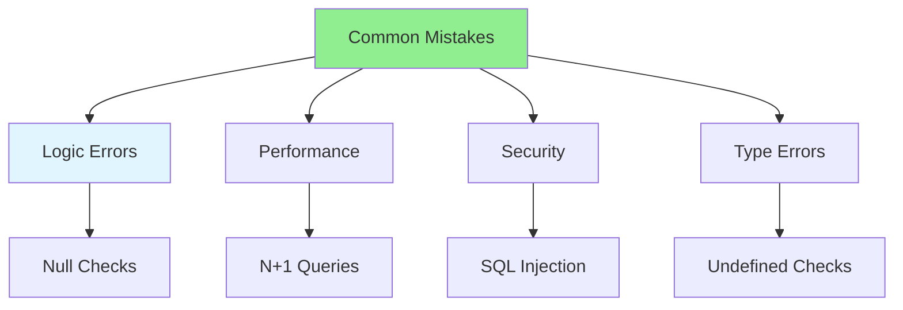

# 03.06 Common Mistakes: 20 Errors / Lỗi phổ biến: 20 lỗi

## Table of Contents / Mục lục
1. [Introduction / Giới thiệu](#introduction--giới-thiệu)
2. [Common Mistakes / Lỗi phổ biến](#common-mistakes--lỗi-phổ-biến)
3. [How to Avoid / Cách tránh](#how-to-avoid--cách-tránh)
4. [Best Practices / Thực hành tốt nhất](#best-practices--thực-hành-tốt-nhất)
5. [Summary / Tóm tắt](#summary--tóm-tắt)

---

## Introduction / Giới thiệu

### Overview / Tổng quan

**English**: Common mistakes lead to bugs and poor performance. Learn to identify and avoid 20 common programming mistakes.

**Vietnamese**: Lỗi phổ biến dẫn đến bug và hiệu suất kém. Học cách xác định và tránh 20 lỗi lập trình phổ biến.

### Common Mistakes Categories / Danh mục lỗi phổ biến



---

## Common Mistakes / Lỗi phổ biến

### Example 1: Null/Undefined Errors / Ví dụ 1: Lỗi Null/Undefined

```typescript
// Mistake 1: Not checking null/undefined / Lỗi 1: Không kiểm tra null/undefined
function getUserName(user: User | null): string {
  return user.name; // Error if user is null / Lỗi nếu user là null
}

// Fix / Sửa
function getUserName(user: User | null): string {
  return user?.name ?? 'Unknown';
}

// Mistake 2: Array access without bounds check / Lỗi 2: Truy cập mảng không kiểm tra giới hạn
function getFirst(arr: number[]): number {
  return arr[0]; // Error if array is empty / Lỗi nếu mảng rỗng
}

// Fix / Sửa
function getFirst(arr: number[]): number | undefined {
  return arr.length > 0 ? arr[0] : undefined;
}
```

### Example 2: Async/Await Mistakes / Ví dụ 2: Lỗi Async/Await

```typescript
// Mistake 3: Forgetting await / Lỗi 3: Quên await
async function fetchUsers() {
  const users = fetch('/api/users'); // Missing await / Thiếu await
  return users.json(); // Error / Lỗi
}

// Fix / Sửa
async function fetchUsers() {
  const response = await fetch('/api/users');
  return response.json();
}

// Mistake 4: Not handling errors / Lỗi 4: Không xử lý lỗi
async function createUser(data: UserData) {
  const user = await prisma.user.create({ data }); // No error handling
  return user;
}

// Fix / Sửa
async function createUser(data: UserData) {
  try {
    const user = await prisma.user.create({ data });
    return user;
  } catch (error) {
    console.error('Error creating user:', error);
    throw error;
  }
}
```

### Example 3: Performance Mistakes / Ví dụ 3: Lỗi hiệu suất

```typescript
// Mistake 5: N+1 queries / Lỗi 5: Truy vấn N+1
async function getUsersWithOrders() {
  const users = await prisma.user.findMany();
  for (const user of users) {
    user.orders = await prisma.order.findMany({
      where: { userId: user.id }
    }); // N queries
  }
  return users;
}

// Fix / Sửa
async function getUsersWithOrders() {
  return await prisma.user.findMany({
    include: { orders: true } // Single query
  });
}

// Mistake 6: Not using indexes / Lỗi 6: Không sử dụng index
// Querying without index on frequently used column
const user = await prisma.user.findFirst({
  where: { email: 'user@example.com' } // No index on email
});

// Fix: Add index / Sửa: Thêm index
// CREATE INDEX idx_user_email ON users(email);
```

### Example 4: Type Safety Mistakes / Ví dụ 4: Lỗi an toàn kiểu

```typescript
// Mistake 7: Using 'any' / Lỗi 7: Sử dụng 'any'
function processData(data: any) { // Loses type safety
  return data.value * 2;
}

// Fix / Sửa
interface Data {
  value: number;
}
function processData(data: Data) {
  return data.value * 2;
}

// Mistake 8: Not validating input / Lỗi 8: Không xác thực đầu vào
app.post('/users', (req, res) => {
  const user = req.body; // No validation
  prisma.user.create({ data: user });
});

// Fix / Sửa
app.post('/users', async (req, res) => {
  const validated = CreateUserSchema.parse(req.body);
  const user = await prisma.user.create({ data: validated });
  res.json(user);
});
```

---

## How to Avoid / Cách tránh

### Example 5: Prevention Strategies / Ví dụ 5: Chiến lược phòng ngừa

```typescript
// Use TypeScript / Sử dụng TypeScript
// Enable strict mode / Bật chế độ strict
// tsconfig.json
{
  "compilerOptions": {
    "strict": true,
    "noImplicitAny": true,
    "strictNullChecks": true
  }
}

// Use linters / Sử dụng linter
// ESLint rules
{
  "rules": {
    "no-unused-vars": "error",
    "no-console": "warn",
    "@typescript-eslint/no-explicit-any": "error"
  }
}

// Write tests / Viết test
describe('getUserName', () => {
  it('should handle null user', () => {
    expect(getUserName(null)).toBe('Unknown');
  });
});
```

---

## Best Practices / Thực hành tốt nhất

1. **Always check null/undefined** - Use optional chaining
2. **Handle errors** - Try-catch for async operations
3. **Use TypeScript** - Enable strict mode
4. **Write tests** - Catch mistakes early
5. **Code review** - Get feedback from others

---

## Summary / Tóm tắt

### Key Takeaways / Điểm chính

- **Null checks**: Always check for null/undefined
- **Error handling**: Handle async errors
- **Performance**: Avoid N+1 queries
- **Type safety**: Use TypeScript strictly
- **Validation**: Validate all inputs

### Next Steps / Bước tiếp theo

- [03.07 Clean Code](./03.07_Clean_Code_DRY_KISS_YAGNI.md) - Next: Clean Code

---

**Last Updated / Cập nhật lần cuối**: 2024


