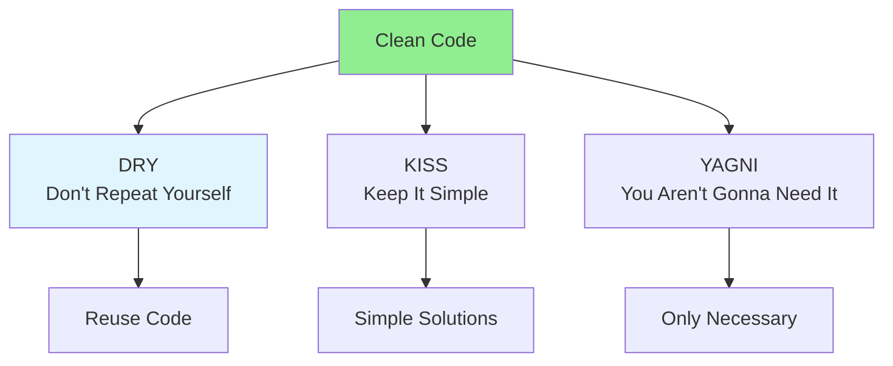

# 03.07 Clean Code: DRY, KISS, YAGNI / Code sạch: DRY, KISS, YAGNI

## Table of Contents / Mục lục
1. [Introduction / Giới thiệu](#introduction--giới-thiệu)
2. [DRY Principle / Nguyên tắc DRY](#dry-principle--nguyên-tắc-dry)
3. [KISS Principle / Nguyên tắc KISS](#kiss-principle--nguyên-tắc-kiss)
4. [YAGNI Principle / Nguyên tắc YAGNI](#yagni-principle--nguyên-tắc-yagni)
5. [Best Practices / Thực hành tốt nhất](#best-practices--thực-hành-tốt-nhất)
6. [Summary / Tóm tắt](#summary--tóm-tắt)

---

## Introduction / Giới thiệu

### Overview / Tổng quan

**English**: Clean code principles (DRY, KISS, YAGNI) improve code quality. Learn to write maintainable, simple, and necessary code.

**Vietnamese**: Nguyên tắc code sạch (DRY, KISS, YAGNI) cải thiện chất lượng code. Học cách viết code dễ bảo trì, đơn giản và cần thiết.

### Clean Code Principles / Nguyên tắc code sạch



---

## DRY Principle / Nguyên tắc DRY

### Example 1: DRY - Don't Repeat Yourself / Ví dụ 1: DRY - Đừng lặp lại

```typescript
// Violates DRY / Vi phạm DRY
function validateUser(user: User) {
  if (!user.name || user.name.length < 2) {
    throw new Error('Invalid name');
  }
  if (!user.email || !user.email.includes('@')) {
    throw new Error('Invalid email');
  }
  if (!user.age || user.age < 18) {
    throw new Error('Invalid age');
  }
}

function validateAdmin(admin: Admin) {
  if (!admin.name || admin.name.length < 2) {
    throw new Error('Invalid name');
  }
  if (!admin.email || !admin.email.includes('@')) {
    throw new Error('Invalid email');
  }
  // Duplicate validation logic / Logic xác thực trùng lặp
}

// DRY - Extract common logic / DRY - Trích xuất logic chung
function validateName(name: string): void {
  if (!name || name.length < 2) {
    throw new Error('Invalid name');
  }
}

function validateEmail(email: string): void {
  if (!email || !email.includes('@')) {
    throw new Error('Invalid email');
  }
}

function validateUser(user: User): void {
  validateName(user.name);
  validateEmail(user.email);
  if (!user.age || user.age < 18) {
    throw new Error('Invalid age');
  }
}
```

---

## KISS Principle / Nguyên tắc KISS

### Example 2: KISS - Keep It Simple / Ví dụ 2: KISS - Giữ đơn giản

```typescript
// Overcomplicated / Phức tạp quá mức
function findUser(users: User[], id: string): User | null {
  return users.reduce<User | null>((found, user, index, arr) => {
    if (found) return found;
    if (user.id === id) {
      arr.splice(index, 1); // Side effect / Tác dụng phụ
      return user;
    }
    return null;
  }, null);
}

// KISS - Simple solution / KISS - Giải pháp đơn giản
function findUser(users: User[], id: string): User | null {
  return users.find(user => user.id === id) || null;
}
```

---

## YAGNI Principle / Nguyên tắc YAGNI

### Example 3: YAGNI - You Aren't Gonna Need It / Ví dụ 3: YAGNI - Bạn sẽ không cần nó

```typescript
// YAGNI violation - Adding unnecessary features / Vi phạm YAGNI - Thêm tính năng không cần thiết
class UserService {
  // Current requirement: Get user by ID
  // Yêu cầu hiện tại: Lấy user theo ID
  
  // But adding features "just in case" / Nhưng thêm tính năng "phòng khi cần"
  async getUserById(id: string): Promise<User> {
    return this.userRepository.findById(id);
  }
  
  async getUserByEmail(email: string): Promise<User> {
    // Not needed yet / Chưa cần
  }
  
  async getUserByPhone(phone: string): Promise<User> {
    // Not needed yet / Chưa cần
  }
  
  async searchUsers(query: string): Promise<User[]> {
    // Not needed yet / Chưa cần
  }
}

// YAGNI - Only what's needed / YAGNI - Chỉ những gì cần
class UserService {
  async getUserById(id: string): Promise<User> {
    return this.userRepository.findById(id);
  }
  // Add other methods when actually needed / Thêm phương thức khác khi thực sự cần
}
```

---

## Best Practices / Thực hành tốt nhất

1. **DRY**: Extract common code into functions
2. **KISS**: Prefer simple solutions
3. **YAGNI**: Don't add features until needed
4. **Balance**: Don't over-abstract
5. **Refactor**: Improve code incrementally

---

## Summary / Tóm tắt

### Key Takeaways / Điểm chính

- **DRY**: Don't repeat code, extract common logic
- **KISS**: Keep solutions simple
- **YAGNI**: Only implement what's needed
- **Balance**: Don't over-engineer
- **Maintainability**: Clean code is easier to maintain

### Next Steps / Bước tiếp theo

- [03.08 SOLID Principles](./03.08_SOLID_Principles_Design.md) - Next: SOLID

---

**Last Updated / Cập nhật lần cuối**: 2024

