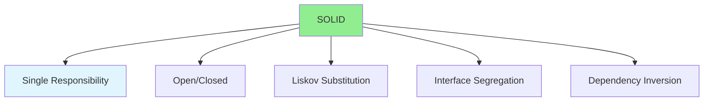

# 03.08 SOLID Principles: Design / Nguyên tắc SOLID: Thiết kế

## Table of Contents / Mục lục
1. [Introduction / Giới thiệu](#introduction--giới-thiệu)
2. [SOLID Principles / Nguyên tắc SOLID](#solid-principles--nguyên-tắc-solid)
3. [Implementation Examples / Ví dụ triển khai](#implementation-examples--ví-dụ-triển-khai)
4. [Best Practices / Thực hành tốt nhất](#best-practices--thực-hành-tốt-nhất)
5. [Summary / Tóm tắt](#summary--tóm-tắt)

---

## Introduction / Giới thiệu

### Overview / Tổng quan

**English**: SOLID principles guide object-oriented design. Learn Single Responsibility, Open/Closed, Liskov Substitution, Interface Segregation, and Dependency Inversion.

**Vietnamese**: Nguyên tắc SOLID hướng dẫn thiết kế hướng đối tượng. Học Trách nhiệm đơn, Mở/Đóng, Thay thế Liskov, Phân tách Interface và Đảo ngược phụ thuộc.

### SOLID Principles / Nguyên tắc SOLID



---

## SOLID Principles / Nguyên tắc SOLID

### Example 1: Single Responsibility Principle / Ví dụ 1: Nguyên tắc trách nhiệm đơn

```typescript
// Violates SRP / Vi phạm SRP
class User {
  name: string;
  email: string;
  
  save(): void {
    // Database logic / Logic database
  }
  
  sendEmail(): void {
    // Email logic / Logic email
  }
  
  validate(): boolean {
    // Validation logic / Logic xác thực
  }
}

// Follows SRP / Tuân theo SRP
class User {
  name: string;
  email: string;
}

class UserRepository {
  save(user: User): void {
    // Database logic only / Chỉ logic database
  }
}

class EmailService {
  sendEmail(user: User): void {
    // Email logic only / Chỉ logic email
  }
}

class UserValidator {
  validate(user: User): boolean {
    // Validation logic only / Chỉ logic xác thực
  }
}
```

### Example 2: Open/Closed Principle / Ví dụ 2: Nguyên tắc mở/đóng

```typescript
// Violates OCP / Vi phạm OCP
class AreaCalculator {
  calculate(shape: any): number {
    if (shape.type === 'circle') {
      return Math.PI * shape.radius ** 2;
    } else if (shape.type === 'rectangle') {
      return shape.width * shape.height;
    }
    // Must modify for new shapes / Phải sửa cho hình mới
  }
}

// Follows OCP / Tuân theo OCP
interface Shape {
  area(): number;
}

class Circle implements Shape {
  constructor(private radius: number) {}
  area(): number {
    return Math.PI * this.radius ** 2;
  }
}

class Rectangle implements Shape {
  constructor(private width: number, private height: number) {}
  area(): number {
    return this.width * this.height;
  }
}

class AreaCalculator {
  calculate(shape: Shape): number {
    return shape.area(); // Open for extension / Mở cho mở rộng
  }
}
```

### Example 3: Liskov Substitution Principle / Ví dụ 3: Nguyên tắc thay thế Liskov

```typescript
// Violates LSP / Vi phạm LSP
class Rectangle {
  width: number;
  height: number;
  
  setWidth(width: number) { this.width = width; }
  setHeight(height: number) { this.height = height; }
}

class Square extends Rectangle {
  setWidth(width: number) {
    this.width = width;
    this.height = width; // Breaks rectangle behavior / Phá vỡ hành vi rectangle
  }
}

// Follows LSP / Tuân theo LSP
interface Shape {
  area(): number;
}

class Rectangle implements Shape {
  constructor(private width: number, private height: number) {}
  area(): number {
    return this.width * this.height;
  }
}

class Square implements Shape {
  constructor(private side: number) {}
  area(): number {
    return this.side ** 2;
  }
}
```

### Example 4: Interface Segregation Principle / Ví dụ 4: Nguyên tắc phân tách interface

```typescript
// Violates ISP / Vi phạm ISP
interface Worker {
  work(): void;
  eat(): void;
  sleep(): void;
}

class Human implements Worker {
  work() { }
  eat() { }
  sleep() { }
}

class Robot implements Worker {
  work() { }
  eat() { throw new Error('Robots don't eat'); } // Forced to implement / Bị ép triển khai
  sleep() { throw new Error('Robots don't sleep'); }
}

// Follows ISP / Tuân theo ISP
interface Workable {
  work(): void;
}

interface Eatable {
  eat(): void;
}

interface Sleepable {
  sleep(): void;
}

class Human implements Workable, Eatable, Sleepable {
  work() { }
  eat() { }
  sleep() { }
}

class Robot implements Workable {
  work() { }
  // No need to implement eat/sleep / Không cần triển khai eat/sleep
}
```

### Example 5: Dependency Inversion Principle / Ví dụ 5: Nguyên tắc đảo ngược phụ thuộc

```typescript
// Violates DIP / Vi phạm DIP
class MySQLDatabase {
  save(data: any): void { }
}

class UserService {
  private db = new MySQLDatabase(); // Depends on concrete class / Phụ thuộc lớp cụ thể
  
  saveUser(user: User): void {
    this.db.save(user);
  }
}

// Follows DIP / Tuân theo DIP
interface Database {
  save(data: any): void;
}

class MySQLDatabase implements Database {
  save(data: any): void { }
}

class PostgreSQLDatabase implements Database {
  save(data: any): void { }
}

class UserService {
  constructor(private db: Database) {} // Depends on abstraction / Phụ thuộc abstraction
  
  saveUser(user: User): void {
    this.db.save(user);
  }
}
```

---

## Best Practices / Thực hành tốt nhất

1. **Single Responsibility**: One class, one reason to change
2. **Open/Closed**: Open for extension, closed for modification
3. **Liskov Substitution**: Subtypes must be substitutable
4. **Interface Segregation**: Many specific interfaces
5. **Dependency Inversion**: Depend on abstractions

---

## Summary / Tóm tắt

### Key Takeaways / Điểm chính

- **S**: Single Responsibility - One class, one job
- **O**: Open/Closed - Extend, don't modify
- **L**: Liskov Substitution - Subtypes work as base
- **I**: Interface Segregation - Small, specific interfaces
- **D**: Dependency Inversion - Depend on abstractions

### Next Steps / Bước tiếp theo

- [03.09 Naming & Comments](./03.09_Naming_Comments_Self_Documenting.md) - Next: Naming

---

**Last Updated / Cập nhật lần cuối**: 2024

