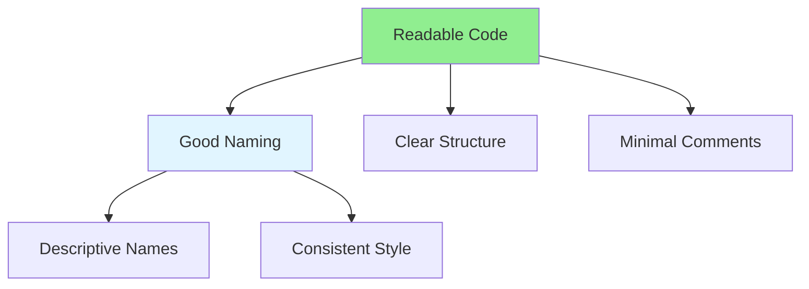

# 03.09 Naming & Comments: Self-Documenting Code / Đặt tên & Comment: Code tự mô tả

## Table of Contents / Mục lục
1. [Introduction / Giới thiệu](#introduction--giới-thiệu)
2. [Naming Conventions / Quy ước đặt tên](#naming-conventions--quy-ước-đặt-tên)
3. [Comments / Comment](#comments--comment)
4. [Self-Documenting Code / Code tự mô tả](#self-documenting-code--code-tự-mô-tả)
5. [Best Practices / Thực hành tốt nhất](#best-practices--thực-hành-tốt-nhất)
6. [Summary / Tóm tắt](#summary--tóm-tắt)

---

## Introduction / Giới thiệu

### Overview / Tổng quan

**English**: Good naming and minimal comments make code self-documenting. Learn naming conventions and when to use comments effectively.

**Vietnamese**: Đặt tên tốt và comment tối thiểu làm code tự mô tả. Học quy ước đặt tên và khi nào sử dụng comment hiệu quả.

### Code Readability Factors / Yếu tố khả năng đọc code



---

## Naming Conventions / Quy ước đặt tên

### Example 1: Good Naming / Ví dụ 1: Đặt tên tốt

```typescript
// Bad naming / Đặt tên xấu
function calc(x: number, y: number): number {
  return x * y;
}

const d = new Date();
const u = getUserById(1);

// Good naming / Đặt tên tốt
function calculateArea(width: number, height: number): number {
  return width * height;
}

const currentDate = new Date();
const user = getUserById(1);

// Descriptive variable names / Tên biến mô tả
const isUserActive = user.status === 'active';
const hasPermission = user.roles.includes('admin');
const userCount = users.length;
```

### Example 2: Function Naming / Ví dụ 2: Đặt tên hàm

```typescript
// Bad / Xấu
function process(data: any): any {
  // What does it process? / Nó xử lý gì?
}

function get(): User[] {
  // Get what? / Lấy gì?
}

// Good / Tốt
function processUserRegistration(userData: UserRegistrationData): User {
  // Clear purpose / Mục đích rõ ràng
}

function getActiveUsers(): User[] {
  // Clear what it returns / Rõ ràng nó trả về gì
}

// Boolean functions / Hàm boolean
function isEmailValid(email: string): boolean { }
function hasPermission(user: User, permission: string): boolean { }
function canAccess(user: User, resource: string): boolean { }
```

---

## Comments / Comment

### Example 3: When to Comment / Ví dụ 3: Khi nào comment

```typescript
// Bad - Commenting obvious code / Xấu - Comment code hiển nhiên
// Increment counter by 1
counter++;

// Good - Comment complex logic / Tốt - Comment logic phức tạp
// Use binary search because array is sorted and we need O(log n) performance
const index = binarySearch(sortedArray, target);

// Bad - Comment instead of fixing code / Xấu - Comment thay vì sửa code
// TODO: Fix this bug
function brokenFunction() { }

// Good - Explain why, not what / Tốt - Giải thích tại sao, không phải gì
// Using setTimeout to debounce rapid API calls and prevent rate limiting
setTimeout(() => fetchData(), 300);
```

---

## Self-Documenting Code / Code tự mô tả

### Example 4: Self-Documenting Examples / Ví dụ 4: Ví dụ tự mô tả

```typescript
// Self-documenting code / Code tự mô tả
class UserAccount {
  private emailAddress: string;
  private accountBalance: number;
  private isAccountActive: boolean;
  
  public activateAccount(): void {
    this.isAccountActive = true;
  }
  
  public deactivateAccount(): void {
    this.isAccountActive = false;
  }
  
  public addFunds(amount: number): void {
    if (amount > 0) {
      this.accountBalance += amount;
    }
  }
  
  public withdrawFunds(amount: number): boolean {
    if (this.isAccountActive && amount > 0 && amount <= this.accountBalance) {
      this.accountBalance -= amount;
      return true;
    }
    return false;
  }
}
```

---

## Best Practices / Thực hành tốt nhất

1. **Use descriptive names** - Names should explain purpose
2. **Be consistent** - Follow team conventions
3. **Avoid abbreviations** - Unless widely understood
4. **Comment why, not what** - Code should explain what
5. **Keep comments updated** - Outdated comments mislead

---

## Summary / Tóm tắt

### Key Takeaways / Điểm chính

- **Naming**: Descriptive, consistent names
- **Comments**: Explain why, not what
- **Self-documenting**: Code should read like prose
- **Consistency**: Follow team conventions
- **Clarity**: Make intent clear

### Next Steps / Bước tiếp theo

- [03.10 Refactoring](./03.10_Refactoring_Improve_Code.md) - Next: Refactoring

---

**Last Updated / Cập nhật lần cuối**: 2024

