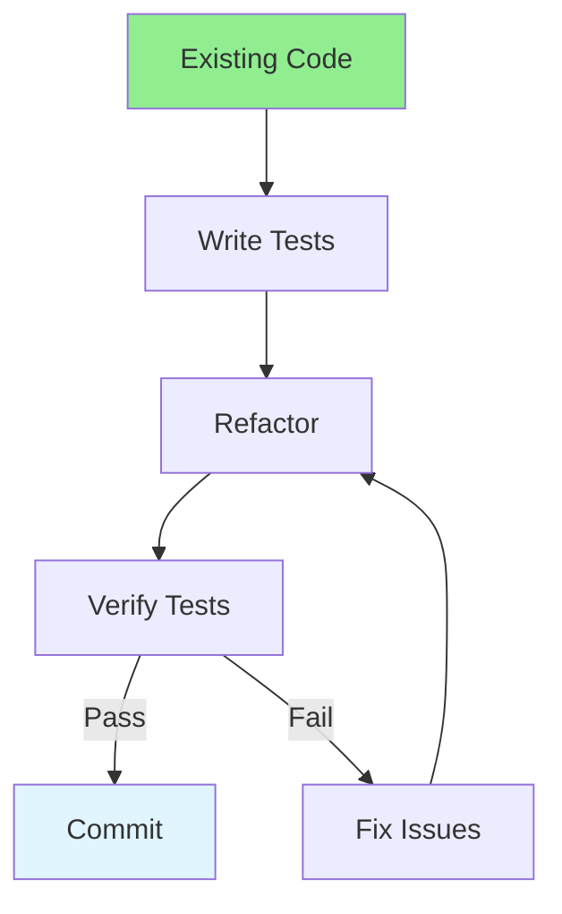

# 03.10 Refactoring: Improve Code / Refactoring: Cải thiện code

## Table of Contents / Mục lục
1. [Introduction / Giới thiệu](#introduction--giới-thiệu)
2. [Refactoring Techniques / Kỹ thuật refactoring](#refactoring-techniques--kỹ-thuật-refactoring)
3. [Refactoring Process / Quy trình refactoring](#refactoring-process--quy-trình-refactoring)
4. [Best Practices / Thực hành tốt nhất](#best-practices--thực-hành-tốt-nhất)
5. [Summary / Tóm tắt](#summary--tóm-tắt)

---

## Introduction / Giới thiệu

### Overview / Tổng quan

**English**: Refactoring improves code structure without changing behavior. Learn refactoring techniques to make code more maintainable and readable.

**Vietnamese**: Refactoring cải thiện cấu trúc code mà không thay đổi hành vi. Học kỹ thuật refactoring để làm code dễ bảo trì và đọc hơn.

### Refactoring Process / Quy trình refactoring



---

## Refactoring Techniques / Kỹ thuật refactoring

### Example 1: Extract Function / Ví dụ 1: Trích xuất hàm

```typescript
// Before / Trước
function processOrder(order: Order) {
  // Calculate tax / Tính thuế
  let tax = 0;
  if (order.items.length > 0) {
    const subtotal = order.items.reduce((sum, item) => sum + item.price, 0);
    tax = subtotal * 0.1;
  }
  
  // Calculate shipping / Tính phí vận chuyển
  let shipping = 0;
  if (order.items.length > 0) {
    const totalWeight = order.items.reduce((sum, item) => sum + item.weight, 0);
    shipping = totalWeight * 0.5;
  }
  
  order.total = order.items.reduce((sum, item) => sum + item.price, 0) + tax + shipping;
}

// After refactoring / Sau refactoring
function calculateTax(items: OrderItem[]): number {
  if (items.length === 0) return 0;
  const subtotal = items.reduce((sum, item) => sum + item.price, 0);
  return subtotal * 0.1;
}

function calculateShipping(items: OrderItem[]): number {
  if (items.length === 0) return 0;
  const totalWeight = items.reduce((sum, item) => sum + item.weight, 0);
  return totalWeight * 0.5;
}

function processOrder(order: Order) {
  const subtotal = order.items.reduce((sum, item) => sum + item.price, 0);
  const tax = calculateTax(order.items);
  const shipping = calculateShipping(order.items);
  order.total = subtotal + tax + shipping;
}
```

### Example 2: Rename Variable / Ví dụ 2: Đổi tên biến

```typescript
// Before / Trước
function getUserData(id: number) {
  const d = fetchUser(id);
  const u = processUser(d);
  return u;
}

// After / Sau
function getUserData(id: number) {
  const rawUserData = fetchUser(id);
  const processedUser = processUser(rawUserData);
  return processedUser;
}
```

### Example 3: Replace Magic Numbers / Ví dụ 3: Thay số ma thuật

```typescript
// Before / Trước
function calculateDiscount(price: number): number {
  if (price > 100) {
    return price * 0.1; // What is 0.1? / 0.1 là gì?
  }
  return price * 0.05; // What is 0.05? / 0.05 là gì?
}

// After / Sau
const DISCOUNT_RATE_HIGH = 0.1;
const DISCOUNT_RATE_LOW = 0.05;
const DISCOUNT_THRESHOLD = 100;

function calculateDiscount(price: number): number {
  if (price > DISCOUNT_THRESHOLD) {
    return price * DISCOUNT_RATE_HIGH;
  }
  return price * DISCOUNT_RATE_LOW;
}
```

---

## Best Practices / Thực hành tốt nhất

1. **Write tests first** - Ensure behavior doesn't change
2. **Small steps** - Refactor incrementally
3. **Run tests often** - Verify after each change
4. **One thing at a time** - Focus on one improvement
5. **Commit frequently** - Save working state

---

## Summary / Tóm tắt

### Key Takeaways / Điểm chính

- **Refactoring**: Improve structure without changing behavior
- **Tests first**: Write tests before refactoring
- **Small steps**: Refactor incrementally
- **Verify**: Run tests after each change
- **Benefits**: More maintainable, readable code

### Next Steps / Bước tiếp theo

- [03.11 Code Smell](./03.11_Code_Smell_Identify_Bad_Code.md) - Next: Code Smell

---

**Last Updated / Cập nhật lần cuối**: 2024

