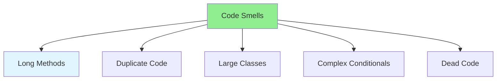

# 03.11 Code Smell: Identify Bad Code / Code Smell: Xác định code xấu

## Table of Contents / Mục lục
1. [Introduction / Giới thiệu](#introduction--giới-thiệu)
2. [Common Code Smells / Code smell phổ biến](#common-code-smells--code-smell-phổ-biến)
3. [How to Identify / Cách xác định](#how-to-identify--cách-xác-định)
4. [Best Practices / Thực hành tốt nhất](#best-practices--thực-hành-tốt-nhất)
5. [Summary / Tóm tắt](#summary--tóm-tắt)

---

## Introduction / Giới thiệu

### Overview / Tổng quan

**English**: Code smells indicate potential problems. Learn to identify common code smells and refactor them for better code quality.

**Vietnamese**: Code smell chỉ ra vấn đề tiềm ẩn. Học cách xác định code smell phổ biến và refactor chúng để có chất lượng code tốt hơn.

### Code Smell Categories / Danh mục code smell



---

## Common Code Smells / Code smell phổ biến

### Example 1: Long Method / Ví dụ 1: Phương thức dài

```typescript
// Code smell: Long method / Code smell: Phương thức dài
function processOrder(order: Order): void {
  // 100+ lines of code / 100+ dòng code
  // Validates order
  if (!order.items || order.items.length === 0) {
    throw new Error('Order must have items');
  }
  // ... 50 more lines of validation
  
  // Calculates prices
  let total = 0;
  for (const item of order.items) {
    // ... complex calculation
  }
  // ... 30 more lines
  
  // Saves to database
  // ... 20 more lines
}

// Refactored / Đã refactor
function processOrder(order: Order): void {
  validateOrder(order);
  calculateOrderTotal(order);
  saveOrder(order);
}
```

### Example 2: Duplicate Code / Ví dụ 2: Code trùng lặp

```typescript
// Code smell: Duplicate code / Code smell: Code trùng lặp
function validateUser(user: User): void {
  if (!user.name || user.name.length < 2) {
    throw new Error('Invalid name');
  }
  if (!user.email || !user.email.includes('@')) {
    throw new Error('Invalid email');
  }
}

function validateAdmin(admin: Admin): void {
  if (!admin.name || admin.name.length < 2) {
    throw new Error('Invalid name');
  }
  if (!admin.email || !admin.email.includes('@')) {
    throw new Error('Invalid email');
  }
}

// Refactored / Đã refactor
function validateName(name: string): void {
  if (!name || name.length < 2) {
    throw new Error('Invalid name');
  }
}

function validateEmail(email: string): void {
  if (!email || !email.includes('@')) {
    throw new Error('Invalid email');
  }
}
```

### Example 3: Large Class / Ví dụ 3: Lớp lớn

```typescript
// Code smell: Large class / Code smell: Lớp lớn
class UserManager {
  // 500+ lines / 500+ dòng
  // Handles user creation, validation, email, database, caching, etc.
  // Xử lý tạo user, xác thực, email, database, cache, v.v.
}

// Refactored / Đã refactor
class UserService {
  constructor(
    private validator: UserValidator,
    private repository: UserRepository,
    private emailService: EmailService
  ) {}
}
```

---

## How to Identify / Cách xác định

### Example 4: Identifying Code Smells / Ví dụ 4: Xác định code smell

```typescript
// Signs of code smells / Dấu hiệu code smell
// 1. Long methods (> 20 lines) / Phương thức dài (> 20 dòng)
// 2. Many parameters (> 3) / Nhiều tham số (> 3)
// 3. Deep nesting (> 3 levels) / Lồng nhau sâu (> 3 cấp)
// 4. Magic numbers / Số ma thuật
// 5. Comments explaining what code does / Comment giải thích code làm gì

// Example / Ví dụ
function calculate(price: number, qty: number, discount: number, tax: number, shipping: number): number {
  // Too many parameters / Quá nhiều tham số
  return (price * qty * (1 - discount) * (1 + tax)) + shipping;
}

// Refactored / Đã refactor
interface CalculationParams {
  price: number;
  quantity: number;
  discount: number;
  tax: number;
  shipping: number;
}

function calculate(params: CalculationParams): number {
  return (params.price * params.quantity * (1 - params.discount) * (1 + params.tax)) + params.shipping;
}
```

---

## Best Practices / Thực hành tốt nhất

1. **Keep methods short** - < 20 lines ideally
2. **Eliminate duplication** - Extract common code
3. **Reduce parameters** - Use objects for many params
4. **Avoid deep nesting** - Extract methods
5. **Use meaningful names** - Self-documenting code

---

## Summary / Tóm tắt

### Key Takeaways / Điểm chính

- **Code smells**: Indicators of potential problems
- **Common smells**: Long methods, duplication, large classes
- **Identify**: Look for patterns that indicate issues
- **Refactor**: Fix smells to improve code quality
- **Prevent**: Write clean code from start

### Next Steps / Bước tiếp theo

- [03.12 String Operations Optimization](./03.12_String_Operations_Optimization.md) - Next: String Optimization

---

**Last Updated / Cập nhật lần cuối**: 2024


