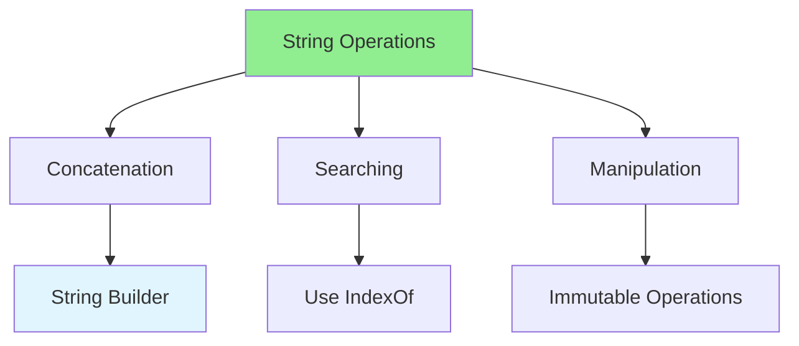

# 03.12 String Operations: Optimization / Thao tác chuỗi: Tối ưu

## Table of Contents / Mục lục
1. [Introduction / Giới thiệu](#introduction--giới-thiệu)
2. [String Optimization Techniques / Kỹ thuật tối ưu chuỗi](#string-optimization-techniques--kỹ-thuật-tối-ưu-chuỗi)
3. [Best Practices / Thực hành tốt nhất](#best-practices--thực-hành-tốt-nhất)
4. [Summary / Tóm tắt](#summary--tóm-tắt)

---

## Introduction / Giới thiệu

### Overview / Tổng quan

**English**: String operations can be expensive. Learn to optimize string concatenation, manipulation, and searching for better performance.

**Vietnamese**: Thao tác chuỗi có thể tốn kém. Học cách tối ưu nối chuỗi, thao tác và tìm kiếm để có hiệu suất tốt hơn.

### String Optimization Techniques / Kỹ thuật tối ưu chuỗi



---

## String Optimization Techniques / Kỹ thuật tối ưu chuỗi

### Example 1: String Concatenation / Ví dụ 1: Nối chuỗi

```typescript
// Slow - String concatenation in loop / Chậm - Nối chuỗi trong vòng lặp
function buildString(arr: string[]): string {
  let result = '';
  for (const str of arr) {
    result += str; // Creates new string each time / Tạo chuỗi mới mỗi lần
  }
  return result;
}

// Fast - Array join / Nhanh - Nối mảng
function buildStringOptimized(arr: string[]): string {
  return arr.join(''); // Single operation / Một thao tác
}

// Template literals / Template literals
const name = 'John';
const age = 30;
const message = `Name: ${name}, Age: ${age}`; // Efficient / Hiệu quả
```

### Example 2: String Searching / Ví dụ 2: Tìm kiếm chuỗi

```typescript
// Slow - Includes in loop / Chậm - Includes trong vòng lặp
function findStrings(arr: string[], search: string): string[] {
  return arr.filter(str => str.includes(search));
}

// Fast - Pre-compile regex / Nhanh - Biên dịch regex trước
function findStringsOptimized(arr: string[], search: string): string[] {
  const regex = new RegExp(search, 'i'); // Compile once / Biên dịch một lần
  return arr.filter(str => regex.test(str));
}

// Use indexOf for simple checks / Sử dụng indexOf cho kiểm tra đơn giản
function contains(str: string, search: string): boolean {
  return str.indexOf(search) !== -1; // Faster than includes for simple cases
}
```

---

## Best Practices / Thực hành tốt nhất

1. **Use join()** - For array concatenation
2. **Template literals** - For string interpolation
3. **Cache regex** - Compile regex once
4. **Use indexOf** - For simple searches
5. **Avoid repeated operations** - Cache results

---

## Summary / Tóm tắt

### Key Takeaways / Điểm chính

- **Join**: Use array.join() for concatenation
- **Template literals**: Efficient interpolation
- **Cache regex**: Compile once, reuse
- **indexOf**: Fast simple searches
- **Avoid loops**: Use built-in methods

### Next Steps / Bước tiếp theo

- [03.13 Array & Collection Optimization](./03.13_Array_Collection_Optimization.md) - Next: Array Optimization

---

**Last Updated / Cập nhật lần cuối**: 2024


