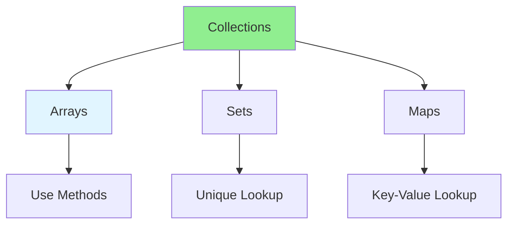

# 03.13 Array & Collection: Optimization / Mảng & Collection: Tối ưu

## Table of Contents / Mục lục
1. [Introduction / Giới thiệu](#introduction--giới-thiệu)
2. [Array Optimization / Tối ưu mảng](#array-optimization--tối-ưu-mảng)
3. [Collection Optimization / Tối ưu collection](#collection-optimization--tối-ưu-collection)
4. [Best Practices / Thực hành tốt nhất](#best-practices--thực-hành-tốt-nhất)
5. [Summary / Tóm tắt](#summary--tóm-tắt)

---

## Introduction / Giới thiệu

### Overview / Tổng quan

**English**: Array and collection operations impact performance. Learn to optimize array methods, use appropriate data structures, and avoid common pitfalls.

**Vietnamese**: Thao tác mảng và collection ảnh hưởng hiệu suất. Học cách tối ưu phương thức mảng, sử dụng cấu trúc dữ liệu phù hợp và tránh lỗi phổ biến.

### Collection Optimization Techniques / Kỹ thuật tối ưu collection



---

## Array Optimization / Tối ưu mảng

### Example 1: Efficient Array Methods / Ví dụ 1: Phương thức mảng hiệu quả

```typescript
// Use appropriate methods / Sử dụng phương thức phù hợp
const numbers = [1, 2, 3, 4, 5];

// For simple iteration / Cho lặp đơn giản
numbers.forEach(num => console.log(num));

// For transformation / Cho chuyển đổi
const doubled = numbers.map(num => num * 2);

// For filtering / Cho lọc
const evens = numbers.filter(num => num % 2 === 0);

// For finding / Cho tìm
const found = numbers.find(num => num > 3);

// For checking / Cho kiểm tra
const hasEven = numbers.some(num => num % 2 === 0);
const allPositive = numbers.every(num => num > 0);

// For reducing / Cho giảm
const sum = numbers.reduce((acc, num) => acc + num, 0);
```

### Example 2: Avoid Unnecessary Operations / Ví dụ 2: Tránh thao tác không cần thiết

```typescript
// Slow - Multiple passes / Chậm - Nhiều lần duyệt
function processNumbers(numbers: number[]): number[] {
  const filtered = numbers.filter(n => n > 0);
  const doubled = filtered.map(n => n * 2);
  const sorted = doubled.sort((a, b) => a - b);
  return sorted; // 3 passes / 3 lần duyệt
}

// Fast - Single pass / Nhanh - Một lần duyệt
function processNumbersOptimized(numbers: number[]): number[] {
  const result: number[] = [];
  for (const num of numbers) {
    if (num > 0) {
      result.push(num * 2);
    }
  }
  result.sort((a, b) => a - b);
  return result; // 2 passes / 2 lần duyệt
}
```

---

## Collection Optimization / Tối ưu collection

### Example 3: Use Sets for Lookups / Ví dụ 3: Sử dụng Set cho tra cứu

```typescript
// Slow - Array lookup / Chậm - Tra cứu mảng
function hasItem(arr: number[], item: number): boolean {
  return arr.includes(item); // O(n)
}

// Fast - Set lookup / Nhanh - Tra cứu Set
const numberSet = new Set([1, 2, 3, 4, 5]);
function hasItemFast(item: number): boolean {
  return numberSet.has(item); // O(1)
}
```

### Example 4: Use Maps for Key-Value / Ví dụ 4: Sử dụng Map cho Key-Value

```typescript
// Slow - Array of objects / Chậm - Mảng objects
function findUserById(users: User[], id: string): User | undefined {
  return users.find(user => user.id === id); // O(n)
}

// Fast - Map lookup / Nhanh - Tra cứu Map
const userMap = new Map<string, User>();
users.forEach(user => userMap.set(user.id, user));

function findUserByIdFast(id: string): User | undefined {
  return userMap.get(id); // O(1)
}
```

---

## Best Practices / Thực hành tốt nhất

1. **Use appropriate methods** - map, filter, reduce, etc.
2. **Minimize passes** - Combine operations when possible
3. **Use Sets** - For membership checks
4. **Use Maps** - For key-value lookups
5. **Cache results** - Avoid repeated calculations

---

## Summary / Tóm tắt

### Key Takeaways / Điểm chính

- **Array methods**: Use map, filter, reduce appropriately
- **Minimize passes**: Combine operations
- **Sets**: O(1) membership checks
- **Maps**: O(1) key-value lookups
- **Cache**: Store computed results

### Next Steps / Bước tiếp theo

- [03.14 Algorithm Optimization](./03.14_Algorithm_Optimization_Techniques.md) - Next: Algorithm Optimization

---

**Last Updated / Cập nhật lần cuối**: 2024


