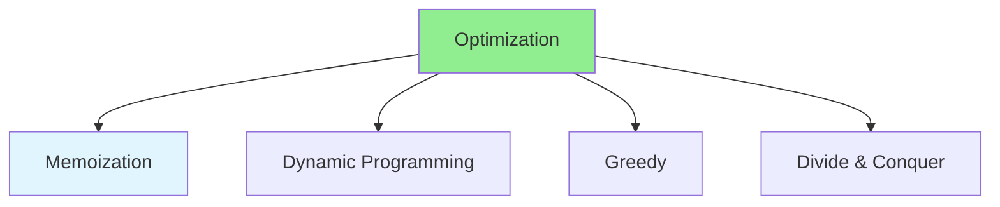

# 03.14 Algorithm Optimization: Techniques / Tối ưu thuật toán: Kỹ thuật

## Table of Contents / Mục lục
1. [Introduction / Giới thiệu](#introduction--giới-thiệu)
2. [Optimization Techniques / Kỹ thuật tối ưu](#optimization-techniques--kỹ-thuật-tối-ưu)
3. [Common Patterns / Mẫu phổ biến](#common-patterns--mẫu-phổ-biến)
4. [Best Practices / Thực hành tốt nhất](#best-practices--thực-hành-tốt-nhất)
5. [Summary / Tóm tắt](#summary--tóm-tắt)

---

## Introduction / Giới thiệu

### Overview / Tổng quan

**English**: Algorithm optimization improves performance. Learn techniques like memoization, dynamic programming, and greedy algorithms.

**Vietnamese**: Tối ưu thuật toán cải thiện hiệu suất. Học kỹ thuật như memoization, dynamic programming và thuật toán tham lam.

### Algorithm Optimization Techniques / Kỹ thuật tối ưu thuật toán



---

## Optimization Techniques / Kỹ thuật tối ưu

### Example 1: Memoization / Ví dụ 1: Memoization

```typescript
// Slow - Recursive without memoization / Chậm - Đệ quy không memoization
function fibonacci(n: number): number {
  if (n <= 1) return n;
  return fibonacci(n - 1) + fibonacci(n - 2); // Recalculates / Tính lại
}

// Fast - With memoization / Nhanh - Với memoization
const memo = new Map<number, number>();

function fibonacciMemo(n: number): number {
  if (n <= 1) return n;
  if (memo.has(n)) return memo.get(n)!;
  
  const result = fibonacciMemo(n - 1) + fibonacciMemo(n - 2);
  memo.set(n, result);
  return result;
}
```

### Example 2: Dynamic Programming / Ví dụ 2: Dynamic Programming

```typescript
// Dynamic programming - Bottom up / Dynamic programming - Từ dưới lên
function fibonacciDP(n: number): number {
  if (n <= 1) return n;
  
  const dp = [0, 1];
  for (let i = 2; i <= n; i++) {
    dp[i] = dp[i - 1] + dp[i - 2];
  }
  return dp[n];
}

// Space optimized / Tối ưu không gian
function fibonacciOptimized(n: number): number {
  if (n <= 1) return n;
  
  let prev = 0, curr = 1;
  for (let i = 2; i <= n; i++) {
    const next = prev + curr;
    prev = curr;
    curr = next;
  }
  return curr;
}
```

### Example 3: Two Pointers / Ví dụ 3: Hai con trỏ

```typescript
// Two pointers technique / Kỹ thuật hai con trỏ
function findPair(arr: number[], target: number): [number, number] | null {
  arr.sort((a, b) => a - b);
  let left = 0, right = arr.length - 1;
  
  while (left < right) {
    const sum = arr[left] + arr[right];
    if (sum === target) {
      return [arr[left], arr[right]];
    } else if (sum < target) {
      left++;
    } else {
      right--;
    }
  }
  return null;
}
```

---

## Best Practices / Thực hành tốt nhất

1. **Identify bottlenecks** - Profile to find slow parts
2. **Choose right algorithm** - Based on data size
3. **Use memoization** - For repeated calculations
4. **Consider space-time tradeoff** - Balance memory and speed
5. **Test optimizations** - Measure actual improvements

---

## Summary / Tóm tắt

### Key Takeaways / Điểm chính

- **Memoization**: Cache computed results
- **Dynamic Programming**: Build solution from subproblems
- **Two Pointers**: Efficient array traversal
- **Greedy**: Make locally optimal choices
- **Measure**: Test actual performance gains

### Next Steps / Bước tiếp theo

- [03.15 Performance Profiling](./03.15_Performance_Profiling_Measurement.md) - Next: Performance Profiling

---

**Last Updated / Cập nhật lần cuối**: 2024

