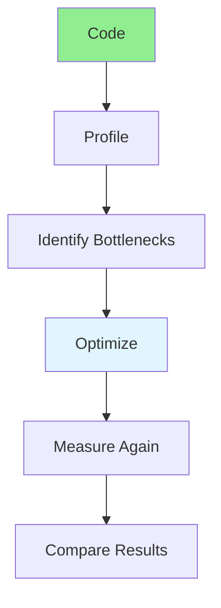

# 03.15 Performance Profiling: Measurement / Đo hiệu suất: Đo lường

## Table of Contents / Mục lục
1. [Introduction / Giới thiệu](#introduction--giới-thiệu)
2. [Profiling Tools / Công cụ profiling](#profiling-tools--công-cụ-profiling)
3. [Measurement Techniques / Kỹ thuật đo lường](#measurement-techniques--kỹ-thuật-đo-lường)
4. [Best Practices / Thực hành tốt nhất](#best-practices--thực-hành-tốt-nhất)
5. [Summary / Tóm tắt](#summary--tóm-tắt)

---

## Introduction / Giới thiệu

### Overview / Tổng quan

**English**: Performance profiling identifies bottlenecks. Learn to measure and profile code to find optimization opportunities.

**Vietnamese**: Đo hiệu suất xác định điểm nghẽn. Học cách đo và profile code để tìm cơ hội tối ưu.

### Performance Profiling Process / Quy trình đo hiệu suất



---

## Profiling Tools / Công cụ profiling

### Example 1: Performance API / Ví dụ 1: Performance API

```typescript
// Performance measurement / Đo hiệu suất
function measurePerformance(fn: () => void): number {
  const start = performance.now();
  fn();
  const end = performance.now();
  return end - start;
}

// Benchmark function / Hàm benchmark
function benchmark(fn: () => void, iterations: number = 1000): {
  avg: number;
  min: number;
  max: number;
} {
  const times: number[] = [];
  
  for (let i = 0; i < iterations; i++) {
    const start = performance.now();
    fn();
    const end = performance.now();
    times.push(end - start);
  }
  
  return {
    avg: times.reduce((a, b) => a + b, 0) / times.length,
    min: Math.min(...times),
    max: Math.max(...times)
  };
}

// Usage / Sử dụng
const result = benchmark(() => {
  // Code to measure / Code cần đo
  processLargeArray(data);
});

console.log(`Average: ${result.avg}ms`);
console.log(`Min: ${result.min}ms`);
console.log(`Max: ${result.max}ms`);
```

### Example 2: Console Time / Ví dụ 2: Console Time

```typescript
// Console.time for quick measurements / Console.time cho đo nhanh
console.time('processData');
processData(data);
console.timeEnd('processData'); // Outputs: processData: 123.456ms

// Multiple timers / Nhiều timer
console.time('total');
console.time('step1');
step1();
console.timeEnd('step1');

console.time('step2');
step2();
console.timeEnd('step2');
console.timeEnd('total');
```

---

## Measurement Techniques / Kỹ thuật đo lường

### Example 3: Memory Profiling / Ví dụ 3: Profile bộ nhớ

```typescript
// Memory usage / Sử dụng bộ nhớ
function getMemoryUsage(): number {
  if (performance.memory) {
    return performance.memory.usedJSHeapSize;
  }
  return 0;
}

function measureMemory(fn: () => void): number {
  const before = getMemoryUsage();
  fn();
  const after = getMemoryUsage();
  return after - before;
}

// Usage / Sử dụng
const memoryUsed = measureMemory(() => {
  processLargeData(data);
});
console.log(`Memory used: ${(memoryUsed / 1024 / 1024).toFixed(2)} MB`);
```

---

## Best Practices / Thực hành tốt nhất

1. **Measure before optimizing** - Know baseline
2. **Profile in production-like environment** - Real conditions
3. **Measure multiple times** - Average results
4. **Focus on bottlenecks** - Optimize slowest parts
5. **Document improvements** - Track performance gains

---

## Summary / Tóm tắt

### Key Takeaways / Điểm chính

- **Profiling**: Identify performance bottlenecks
- **Measurement**: Use performance.now() or console.time
- **Benchmarking**: Run multiple iterations
- **Memory**: Monitor memory usage
- **Optimize**: Focus on measured bottlenecks

### Next Steps / Bước tiếp theo

- ✅ Complete Group 03: Algorithm Analysis
- Move to [Group 04: Requirements Research](../Group-04-Requirements-Research/) - Coming next

---

**Last Updated / Cập nhật lần cuối**: 2024

