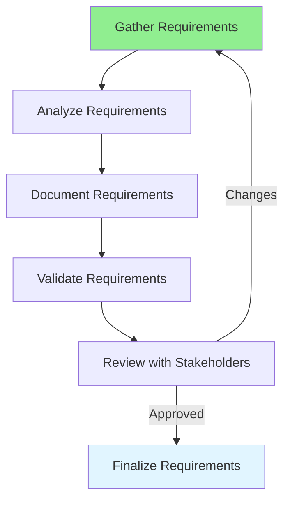

# 04.01 Business Requirements Analysis / Phân tích yêu cầu nghiệp vụ

## Table of Contents / Mục lục
1. [Introduction / Giới thiệu](#introduction--giới-thiệu)
2. [Requirements Analysis Process / Quy trình phân tích yêu cầu](#requirements-analysis-process--quy-trình-phân-tích-yêu-cầu)
3. [Techniques / Kỹ thuật](#techniques--kỹ-thuật)
4. [Best Practices / Thực hành tốt nhất](#best-practices--thực-hành-tốt-nhất)
5. [Summary / Tóm tắt](#summary--tóm-tắt)

---

## Introduction / Giới thiệu

### Overview / Tổng quan

**English**: Business requirements analysis identifies what the system must do. Learn to analyze, document, and validate business requirements effectively.

**Vietnamese**: Phân tích yêu cầu nghiệp vụ xác định hệ thống phải làm gì. Học cách phân tích, tài liệu hóa và xác thực yêu cầu nghiệp vụ hiệu quả.

### Business Requirements Analysis Process / Quy trình phân tích yêu cầu nghiệp vụ



---

## Requirements Analysis Process / Quy trình phân tích yêu cầu

### Example 1: Requirements Gathering / Ví dụ 1: Thu thập yêu cầu

```typescript
// Requirements template / Mẫu yêu cầu
interface BusinessRequirement {
  id: string;
  title: string;
  description: string;
  priority: 'high' | 'medium' | 'low';
  stakeholders: string[];
  acceptanceCriteria: string[];
  businessValue: string;
  dependencies: string[];
}

// Example requirement / Ví dụ yêu cầu
const userRegistrationRequirement: BusinessRequirement = {
  id: 'REQ-001',
  title: 'User Registration',
  description: 'Users must be able to register for an account',
  priority: 'high',
  stakeholders: ['Product Owner', 'Business Analyst', 'End Users'],
  acceptanceCriteria: [
    'User can register with email and password',
    'Email must be validated',
    'Password must meet security requirements',
    'User receives confirmation email'
  ],
  businessValue: 'Enables user onboarding and account creation',
  dependencies: ['Email service', 'Database']
};
```

### Example 2: Requirements Documentation / Ví dụ 2: Tài liệu yêu cầu

```markdown
# Business Requirement: User Registration

## Requirement ID
REQ-001

## Description
The system shall allow new users to create an account by providing email and password.

## Business Value
- Enable user onboarding
- Create user base for the application
- Support authentication and authorization

## Functional Requirements
1. User can enter email address
2. User can enter password
3. System validates email format
4. System validates password strength
5. System creates user account
6. System sends confirmation email

## Non-Functional Requirements
- Registration must complete within 3 seconds
- System must handle 1000 concurrent registrations
- Password must be encrypted

## Acceptance Criteria
- [ ] User can successfully register with valid email and password
- [ ] Invalid email format is rejected
- [ ] Weak password is rejected
- [ ] Confirmation email is sent
```

---

## Techniques / Kỹ thuật

### Example 3: Interviewing Stakeholders / Ví dụ 3: Phỏng vấn stakeholder

```typescript
// Interview questions template / Mẫu câu hỏi phỏng vấn
interface InterviewQuestions {
  background: string[];
  currentProcess: string[];
  painPoints: string[];
  desiredOutcome: string[];
  constraints: string[];
}

const questions: InterviewQuestions = {
  background: [
    'What is your role?',
    'How do you currently handle this process?'
  ],
  currentProcess: [
    'Can you walk me through the current process?',
    'What tools do you use?'
  ],
  painPoints: [
    'What problems do you face?',
    'What takes too long?',
    'What causes errors?'
  ],
  desiredOutcome: [
    'What would success look like?',
    'What would make your job easier?'
  ],
  constraints: [
    'Are there any limitations?',
    'What cannot be changed?'
  ]
};
```

---

## Best Practices / Thực hành tốt nhất

1. **Engage stakeholders** - Talk to all relevant parties
2. **Ask open questions** - Understand the why, not just what
3. **Document clearly** - Use clear, unambiguous language
4. **Validate early** - Confirm understanding with stakeholders
5. **Prioritize** - Focus on high-value requirements first

---

## Summary / Tóm tắt

### Key Takeaways / Điểm chính

- **Gather**: Collect requirements from all stakeholders
- **Analyze**: Understand business needs and constraints
- **Document**: Write clear, testable requirements
- **Validate**: Confirm with stakeholders
- **Prioritize**: Focus on high-value items

### Next Steps / Bước tiếp theo

- [04.02 User Story Understanding](./04.02_User_Story_Understanding.md) - Next: User Stories

---

**Last Updated / Cập nhật lần cuối**: 2024


