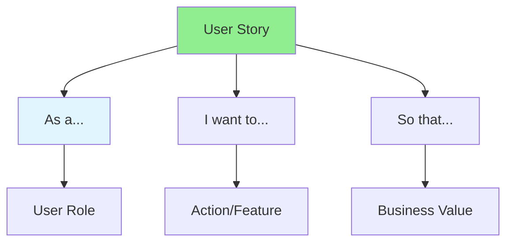

# 04.02 User Story: Understanding / User Story: Hiểu biết

## Table of Contents / Mục lục
1. [Introduction / Giới thiệu](#introduction--giới-thiệu)
2. [User Story Structure / Cấu trúc User Story](#user-story-structure--cấu-trúc-user-story)
3. [Writing User Stories / Viết User Story](#writing-user-stories--viết-user-story)
4. [Best Practices / Thực hành tốt nhất](#best-practices--thực-hành-tốt-nhất)
5. [Summary / Tóm tắt](#summary--tóm-tắt)

---

## Introduction / Giới thiệu

### Overview / Tổng quan

**English**: User stories describe features from the user's perspective. Learn to write effective user stories that guide development.

**Vietnamese**: User story mô tả tính năng từ góc nhìn người dùng. Học cách viết user story hiệu quả để hướng dẫn phát triển.

### User Story Components / Thành phần User Story



---

## User Story Structure / Cấu trúc User Story

### Example 1: Basic User Story / Ví dụ 1: User Story cơ bản

```markdown
# User Story Template / Mẫu User Story

As a [type of user]
I want to [perform an action]
So that [achieve a benefit]

## Example / Ví dụ

As a registered user
I want to reset my password
So that I can regain access to my account if I forget it
```

### Example 2: Detailed User Story / Ví dụ 2: User Story chi tiết

```markdown
# User Story: User Registration

## Story
As a new visitor
I want to create an account
So that I can access personalized features

## Acceptance Criteria
- [ ] User can enter email and password
- [ ] System validates email format
- [ ] System validates password strength (min 8 chars, uppercase, lowercase, number)
- [ ] User receives confirmation email
- [ ] User account is created in database

## Technical Notes
- Use email verification
- Hash password with bcrypt
- Send email via SMTP service

## Story Points
5

## Priority
High
```

---

## Writing User Stories / Viết User Story

### Example 3: Good vs Bad User Stories / Ví dụ 3: User Story tốt vs xấu

```markdown
# Bad User Story / User Story xấu

As a user
I want a login page
So that I can log in

## Problems / Vấn đề
- Too vague / Quá mơ hồ
- No clear value / Không có giá trị rõ ràng
- No acceptance criteria / Không có tiêu chí chấp nhận

# Good User Story / User Story tốt

As a registered user
I want to log in with my email and password
So that I can access my account and personal data

## Acceptance Criteria
- [ ] User can enter email and password
- [ ] System validates credentials
- [ ] User is redirected to dashboard on success
- [ ] User sees error message on failure
- [ ] Failed login attempts are logged
```

---

## Best Practices / Thực hành tốt nhất

1. **User perspective** - Write from user's viewpoint
2. **Clear value** - Explain the benefit
3. **Acceptance criteria** - Define what "done" means
4. **Independent** - Story should be implementable alone
5. **Testable** - Can be verified with tests

---

## Summary / Tóm tắt

### Key Takeaways / Điểm chính

- **Structure**: As a... I want... So that...
- **User-focused**: Written from user perspective
- **Value**: Clear business benefit
- **Criteria**: Specific acceptance criteria
- **Size**: Small enough to complete in sprint

### Next Steps / Bước tiếp theo

- [04.03 Acceptance Criteria](./04.03_Acceptance_Criteria.md) - Next: Acceptance Criteria

---

**Last Updated / Cập nhật lần cuối**: 2024

