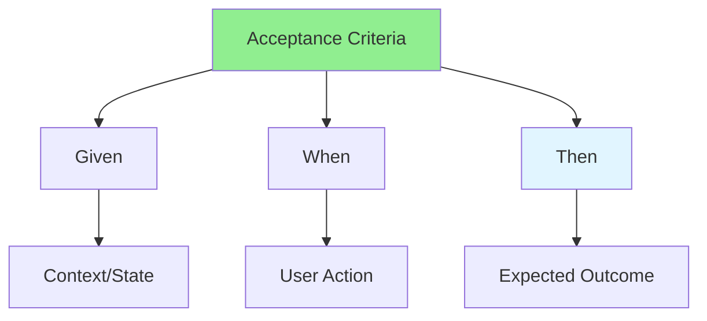

# 04.03 Acceptance Criteria / Tiêu chí chấp nhận

## Table of Contents / Mục lục
1. [Introduction / Giới thiệu](#introduction--giới-thiệu)
2. [Writing Acceptance Criteria / Viết tiêu chí chấp nhận](#writing-acceptance-criteria--viết-tiêu-chí-chấp-nhận)
3. [Examples / Ví dụ](#examples--ví-dụ)
4. [Best Practices / Thực hành tốt nhất](#best-practices--thực-hành-tốt-nhất)
5. [Summary / Tóm tắt](#summary--tóm-tắt)

---

## Introduction / Giới thiệu

### Overview / Tổng quan

**English**: Acceptance criteria define when a user story is complete. Learn to write clear, testable acceptance criteria.

**Vietnamese**: Tiêu chí chấp nhận định nghĩa khi nào user story hoàn thành. Học cách viết tiêu chí chấp nhận rõ ràng, có thể kiểm thử.

### Acceptance Criteria Elements / Yếu tố tiêu chí chấp nhận



---

## Writing Acceptance Criteria / Viết tiêu chí chấp nhận

### Example 1: Given-When-Then Format / Ví dụ 1: Định dạng Given-When-Then

```markdown
# User Story: User Login

## Acceptance Criteria

### AC1: Successful Login
Given the user is on the login page
And the user has a valid account
When the user enters correct email and password
And clicks the login button
Then the user is redirected to the dashboard
And the user's session is created

### AC2: Invalid Credentials
Given the user is on the login page
When the user enters incorrect email or password
And clicks the login button
Then an error message "Invalid email or password" is displayed
And the user remains on the login page
And no session is created

### AC3: Empty Fields
Given the user is on the login page
When the user clicks the login button without entering credentials
Then validation errors are displayed for email and password fields
And the user remains on the login page
```

### Example 2: Checklist Format / Ví dụ 2: Định dạng checklist

```markdown
# User Story: User Registration

## Acceptance Criteria

- [ ] User can enter email address
- [ ] User can enter password
- [ ] System validates email format (must contain @ and domain)
- [ ] System validates password strength:
  - [ ] Minimum 8 characters
  - [ ] At least one uppercase letter
  - [ ] At least one lowercase letter
  - [ ] At least one number
- [ ] System displays validation errors in real-time
- [ ] User account is created upon successful registration
- [ ] Confirmation email is sent to user's email
- [ ] User is redirected to email verification page
```

---

## Examples / Ví dụ

### Example 3: Detailed Acceptance Criteria / Ví dụ 3: Tiêu chí chấp nhận chi tiết

```markdown
# User Story: Password Reset

## Acceptance Criteria

### AC1: Request Password Reset
Given the user is on the login page
When the user clicks "Forgot Password"
Then the password reset form is displayed
And the user can enter their email address

### AC2: Send Reset Link
Given the user has entered a valid registered email
When the user clicks "Send Reset Link"
Then a password reset email is sent
And a success message is displayed
And the reset token expires in 1 hour

### AC3: Reset Password
Given the user has received a valid reset link
When the user clicks the reset link
Then the password reset page is displayed
And the user can enter a new password
And the user can confirm the new password

### AC4: Password Validation
Given the user is on the password reset page
When the user enters a new password
Then the system validates:
- Minimum 8 characters
- Contains uppercase and lowercase
- Contains at least one number
And validation errors are shown in real-time

### AC5: Complete Reset
Given the user has entered a valid new password
When the user clicks "Reset Password"
Then the password is updated
And the user is redirected to login page
And a success message is displayed
And the reset token is invalidated
```

---

## Best Practices / Thực hành tốt nhất

1. **Be specific** - Clear, unambiguous criteria
2. **Testable** - Can be verified with tests
3. **Complete** - Cover all scenarios
4. **User-focused** - From user's perspective
5. **Independent** - Each criterion is testable alone

---

## Summary / Tóm tắt

### Key Takeaways / Điểm chính

- **Given-When-Then**: Clear scenario format
- **Specific**: Unambiguous criteria
- **Testable**: Can be verified
- **Complete**: Cover all cases
- **User-focused**: From user perspective

### Next Steps / Bước tiếp theo

- [04.04 Writing Q&A](./04.04_Writing_Q&A.md) - Next: Writing Q&A

---

**Last Updated / Cập nhật lần cuối**: 2024

