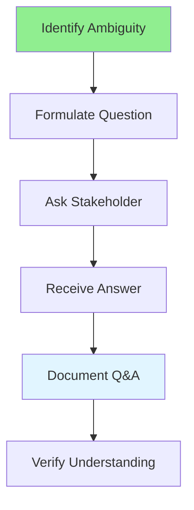

# 04.04 Writing Q&A / Viết Q&A

## Table of Contents / Mục lục
1. [Introduction / Giới thiệu](#introduction--giới-thiệu)
2. [Q&A Writing Process / Quy trình viết Q&A](#qa-writing-process--quy-trình-viết-qa)
3. [Question Types / Loại câu hỏi](#question-types--loại-câu-hỏi)
4. [Best Practices / Thực hành tốt nhất](#best-practices--thực-hành-tốt-nhất)
5. [Summary / Tóm tắt](#summary--tóm-tắt)

---

## Introduction / Giới thiệu

### Overview / Tổng quan

**English**: Q&A documents clarify requirements and capture stakeholder questions. Learn to write effective Q&A to resolve ambiguities.

**Vietnamese**: Tài liệu Q&A làm rõ yêu cầu và ghi lại câu hỏi của stakeholder. Học cách viết Q&A hiệu quả để giải quyết sự mơ hồ.

### Q&A Writing Process / Quy trình viết Q&A



---

## Q&A Writing Process / Quy trình viết Q&A

### Example 1: Q&A Template / Ví dụ 1: Mẫu Q&A

```markdown
# Q&A Document: User Registration Feature

## Q1: Email Validation
**Question**: Should the system validate email format on the client side, server side, or both?

**Answer**: Both. Client-side validation provides immediate feedback, server-side validation ensures security.

**Impact**: Requires validation on both frontend and backend.

**Status**: Resolved

---

## Q2: Password Requirements
**Question**: What are the exact password requirements?

**Answer**: 
- Minimum 8 characters
- At least one uppercase letter
- At least one lowercase letter
- At least one number
- Special characters are optional but recommended

**Impact**: Affects validation logic and user experience.

**Status**: Resolved

---

## Q3: Email Verification
**Question**: Should users be able to use the system before verifying their email?

**Answer**: No. Users must verify their email before accessing the system. They can only access the email verification page until verified.

**Impact**: Requires email verification flow before full access.

**Status**: Resolved
```

### Example 2: Clarifying Questions / Ví dụ 2: Câu hỏi làm rõ

```markdown
# Q&A: Payment Processing

## Q1: Payment Methods
**Question**: Which payment methods should be supported?

**Answer**: Credit cards (Visa, Mastercard, Amex) and PayPal initially. Debit cards and bank transfers in Phase 2.

**Follow-up Questions**:
- Q1.1: Should we support recurring payments?
- A1.1: Yes, for subscription plans.

**Status**: Resolved

---

## Q2: Currency Support
**Question**: Should the system support multiple currencies?

**Answer**: Initially USD only. Multi-currency support planned for Q2.

**Impact**: No currency conversion needed in Phase 1.

**Status**: Resolved
```

---

## Question Types / Loại câu hỏi

### Example 3: Types of Questions / Ví dụ 3: Loại câu hỏi

```typescript
// Question types / Loại câu hỏi
interface Question {
  type: 'clarification' | 'constraint' | 'assumption' | 'edge-case';
  question: string;
  context: string;
  priority: 'high' | 'medium' | 'low';
}

const questions: Question[] = [
  {
    type: 'clarification',
    question: 'What happens if user enters invalid email?',
    context: 'User registration form',
    priority: 'high'
  },
  {
    type: 'constraint',
    question: 'Are there any performance requirements?',
    context: 'User registration',
    priority: 'medium'
  },
  {
    type: 'edge-case',
    question: 'What if user tries to register with existing email?',
    context: 'User registration',
    priority: 'high'
  }
];
```

---

## Best Practices / Thực hành tốt nhất

1. **Be specific** - Ask clear, focused questions
2. **Provide context** - Explain why you're asking
3. **Document answers** - Record all Q&A
4. **Follow up** - Ask follow-up questions if needed
5. **Update requirements** - Update docs based on answers

---

## Summary / Tóm tắt

### Key Takeaways / Điểm chính

- **Clarify**: Ask questions to resolve ambiguities
- **Document**: Record all Q&A
- **Context**: Provide background for questions
- **Follow up**: Ask clarifying questions
- **Update**: Update requirements based on answers

### Next Steps / Bước tiếp theo

- [04.05 Question Classification](./04.05_Question_Classification.md) - Next: Question Classification

---

**Last Updated / Cập nhật lần cuối**: 2024

