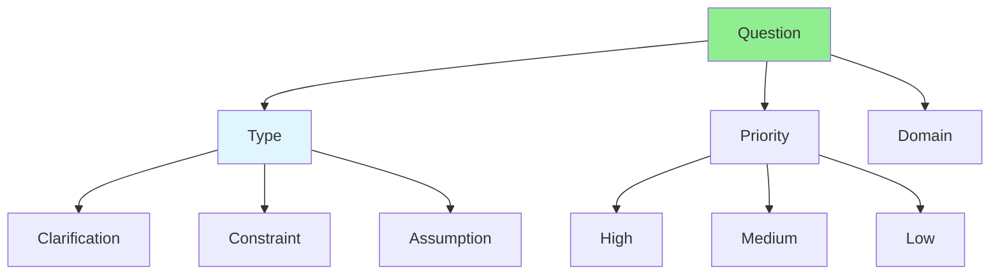

# 04.05 Question Classification / Phân loại câu hỏi

## Table of Contents / Mục lục
1. [Introduction / Giới thiệu](#introduction--giới-thiệu)
2. [Question Categories / Danh mục câu hỏi](#question-categories--danh-mục-câu-hỏi)
3. [Classification Techniques / Kỹ thuật phân loại](#classification-techniques--kỹ-thuật-phân-loại)
4. [Best Practices / Thực hành tốt nhất](#best-practices--thực-hành-tốt-nhất)
5. [Summary / Tóm tắt](#summary--tóm-tắt)

---

## Introduction / Giới thiệu

### Overview / Tổng quan

**English**: Classifying questions helps prioritize and route them appropriately. Learn to categorize questions by type, priority, and domain.

**Vietnamese**: Phân loại câu hỏi giúp ưu tiên và định tuyến chúng phù hợp. Học cách phân loại câu hỏi theo loại, mức độ ưu tiên và lĩnh vực.

### Question Classification / Phân loại câu hỏi



---

## Question Categories / Danh mục câu hỏi

### Example 1: Question Types / Ví dụ 1: Loại câu hỏi

```typescript
// Question classification / Phân loại câu hỏi
enum QuestionType {
  CLARIFICATION = 'clarification',    // Need more details / Cần thêm chi tiết
  CONSTRAINT = 'constraint',           // Limitations / Hạn chế
  ASSUMPTION = 'assumption',          // Assumed behavior / Hành vi giả định
  EDGE_CASE = 'edge-case',            // Unusual scenarios / Kịch bản bất thường
  TECHNICAL = 'technical',            // Technical implementation / Triển khai kỹ thuật
  BUSINESS = 'business'              // Business logic / Logic nghiệp vụ
}

enum QuestionPriority {
  HIGH = 'high',      // Blocks development / Chặn phát triển
  MEDIUM = 'medium',  // Important but not blocking / Quan trọng nhưng không chặn
  LOW = 'low'         // Nice to have / Tốt nếu có
}

interface ClassifiedQuestion {
  id: string;
  question: string;
  type: QuestionType;
  priority: QuestionPriority;
  domain: string;
  status: 'open' | 'answered' | 'resolved';
}
```

### Example 2: Classification Examples / Ví dụ 2: Ví dụ phân loại

```markdown
# Question Classification Examples

## Q1: Clarification - High Priority
**Type**: Clarification
**Priority**: High
**Domain**: User Authentication
**Question**: Should password reset tokens expire? If yes, what's the expiration time?
**Reason**: Blocks implementation of password reset feature

## Q2: Constraint - Medium Priority
**Type**: Constraint
**Priority**: Medium
**Domain**: Performance
**Question**: What's the maximum response time for user registration?
**Reason**: Important for UX but doesn't block development

## Q3: Edge Case - High Priority
**Type**: Edge Case
**Priority**: High
**Domain**: User Registration
**Question**: What happens if user tries to register with email that was previously deleted?
**Reason**: Affects data integrity and user experience

## Q4: Assumption - Low Priority
**Type**: Assumption
**Priority**: Low
**Domain**: Email Notifications
**Question**: Should we send welcome email immediately or queue it?
**Reason**: Implementation detail, can be decided later
```

---

## Classification Techniques / Kỹ thuật phân loại

### Example 3: Classification Workflow / Ví dụ 3: Quy trình phân loại

```typescript
// Question classification workflow / Quy trình phân loại câu hỏi
function classifyQuestion(question: string, context: string): ClassifiedQuestion {
  let type: QuestionType;
  let priority: QuestionPriority;
  
  // Determine type / Xác định loại
  if (question.includes('what') || question.includes('how')) {
    type = QuestionType.CLARIFICATION;
  } else if (question.includes('limit') || question.includes('constraint')) {
    type = QuestionType.CONSTRAINT;
  } else if (question.includes('what if') || question.includes('edge')) {
    type = QuestionType.EDGE_CASE;
  } else {
    type = QuestionType.ASSUMPTION;
  }
  
  // Determine priority / Xác định mức độ ưu tiên
  if (context.includes('blocking') || context.includes('critical')) {
    priority = QuestionPriority.HIGH;
  } else if (context.includes('important')) {
    priority = QuestionPriority.MEDIUM;
  } else {
    priority = QuestionPriority.LOW;
  }
  
  return {
    id: generateId(),
    question,
    type,
    priority,
    domain: extractDomain(context),
    status: 'open'
  };
}
```

---

## Best Practices / Thực hành tốt nhất

1. **Classify immediately** - Categorize when question is asked
2. **Set priority** - Based on impact on development
3. **Route appropriately** - Send to right stakeholder
4. **Track status** - Monitor question resolution
5. **Review regularly** - Update classifications as needed

---

## Summary / Tóm tắt

### Key Takeaways / Điểm chính

- **Types**: Clarification, constraint, assumption, edge-case
- **Priority**: High, medium, low based on impact
- **Domain**: Technical, business, UX, etc.
- **Routing**: Send to appropriate stakeholder
- **Tracking**: Monitor resolution status

### Next Steps / Bước tiếp theo

- [04.06 Missing Information](./04.06_Missing_Information.md) - Next: Missing Information

---

**Last Updated / Cập nhật lần cuối**: 2024


