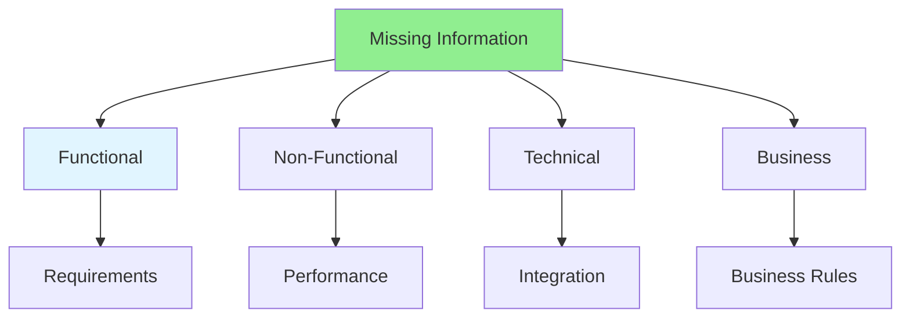

# 04.06 Missing Information / Thông tin thiếu

## Table of Contents / Mục lục
1. [Introduction / Giới thiệu](#introduction--giới-thiệu)
2. [Identifying Missing Information / Xác định thông tin thiếu](#identifying-missing-information--xác-định-thông-tin-thiếu)
3. [Categories / Danh mục](#categories--danh-mục)
4. [Best Practices / Thực hành tốt nhất](#best-practices--thực-hành-tốt-nhất)
5. [Summary / Tóm tắt](#summary--tóm-tắt)

---

## Introduction / Giới thiệu

### Overview / Tổng quan

**English**: Missing information causes delays and rework. Learn to identify gaps in requirements and document what's needed.

**Vietnamese**: Thông tin thiếu gây chậm trễ và làm lại. Học cách xác định khoảng trống trong yêu cầu và tài liệu hóa những gì cần thiết.

### Missing Information Categories / Danh mục thông tin thiếu



---

## Identifying Missing Information / Xác định thông tin thiếu

### Example 1: Missing Information Checklist / Ví dụ 1: Checklist thông tin thiếu

```markdown
# Missing Information Checklist

## Functional Requirements
- [ ] Complete user flows defined?
- [ ] All user roles identified?
- [ ] Edge cases documented?
- [ ] Error handling specified?
- [ ] Validation rules clear?

## Non-Functional Requirements
- [ ] Performance requirements?
- [ ] Security requirements?
- [ ] Scalability requirements?
- [ ] Browser compatibility?
- [ ] Mobile support?

## Technical Requirements
- [ ] API specifications?
- [ ] Database schema?
- [ ] Third-party integrations?
- [ ] Authentication method?
- [ ] Deployment environment?

## Business Rules
- [ ] Business logic documented?
- [ ] Calculation formulas?
- [ ] Approval workflows?
- [ ] Data retention policies?
- [ ] Compliance requirements?
```

### Example 2: Gap Analysis / Ví dụ 2: Phân tích khoảng trống

```typescript
// Gap analysis / Phân tích khoảng trống
interface RequirementGap {
  area: string;
  missingInfo: string;
  impact: 'high' | 'medium' | 'low';
  blocker: boolean;
  neededBy: Date;
}

const gaps: RequirementGap[] = [
  {
    area: 'User Authentication',
    missingInfo: 'Password reset token expiration time',
    impact: 'high',
    blocker: true,
    neededBy: new Date('2024-02-01')
  },
  {
    area: 'Payment Processing',
    missingInfo: 'Supported payment methods',
    impact: 'high',
    blocker: true,
    neededBy: new Date('2024-02-01')
  },
  {
    area: 'Email Notifications',
    missingInfo: 'Email template designs',
    impact: 'medium',
    blocker: false,
    neededBy: new Date('2024-02-15')
  }
];
```

---

## Categories / Danh mục

### Example 3: Common Missing Information / Ví dụ 3: Thông tin thiếu phổ biến

```markdown
# Common Missing Information

## 1. Edge Cases
- What happens when system is down?
- How to handle concurrent updates?
- What if user closes browser mid-process?
- How to handle network timeouts?

## 2. Error Messages
- What error messages to show?
- How detailed should errors be?
- Should errors be user-friendly or technical?

## 3. Validation Rules
- Exact validation criteria?
- Client-side or server-side validation?
- Real-time or on submit?

## 4. Performance Requirements
- Response time expectations?
- Concurrent user capacity?
- Data volume limits?

## 5. Security Requirements
- Authentication method?
- Authorization rules?
- Data encryption requirements?
- Session management?
```

---

## Best Practices / Thực hành tốt nhất

1. **Review systematically** - Check all requirement areas
2. **Document gaps** - List all missing information
3. **Prioritize** - Focus on blockers first
4. **Set deadlines** - Define when info is needed
5. **Follow up** - Track until resolved

---

## Summary / Tóm tắt

### Key Takeaways / Điểm chính

- **Identify gaps**: Systematically review requirements
- **Categorize**: Functional, non-functional, technical, business
- **Prioritize**: Focus on blockers
- **Document**: List all missing information
- **Track**: Follow up until resolved

### Next Steps / Bước tiếp theo

- [04.07 Use Cases & Scenarios](./04.07_Use_Cases_Scenarios.md) - Next: Use Cases

---

**Last Updated / Cập nhật lần cuối**: 2024

