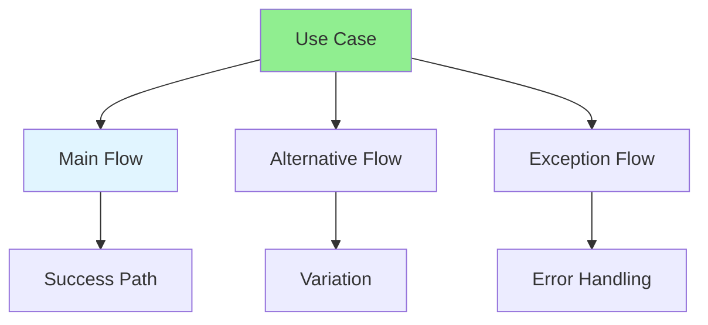
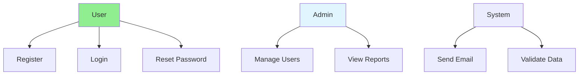

# 04.07 Use Cases & Scenarios / Use Case & Kịch bản

## Table of Contents / Mục lục
1. [Introduction / Giới thiệu](#introduction--giới-thiệu)
2. [Use Cases / Use Case](#use-cases--use-case)
3. [Scenarios / Kịch bản](#scenarios--kịch-bản)
4. [Best Practices / Thực hành tốt nhất](#best-practices--thực-hành-tốt-nhất)
5. [Summary / Tóm tắt](#summary--tóm-tắt)

---

## Introduction / Giới thiệu

### Overview / Tổng quan

**English**: Use cases describe how users interact with the system. Learn to write use cases and scenarios to capture system behavior.

**Vietnamese**: Use case mô tả cách người dùng tương tác với hệ thống. Học cách viết use case và kịch bản để nắm bắt hành vi hệ thống.

### Use Case Flow Types / Loại luồng Use Case



---

## Use Cases / Use Case

### Example 1: Use Case Template / Ví dụ 1: Mẫu Use Case

```markdown
# Use Case: User Registration

## Basic Information
- **Use Case ID**: UC-001
- **Use Case Name**: User Registration
- **Actor**: New Visitor
- **Preconditions**: User is on registration page
- **Postconditions**: User account is created and verified

## Main Flow
1. User navigates to registration page
2. User enters email address
3. User enters password
4. User confirms password
5. User clicks "Register" button
6. System validates email format
7. System validates password strength
8. System checks if email already exists
9. System creates user account
10. System sends confirmation email
11. System displays success message
12. System redirects to email verification page

## Alternative Flows

### A1: Email Already Exists
6a. System detects email already exists
6b. System displays error: "Email already registered"
6c. Use case ends

### A2: Weak Password
7a. System detects password doesn't meet requirements
7b. System displays password requirements
7c. User updates password
7d. Continue from step 5

## Exception Flows

### E1: Network Error
9a. System cannot connect to database
9b. System displays error: "Registration failed. Please try again."
9c. Use case ends

### E2: Email Service Unavailable
10a. System cannot send confirmation email
10b. System logs error
10c. System displays warning: "Account created but verification email delayed"
10d. Use case continues
```

### Example 2: Use Case Diagram / Ví dụ 2: Biểu đồ Use Case



---

## Scenarios / Kịch bản

### Example 3: Scenario Examples / Ví dụ 3: Ví dụ kịch bản

```markdown
# Scenario: Successful User Registration

## Scenario Name
Happy Path - User Registration

## Steps
1. **Given** user is on registration page
2. **When** user enters valid email "user@example.com"
3. **And** user enters valid password "SecurePass123"
4. **And** user confirms password "SecurePass123"
5. **And** user clicks "Register" button
6. **Then** system creates user account
7. **And** system sends confirmation email
8. **And** system displays "Registration successful"
9. **And** user is redirected to email verification page

---

# Scenario: Registration with Existing Email

## Scenario Name
Alternative Path - Duplicate Email

## Steps
1. **Given** user is on registration page
2. **And** email "user@example.com" already exists in system
3. **When** user enters email "user@example.com"
4. **And** user enters password "SecurePass123"
5. **And** user clicks "Register" button
6. **Then** system displays error "Email already registered"
7. **And** user remains on registration page
8. **And** user account is not created
```

---

## Best Practices / Thực hành tốt nhất

1. **Start with main flow** - Describe happy path first
2. **Cover alternatives** - Document variations
3. **Handle exceptions** - Include error scenarios
4. **Be specific** - Clear step-by-step descriptions
5. **Test scenarios** - Verify with stakeholders

---

## Summary / Tóm tắt

### Key Takeaways / Điểm chính

- **Use cases**: Describe system interactions
- **Main flow**: Happy path scenario
- **Alternatives**: Variations of main flow
- **Exceptions**: Error handling scenarios
- **Scenarios**: Specific instances of use cases

### Next Steps / Bước tiếp theo

- [04.08 Business Logic Analysis](./04.08_Business_Logic_Analysis.md) - Next: Business Logic

---

**Last Updated / Cập nhật lần cuối**: 2024

