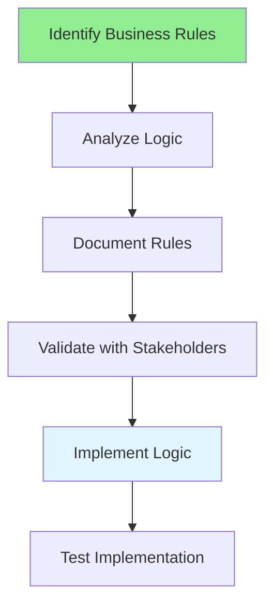

# 04.08 Business Logic Analysis / Phân tích logic nghiệp vụ

## Table of Contents / Mục lục
1. [Introduction / Giới thiệu](#introduction--giới-thiệu)
2. [Business Logic Analysis Process / Quy trình phân tích logic nghiệp vụ](#business-logic-analysis-process--quy-trình-phân-tích-logic-nghiệp-vụ)
3. [Documenting Business Rules / Tài liệu hóa quy tắc nghiệp vụ](#documenting-business-rules--tài-liệu-hóa-quy-tắc-nghiệp-vụ)
4. [Best Practices / Thực hành tốt nhất](#best-practices--thực-hành-tốt-nhất)
5. [Summary / Tóm tắt](#summary--tóm-tắt)

---

## Introduction / Giới thiệu

### Overview / Tổng quan

**English**: Business logic defines how the system implements business rules. Learn to analyze, document, and implement business logic correctly.

**Vietnamese**: Logic nghiệp vụ định nghĩa cách hệ thống triển khai quy tắc nghiệp vụ. Học cách phân tích, tài liệu hóa và triển khai logic nghiệp vụ đúng.

### Business Logic Analysis Process / Quy trình phân tích logic nghiệp vụ



---

## Business Logic Analysis Process / Quy trình phân tích logic nghiệp vụ

### Example 1: Business Rule Documentation / Ví dụ 1: Tài liệu quy tắc nghiệp vụ

```markdown
# Business Rule: Discount Calculation

## Rule ID
BR-001

## Description
Calculate discount based on order total and customer type.

## Business Logic
- Regular customers: 5% discount for orders over $100
- Premium customers: 10% discount for orders over $50
- VIP customers: 15% discount for all orders

## Conditions
- Order total > $100 AND customer type = "regular" → 5% discount
- Order total > $50 AND customer type = "premium" → 10% discount
- Customer type = "vip" → 15% discount
- Otherwise → No discount

## Examples
- Regular customer, $150 order → $7.50 discount (5%)
- Premium customer, $75 order → $7.50 discount (10%)
- VIP customer, $30 order → $4.50 discount (15%)
```

### Example 2: Business Logic Implementation / Ví dụ 2: Triển khai logic nghiệp vụ

```typescript
// Business logic implementation / Triển khai logic nghiệp vụ
enum CustomerType {
  REGULAR = 'regular',
  PREMIUM = 'premium',
  VIP = 'vip'
}

function calculateDiscount(orderTotal: number, customerType: CustomerType): number {
  // Business rule: VIP customers always get 15% discount
  if (customerType === CustomerType.VIP) {
    return orderTotal * 0.15;
  }
  
  // Business rule: Premium customers get 10% for orders over $50
  if (customerType === CustomerType.PREMIUM && orderTotal > 50) {
    return orderTotal * 0.10;
  }
  
  // Business rule: Regular customers get 5% for orders over $100
  if (customerType === CustomerType.REGULAR && orderTotal > 100) {
    return orderTotal * 0.05;
  }
  
  // No discount
  return 0;
}

// Business rule validation / Xác thực quy tắc nghiệp vụ
function validateOrder(order: Order): ValidationResult {
  const errors: string[] = [];
  
  // Business rule: Minimum order amount
  if (order.total < 10) {
    errors.push('Minimum order amount is $10');
  }
  
  // Business rule: Maximum items per order
  if (order.items.length > 50) {
    errors.push('Maximum 50 items per order');
  }
  
  return {
    valid: errors.length === 0,
    errors
  };
}
```

---

## Documenting Business Rules / Tài liệu hóa quy tắc nghiệp vụ

### Example 3: Business Rules Template / Ví dụ 3: Mẫu quy tắc nghiệp vụ

```markdown
# Business Rules Document

## Rule: Order Cancellation

### Rule ID
BR-002

### Description
Rules for canceling orders based on order status and time.

### Business Logic
1. Orders can only be canceled if status is "pending" or "confirmed"
2. Orders cannot be canceled if status is "shipped" or "delivered"
3. Orders canceled within 24 hours get full refund
4. Orders canceled after 24 hours but before shipping get 80% refund
5. Refunds are processed within 5 business days

### Conditions
- Status = "pending" OR "confirmed" → Can cancel
- Status = "shipped" OR "delivered" → Cannot cancel
- Canceled within 24 hours → 100% refund
- Canceled after 24 hours → 80% refund

### Exceptions
- Admin can cancel any order
- System can auto-cancel unpaid orders after 7 days
```

---

## Best Practices / Thực hành tốt nhất

1. **Document clearly** - Write unambiguous business rules
2. **Provide examples** - Show how rules apply
3. **Validate with business** - Confirm with stakeholders
4. **Code as documentation** - Implement rules clearly
5. **Test thoroughly** - Test all rule scenarios

---

## Summary / Tóm tắt

### Key Takeaways / Điểm chính

- **Identify rules**: Extract from requirements
- **Document clearly**: Unambiguous descriptions
- **Provide examples**: Show rule application
- **Validate**: Confirm with business stakeholders
- **Implement**: Code rules clearly

### Next Steps / Bước tiếp theo

- [04.09 Document Conflicts](./04.09_Document_Conflicts.md) - Next: Document Conflicts

---

**Last Updated / Cập nhật lần cuối**: 2024

