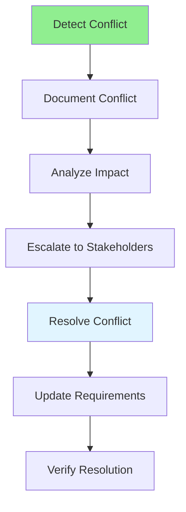

# 04.09 Document Conflicts / Tài liệu xung đột

## Table of Contents / Mục lục
1. [Introduction / Giới thiệu](#introduction--giới-thiệu)
2. [Identifying Conflicts / Xác định xung đột](#identifying-conflicts--xác-định-xung-đột)
3. [Conflict Resolution / Giải quyết xung đột](#conflict-resolution--giải-quyết-xung-đột)
4. [Best Practices / Thực hành tốt nhất](#best-practices--thực-hành-tốt-nhất)
5. [Summary / Tóm tắt](#summary--tóm-tắt)

---

## Introduction / Giới thiệu

### Overview / Tổng quan

**English**: Document conflicts arise when requirements contradict each other. Learn to identify, document, and resolve conflicts in requirements.

**Vietnamese**: Xung đột tài liệu xảy ra khi yêu cầu mâu thuẫn với nhau. Học cách xác định, tài liệu hóa và giải quyết xung đột trong yêu cầu.

### Conflict Resolution Flow / Luồng giải quyết xung đột



---

## Identifying Conflicts / Xác định xung đột

### Example 1: Conflict Types / Ví dụ 1: Loại xung đột

```typescript
// Conflict types / Loại xung đột
enum ConflictType {
  CONTRADICTION = 'contradiction',  // Requirements contradict / Yêu cầu mâu thuẫn
  OVERLAP = 'overlap',              // Duplicate requirements / Yêu cầu trùng lặp
  INCOMPLETE = 'incomplete',        // Missing information / Thiếu thông tin
  PRIORITY = 'priority'            // Conflicting priorities / Ưu tiên xung đột
}

interface RequirementConflict {
  id: string;
  type: ConflictType;
  requirements: string[];
  description: string;
  impact: 'high' | 'medium' | 'low';
  status: 'open' | 'resolved' | 'deferred';
  resolution?: string;
}
```

### Example 2: Conflict Documentation / Ví dụ 2: Tài liệu xung đột

```markdown
# Conflict: Password Requirements

## Conflict ID
CONF-001

## Type
Contradiction

## Conflicting Requirements
1. REQ-001: "Password must be minimum 6 characters"
2. REQ-002: "Password must be minimum 8 characters with uppercase, lowercase, and number"

## Description
Two requirements specify different password rules. REQ-001 says minimum 6 characters, while REQ-002 requires minimum 8 characters with complexity.

## Impact
High - Blocks implementation of password validation

## Affected Areas
- User registration
- Password reset
- Password change

## Proposed Resolution
Use REQ-002 (8 characters with complexity) as it provides better security.

## Resolution Status
Pending stakeholder approval

## Resolved By
[To be filled]

## Resolution Date
[To be filled]
```

---

## Conflict Resolution / Giải quyết xung đột

### Example 3: Resolution Process / Ví dụ 3: Quy trình giải quyết

```markdown
# Conflict Resolution: Payment Methods

## Conflict
REQ-010 says "Support credit cards only"
REQ-011 says "Support PayPal and credit cards"

## Analysis
- REQ-010 is from initial requirements
- REQ-011 is from updated requirements after stakeholder feedback
- REQ-011 is more recent and aligns with business goals

## Impact Assessment
- High impact: Affects payment integration
- Requires: Update payment gateway integration
- Timeline: 2 weeks additional development

## Resolution Options
1. **Option A**: Support credit cards only (REQ-010)
   - Pros: Faster implementation
   - Cons: Limits payment options, may reduce conversions

2. **Option B**: Support both (REQ-011)
   - Pros: More payment options, better UX
   - Cons: Additional integration work

## Recommended Resolution
Option B - Support both credit cards and PayPal

## Stakeholder Decision
[Pending]

## Resolution Date
[To be filled]
```

---

## Best Practices / Thực hành tốt nhất

1. **Document immediately** - Record conflicts when found
2. **Analyze impact** - Understand consequences
3. **Escalate quickly** - Get stakeholder input
4. **Propose solutions** - Suggest resolution options
5. **Update requirements** - Document final resolution

---

## Summary / Tóm tắt

### Key Takeaways / Điểm chính

- **Identify**: Detect conflicts early
- **Document**: Record all conflicts
- **Analyze**: Assess impact
- **Escalate**: Get stakeholder input
- **Resolve**: Update requirements

### Next Steps / Bước tiếp theo

- [04.10 Requirement Traceability](./04.10_Requirement_Traceability.md) - Next: Traceability

---

**Last Updated / Cập nhật lần cuối**: 2024


