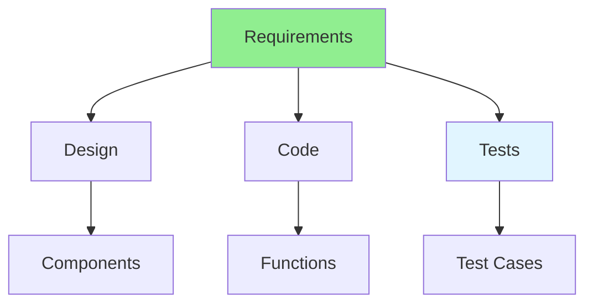

# 04.10 Requirement Traceability / Truy vết yêu cầu

## Table of Contents / Mục lục
1. [Introduction / Giới thiệu](#introduction--giới-thiệu)
2. [Traceability Matrix / Ma trận truy vết](#traceability-matrix--ma-trận-truy-vết)
3. [Implementation / Triển khai](#implementation--triển-khai)
4. [Best Practices / Thực hành tốt nhất](#best-practices--thực-hành-tốt-nhất)
5. [Summary / Tóm tắt](#summary--tóm-tắt)

---

## Introduction / Giới thiệu

### Overview / Tổng quan

**English**: Requirement traceability links requirements to design, code, and tests. Learn to maintain traceability for change management and compliance.

**Vietnamese**: Truy vết yêu cầu liên kết yêu cầu với thiết kế, code và test. Học cách duy trì truy vết để quản lý thay đổi và tuân thủ.

### Traceability Matrix / Ma trận truy vết



---

## Traceability Matrix / Ma trận truy vết

### Example 1: Traceability Matrix / Ví dụ 1: Ma trận truy vết

```markdown
# Requirement Traceability Matrix

| Requirement ID | User Story | Design Doc | Code Module | Test Case | Status |
|---------------|------------|------------|-------------|-----------|--------|
| REQ-001 | US-001 | DD-001 | UserService.ts | TC-001 | ✅ Complete |
| REQ-002 | US-001 | DD-001 | UserController.ts | TC-002 | ✅ Complete |
| REQ-003 | US-002 | DD-002 | AuthService.ts | TC-003 | 🔄 In Progress |
| REQ-004 | US-003 | DD-003 | PaymentService.ts | TC-004 | ⏳ Pending |

## Legend
- ✅ Complete: Requirement fully implemented and tested
- 🔄 In Progress: Currently being implemented
- ⏳ Pending: Not yet started
```

### Example 2: Traceability Links / Ví dụ 2: Liên kết truy vết

```typescript
// Requirement traceability / Truy vết yêu cầu
interface TraceabilityLink {
  requirementId: string;
  userStoryId: string;
  designDocumentId: string;
  codeModules: string[];
  testCases: string[];
  status: 'complete' | 'in-progress' | 'pending';
}

const traceability: TraceabilityLink[] = [
  {
    requirementId: 'REQ-001',
    userStoryId: 'US-001',
    designDocumentId: 'DD-001',
    codeModules: [
      'src/services/UserService.ts',
      'src/controllers/UserController.ts'
    ],
    testCases: [
      'tests/UserService.test.ts',
      'tests/UserController.test.ts'
    ],
    status: 'complete'
  }
];

// Find all code related to requirement / Tìm tất cả code liên quan đến yêu cầu
function findCodeForRequirement(requirementId: string): string[] {
  const link = traceability.find(t => t.requirementId === requirementId);
  return link?.codeModules || [];
}

// Find requirements for code module / Tìm yêu cầu cho module code
function findRequirementsForModule(module: string): string[] {
  return traceability
    .filter(t => t.codeModules.includes(module))
    .map(t => t.requirementId);
}
```

---

## Implementation / Triển khai

### Example 3: Code Comments for Traceability / Ví dụ 3: Comment code cho truy vết

```typescript
/**
 * User Registration Service
 * 
 * Requirements:
 * - REQ-001: User must be able to register with email and password
 * - REQ-002: Email must be validated
 * - REQ-003: Password must meet security requirements
 * 
 * User Story: US-001
 * Design Document: DD-001
 * Test Cases: TC-001, TC-002
 */
class UserService {
  /**
   * Register new user
   * Implements: REQ-001
   * Test: TC-001
   */
  async registerUser(email: string, password: string): Promise<User> {
    // REQ-002: Validate email
    if (!this.isValidEmail(email)) {
      throw new Error('Invalid email format');
    }
    
    // REQ-003: Validate password
    if (!this.isValidPassword(password)) {
      throw new Error('Password does not meet requirements');
    }
    
    // REQ-001: Create user account
    return await this.userRepository.create({ email, password });
  }
}
```

---

## Best Practices / Thực hành tốt nhất

1. **Link everything** - Connect requirements to code and tests
2. **Update regularly** - Keep traceability current
3. **Use tools** - Leverage traceability tools
4. **Document changes** - Track requirement changes
5. **Verify coverage** - Ensure all requirements are covered

---

## Summary / Tóm tắt

### Key Takeaways / Điểm chính

- **Traceability**: Link requirements to implementation
- **Matrix**: Track requirements through lifecycle
- **Coverage**: Ensure all requirements implemented
- **Change management**: Track requirement changes
- **Compliance**: Support audit and compliance

### Next Steps / Bước tiếp theo

- [04.11 Assumptions & Risks](./04.11_Assumptions_Risks.md) - Next: Assumptions & Risks

---

**Last Updated / Cập nhật lần cuối**: 2024

