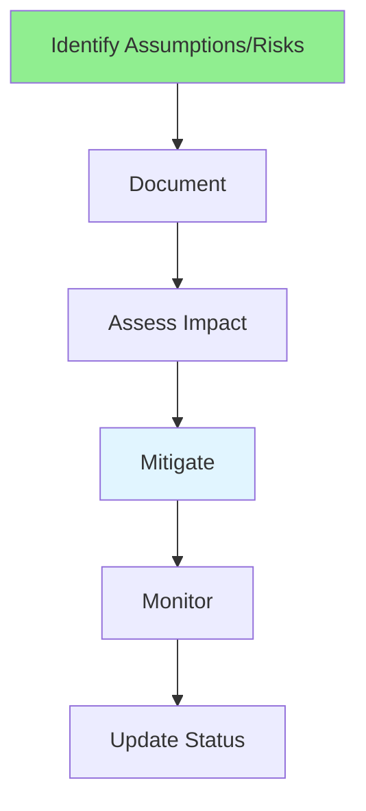

# 04.11 Assumptions & Risks / Giả định & Rủi ro

## Table of Contents / Mục lục
1. [Introduction / Giới thiệu](#introduction--giới-thiệu)
2. [Assumptions / Giả định](#assumptions--giả-định)
3. [Risks / Rủi ro](#risks--rủi-ro)
4. [Best Practices / Thực hành tốt nhất](#best-practices--thực-hành-tốt-nhất)
5. [Summary / Tóm tắt](#summary--tóm-tắt)

---

## Introduction / Giới thiệu

### Overview / Tổng quan

**English**: Documenting assumptions and risks helps manage project uncertainty. Learn to identify, document, and mitigate assumptions and risks.

**Vietnamese**: Tài liệu hóa giả định và rủi ro giúp quản lý sự không chắc chắn của dự án. Học cách xác định, tài liệu hóa và giảm thiểu giả định và rủi ro.

### Assumptions and Risks Management / Quản lý giả định và rủi ro



---

## Assumptions / Giả định

### Example 1: Assumptions Documentation / Ví dụ 1: Tài liệu giả định

```markdown
# Assumptions Document

## ASS-001: Third-Party API Availability
**Assumption**: Payment gateway API will be available and stable during development.

**Impact**: High - Blocks payment integration if unavailable

**Validation**: Confirm with payment provider

**Mitigation**: 
- Have backup payment provider option
- Implement mock service for development

**Status**: Validated

---

## ASS-002: User Volume
**Assumption**: System will handle up to 10,000 concurrent users initially.

**Impact**: Medium - Affects infrastructure planning

**Validation**: Review business projections

**Mitigation**: 
- Design for scalability
- Plan for load testing

**Status**: Pending validation

---

## ASS-003: Browser Support
**Assumption**: Users will use modern browsers (Chrome, Firefox, Safari, Edge).

**Impact**: Low - Affects feature implementation

**Validation**: Review analytics from similar products

**Mitigation**: 
- Progressive enhancement
- Graceful degradation

**Status**: Validated
```

---

## Risks / Rủi ro

### Example 2: Risk Register / Ví dụ 2: Sổ đăng ký rủi ro

```markdown
# Risk Register

## RISK-001: Third-Party API Failure
**Risk**: Payment gateway API may be unavailable or change

**Probability**: Medium
**Impact**: High
**Risk Level**: High

**Mitigation**:
- Implement retry logic
- Use circuit breaker pattern
- Have backup provider

**Owner**: Backend Team Lead
**Status**: Mitigated

---

## RISK-002: Scope Creep
**Risk**: Requirements may change during development

**Probability**: High
**Impact**: Medium
**Risk Level**: High

**Mitigation**:
- Freeze requirements for each sprint
- Change control process
- Regular stakeholder communication

**Owner**: Product Owner
**Status**: Active

---

## RISK-003: Security Vulnerabilities
**Risk**: Application may have security vulnerabilities

**Probability**: Medium
**Impact**: High
**Risk Level**: High

**Mitigation**:
- Security code review
- Penetration testing
- Regular security audits

**Owner**: Security Team
**Status**: Mitigated
```

### Example 3: Risk Assessment / Ví dụ 3: Đánh giá rủi ro

```typescript
// Risk assessment / Đánh giá rủi ro
enum RiskProbability {
  LOW = 'low',
  MEDIUM = 'medium',
  HIGH = 'high'
}

enum RiskImpact {
  LOW = 'low',
  MEDIUM = 'medium',
  HIGH = 'high'
}

interface Risk {
  id: string;
  description: string;
  probability: RiskProbability;
  impact: RiskImpact;
  riskLevel: 'low' | 'medium' | 'high';
  mitigation: string[];
  owner: string;
  status: 'open' | 'mitigated' | 'accepted';
}

function calculateRiskLevel(
  probability: RiskProbability,
  impact: RiskImpact
): 'low' | 'medium' | 'high' {
  if (probability === RiskProbability.HIGH && impact === RiskImpact.HIGH) {
    return 'high';
  }
  if (probability === RiskProbability.MEDIUM && impact === RiskImpact.HIGH) {
    return 'high';
  }
  if (probability === RiskProbability.HIGH && impact === RiskImpact.MEDIUM) {
    return 'medium';
  }
  return 'low';
}
```

---

## Best Practices / Thực hành tốt nhất

1. **Document early** - Identify assumptions and risks early
2. **Validate assumptions** - Confirm with stakeholders
3. **Assess impact** - Understand consequences
4. **Mitigate risks** - Plan mitigation strategies
5. **Monitor regularly** - Review and update status

---

## Summary / Tóm tắt

### Key Takeaways / Điểm chính

- **Assumptions**: Document what you assume to be true
- **Risks**: Identify potential problems
- **Impact**: Assess probability and impact
- **Mitigation**: Plan how to reduce risks
- **Monitor**: Track and update regularly

### Next Steps / Bước tiếp theo

- [04.12 Communication with PM/BA](./04.12_Communication_PM_BA.md) - Next: Communication

---

**Last Updated / Cập nhật lần cuối**: 2024

