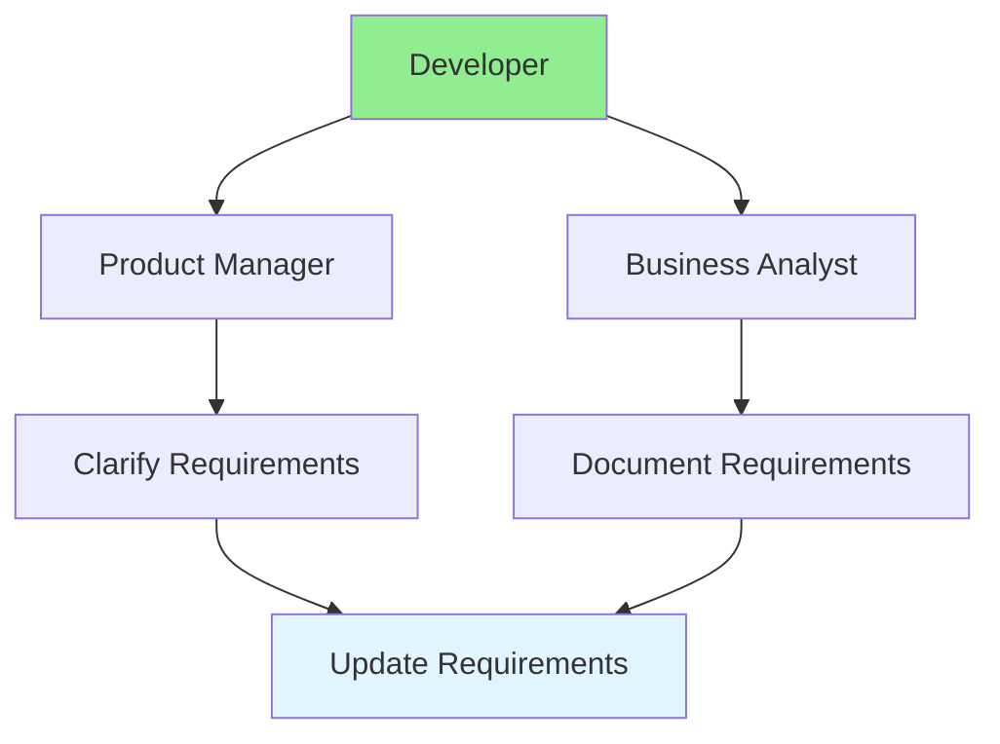

# 04.12 Communication: PM & BA / Giao tiếp: PM & BA

## Table of Contents / Mục lục
1. [Introduction / Giới thiệu](#introduction--giới-thiệu)
2. [Communication Flow / Luồng giao tiếp](#communication-flow--luồng-giao-tiếp)
3. [Effective Communication / Giao tiếp hiệu quả](#effective-communication--giao-tiếp-hiệu-quả)
4. [Best Practices / Thực hành tốt nhất](#best-practices--thực-hành-tốt-nhất)
5. [Summary / Tóm tắt](#summary--tóm-tắt)

---

## Introduction / Giới thiệu

### Overview / Tổng quan

**English**: Effective communication with Product Managers and Business Analysts is crucial. Learn to communicate requirements, questions, and updates clearly.

**Vietnamese**: Giao tiếp hiệu quả với Product Manager và Business Analyst rất quan trọng. Học cách giao tiếp yêu cầu, câu hỏi và cập nhật rõ ràng.

### Communication Flow / Luồng giao tiếp



---

## Communication Flow / Luồng giao tiếp

### Example 1: Communication Templates / Ví dụ 1: Mẫu giao tiếp

```markdown
# Communication Template: Requirement Clarification

## Subject
Clarification needed: User Registration Password Requirements

## Context
Working on user registration feature (REQ-001, US-001)

## Question
Two requirements mention different password rules:
- REQ-001: "Minimum 6 characters"
- REQ-002: "Minimum 8 characters with complexity"

Which rule should we implement?

## Impact
- Blocks implementation
- Affects user experience
- Needs decision by [date]

## Proposed Solution
Implement REQ-002 (8 characters with complexity) for better security.

## Requested Action
Please confirm which requirement to follow.

---

# Communication Template: Status Update

## Subject
Status Update: User Registration Feature

## Completed
- ✅ Email validation
- ✅ Password validation
- ✅ User account creation

## In Progress
- 🔄 Email verification flow
- 🔄 Error handling

## Blockers
- ⚠️ Need confirmation on password requirements (see above)

## Next Steps
- Complete email verification
- Implement error handling
- Write tests

## ETA
Feature completion: [date]
```

---

## Effective Communication / Giao tiếp hiệu quả

### Example 2: Communication Best Practices / Ví dụ 2: Thực hành tốt nhất giao tiếp

```typescript
// Communication guidelines / Hướng dẫn giao tiếp
interface CommunicationGuidelines {
  clarity: 'Be specific and clear';
  context: 'Provide background information';
  impact: 'Explain impact of issue';
  solution: 'Propose solutions when possible';
  urgency: 'Indicate urgency level';
  followUp: 'Set follow-up expectations';
}

// Example: Effective communication / Ví dụ: Giao tiếp hiệu quả
const effectiveMessage = {
  subject: 'Clarification: Payment Processing Flow',
  context: 'Implementing payment feature (REQ-005)',
  question: 'Should payment be processed immediately or queued?',
  impact: 'High - Affects payment service integration',
  urgency: 'High - Blocks development',
  proposedSolution: 'Process immediately for better UX',
  requestedAction: 'Please confirm by EOD today',
  followUp: 'Will follow up tomorrow if no response'
};
```

---

## Best Practices / Thực hành tốt nhất

1. **Be clear** - Use specific, unambiguous language
2. **Provide context** - Explain background
3. **Show impact** - Explain consequences
4. **Propose solutions** - Suggest options
5. **Set expectations** - Indicate urgency and follow-up

---

## Summary / Tóm tắt

### Key Takeaways / Điểm chính

- **Clarity**: Be specific and clear
- **Context**: Provide background
- **Impact**: Explain consequences
- **Solutions**: Propose options
- **Follow-up**: Set expectations

### Next Steps / Bước tiếp theo

- [04.13 Document Requirements](./04.13_Document_Requirements.md) - Next: Document Requirements

---

**Last Updated / Cập nhật lần cuối**: 2024


