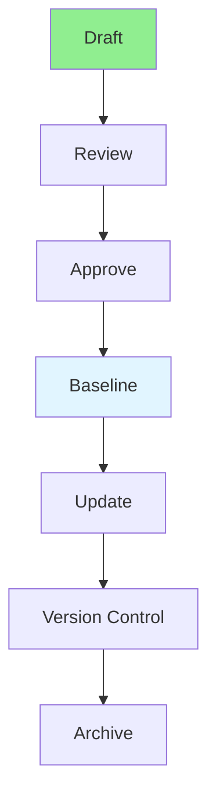

# 04.13 Document Requirements / Tài liệu yêu cầu

## Table of Contents / Mục lục
1. [Introduction / Giới thiệu](#introduction--giới-thiệu)
2. [Documentation Structure / Cấu trúc tài liệu](#documentation-structure--cấu-trúc-tài-liệu)
3. [Documentation Lifecycle / Vòng đời tài liệu](#documentation-lifecycle--vòng-đời-tài-liệu)
4. [Best Practices / Thực hành tốt nhất](#best-practices--thực-hành-tốt-nhất)
5. [Summary / Tóm tắt](#summary--tóm-tắt)

---

## Introduction / Giới thiệu

### Overview / Tổng quan

**English**: Requirements documentation captures what the system must do. Learn to create clear, comprehensive, and maintainable requirements documents.

**Vietnamese**: Tài liệu yêu cầu ghi lại những gì hệ thống phải làm. Học cách tạo tài liệu yêu cầu rõ ràng, toàn diện và dễ bảo trì.

### Documentation Lifecycle / Vòng đời tài liệu



---

## Documentation Structure / Cấu trúc tài liệu

### Example 1: Requirements Document Template / Ví dụ 1: Mẫu tài liệu yêu cầu

```markdown
# Requirements Document: User Management System

## Document Information
- **Document ID**: RD-001
- **Version**: 1.0
- **Date**: 2024-01-15
- **Author**: Business Analyst
- **Status**: Approved

## 1. Introduction
### 1.1 Purpose
This document describes the requirements for the User Management System.

### 1.2 Scope
The system will handle user registration, authentication, and profile management.

### 1.3 Definitions
- **User**: Person who uses the system
- **Account**: User's system account
- **Profile**: User's personal information

## 2. Functional Requirements

### 2.1 User Registration (REQ-001)
**Description**: Users must be able to create an account.

**Priority**: High

**Acceptance Criteria**:
- User can register with email and password
- Email is validated
- Password meets security requirements
- Confirmation email is sent

**Dependencies**: Email service

### 2.2 User Login (REQ-002)
**Description**: Registered users must be able to log in.

**Priority**: High

**Acceptance Criteria**:
- User can log in with email and password
- Invalid credentials are rejected
- Session is created on successful login

## 3. Non-Functional Requirements

### 3.1 Performance
- Registration must complete within 3 seconds
- Login must complete within 2 seconds

### 3.2 Security
- Passwords must be encrypted
- Sessions must expire after 24 hours

## 4. Assumptions
- Users have valid email addresses
- Modern browsers are used

## 5. Risks
- Third-party email service may be unavailable
- High user volume may affect performance
```

---

## Documentation Lifecycle / Vòng đời tài liệu

### Example 2: Version Control / Ví dụ 2: Kiểm soát phiên bản

```markdown
# Requirements Document Version History

## Version 1.0 (2024-01-15)
- Initial requirements
- User registration and login

## Version 1.1 (2024-01-20)
- Added password reset requirement
- Updated acceptance criteria for registration

## Version 1.2 (2024-01-25)
- Added email verification requirement
- Updated security requirements

## Version 2.0 (2024-02-01)
- Major update: Added profile management
- Restructured document
```

---

## Best Practices / Thực hành tốt nhất

1. **Be clear** - Use unambiguous language
2. **Be complete** - Cover all requirements
3. **Be organized** - Use clear structure
4. **Version control** - Track changes
5. **Keep updated** - Maintain current version

---

## Summary / Tóm tắt

### Key Takeaways / Điểm chính

- **Structure**: Clear, organized format
- **Completeness**: Cover all requirements
- **Clarity**: Unambiguous language
- **Versioning**: Track changes
- **Maintenance**: Keep updated

### Next Steps / Bước tiếp theo

- [04.14 Verify Understanding](./04.14_Verify_Understanding.md) - Next: Verify Understanding

---

**Last Updated / Cập nhật lần cuối**: 2024

