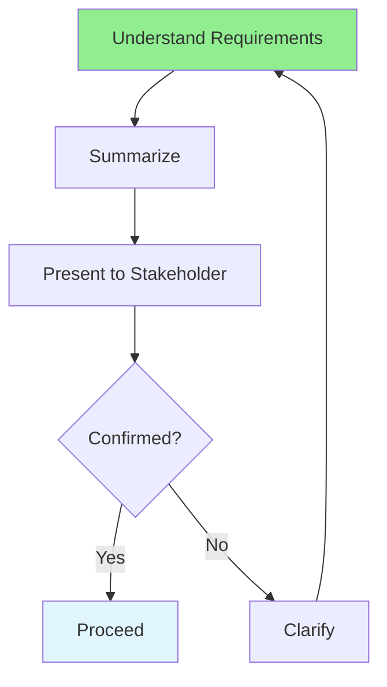

# 04.14 Verify Understanding / Xác minh hiểu biết

## Table of Contents / Mục lục
1. [Introduction / Giới thiệu](#introduction--giới-thiệu)
2. [Verification Techniques / Kỹ thuật xác minh](#verification-techniques--kỹ-thuật-xác-minh)
3. [Verification Process / Quy trình xác minh](#verification-process--quy-trình-xác-minh)
4. [Best Practices / Thực hành tốt nhất](#best-practices--thực-hành-tốt-nhất)
5. [Summary / Tóm tắt](#summary--tóm-tắt)

---

## Introduction / Giới thiệu

### Overview / Tổng quan

**English**: Verifying understanding ensures you correctly interpret requirements. Learn techniques to confirm your understanding with stakeholders.

**Vietnamese**: Xác minh hiểu biết đảm bảo bạn diễn giải yêu cầu đúng. Học kỹ thuật xác nhận hiểu biết của bạn với stakeholder.

### Verification Process / Quy trình xác minh



---

## Verification Techniques / Kỹ thuật xác minh

### Example 1: Summarization / Ví dụ 1: Tóm tắt

```markdown
# Verification: User Registration Requirements

## My Understanding
Based on the requirements document, I understand that:

1. **User Registration Flow**:
   - User enters email and password
   - System validates email format (must contain @ and domain)
   - System validates password (min 8 chars, uppercase, lowercase, number)
   - System checks if email already exists
   - If valid, system creates account and sends confirmation email
   - User must verify email before accessing system

2. **Validation Rules**:
   - Email: Must be valid format, checked on client and server
   - Password: Min 8 chars, must have uppercase, lowercase, number
   - Duplicate email: Show error "Email already registered"

3. **Error Handling**:
   - Invalid email: Show error message
   - Weak password: Show password requirements
   - Duplicate email: Show error message
   - Network error: Show "Please try again" message

## Questions for Confirmation
1. Should password special characters be required or optional?
2. What should happen if email service is unavailable?
3. Should we allow registration with social media accounts?

## Please Confirm
- [ ] My understanding is correct
- [ ] Any corrections needed?
- [ ] Any additional requirements?
```

### Example 2: Use Case Walkthrough / Ví dụ 2: Đi qua Use Case

```markdown
# Verification: Use Case Walkthrough

## Use Case: User Registration

Let me walk through my understanding:

**Step 1**: User navigates to registration page
- **My understanding**: User sees form with email, password, confirm password fields
- **Question**: Is there a "Terms and Conditions" checkbox?

**Step 2**: User enters email
- **My understanding**: System validates format in real-time
- **Question**: Should validation happen on blur or on typing?

**Step 3**: User enters password
- **My understanding**: System shows password strength indicator
- **Question**: What are the exact password requirements?

**Step 4**: User clicks Register
- **My understanding**: System validates all fields, creates account, sends email
- **Question**: Should user see loading state during registration?

Please confirm if my understanding is correct or provide corrections.
```

---

## Verification Process / Quy trình xác minh

### Example 3: Verification Checklist / Ví dụ 3: Checklist xác minh

```markdown
# Requirements Verification Checklist

## Functional Requirements
- [ ] All user stories understood?
- [ ] All acceptance criteria clear?
- [ ] All use cases reviewed?
- [ ] Edge cases identified?

## Non-Functional Requirements
- [ ] Performance requirements clear?
- [ ] Security requirements understood?
- [ ] Scalability requirements known?
- [ ] Browser compatibility specified?

## Business Rules
- [ ] All business logic documented?
- [ ] Calculation formulas clear?
- [ ] Workflows understood?
- [ ] Exceptions handled?

## Technical Requirements
- [ ] API specifications clear?
- [ ] Database requirements known?
- [ ] Integration requirements understood?
- [ ] Deployment requirements clear?

## Verification Status
- [ ] Summarized understanding
- [ ] Presented to stakeholders
- [ ] Received confirmation
- [ ] Documented any corrections
```

---

## Best Practices / Thực hành tốt nhất

1. **Summarize** - Restate in your own words
2. **Ask questions** - Clarify uncertainties
3. **Use examples** - Walk through scenarios
4. **Get confirmation** - Written or verbal
5. **Document** - Record verified understanding

---

## Summary / Tóm tắt

### Key Takeaways / Điểm chính

- **Summarize**: Restate requirements in your words
- **Ask questions**: Clarify uncertainties
- **Walk through**: Use scenarios to verify
- **Get confirmation**: From stakeholders
- **Document**: Record verified understanding

### Next Steps / Bước tiếp theo

- ✅ Complete Group 04: Requirements Research
- Move to [Group 05: AI-Assisted Coding](../Group-05-AI-Assisted-Coding/) - Coming next

---

**Last Updated / Cập nhật lần cuối**: 2024

