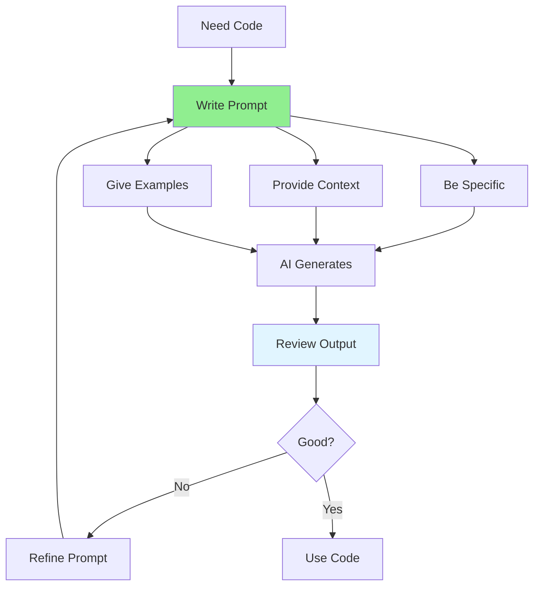

# 05.01 Prompt Engineering for Coding / Kỹ thuật viết prompt cho Coding

## Table of Contents / Mục lục
1. [Introduction / Giới thiệu](#introduction--giới-thiệu)
2. [Prompt Engineering Principles / Nguyên tắc viết prompt](#prompt-engineering-principles--nguyên-tắc-viết-prompt)
3. [Prompt Patterns / Mẫu prompt](#prompt-patterns--mẫu-prompt)
4. [Best Practices / Thực hành tốt nhất](#best-practices--thực-hành-tốt-nhất)
5. [Summary / Tóm tắt](#summary--tóm-tắt)

---

## Introduction / Giới thiệu

### Overview / Tổng quan

**English**: Effective prompt engineering is the key to getting quality code suggestions from AI. Well-crafted prompts lead to better results and save time.

**Vietnamese**: Kỹ thuật viết prompt hiệu quả là chìa khóa để nhận được gợi ý code chất lượng từ AI. Prompt được viết tốt dẫn đến kết quả tốt hơn và tiết kiệm thời gian.

### Prompt Engineering Process / Quy trình viết prompt



---

## Prompt Engineering Principles / Nguyên tắc viết prompt

### Example 1: Good vs Bad Prompts / Ví dụ 1: Prompt tốt vs xấu

```typescript
// ❌ Bad: Vague prompt / Xấu: Prompt mơ hồ
const badPrompt = "Create a function to handle users";

// ✅ Good: Specific prompt / Tốt: Prompt cụ thể
const goodPrompt = `
Create a TypeScript function that:
1. Takes a user ID as parameter
2. Validates the ID format (must be UUID v4)
3. Fetches user from database using Prisma
4. Returns user object or throws NotFoundError if user doesn't exist
5. Includes proper error handling and TypeScript types

Use this structure:
- Function name: getUserById
- Parameter: id: string
- Return type: Promise<User>
- Error: throw new NotFoundError('User not found')
`;

// ✅ Better: With context / Tốt hơn: Có ngữ cảnh
const betterPrompt = `
Context: I'm building a NestJS REST API for user management.

Task: Create a service method to get user by ID

Requirements:
- Use Prisma ORM
- User model has: id (UUID), email, name, createdAt
- Handle case when user doesn't exist
- Follow NestJS best practices

Generate the complete service method with:
1. Method signature with proper types
2. Implementation with Prisma query
3. Error handling
4. JSDoc comments
`;
```

---

## Prompt Patterns / Mẫu prompt

### Example 2: Chain of Thought / Ví dụ 2: Chuỗi suy nghĩ

```typescript
// Chain of Thought Pattern / Mẫu chuỗi suy nghĩ
const chainOfThoughtPrompt = `
I need to implement user authentication. Let me break this down:

Step 1: Create a login endpoint that accepts email and password
Step 2: Validate the input (email format, password not empty)
Step 3: Find user in database by email
Step 4: Compare password hash with stored hash using bcrypt
Step 5: Generate JWT token if credentials are valid
Step 6: Return token to client
Step 7: Handle errors (invalid credentials, user not found)

Now generate the complete implementation in NestJS with:
- Controller endpoint: POST /auth/login
- DTO for request validation
- Service method for authentication logic
- Proper error handling
`;

// Few-shot Learning Pattern / Mẫu học từ ví dụ
const fewShotPrompt = `
Here are examples of good TypeScript functions:

Example 1:
\`\`\`typescript
async function getUser(id: string): Promise<User> {
  if (!isValidUUID(id)) {
    throw new BadRequestError('Invalid user ID format');
  }
  const user = await prisma.user.findUnique({ where: { id } });
  if (!user) {
    throw new NotFoundError('User not found');
  }
  return user;
}
\`\`\`

Now create a similar function for getting a product by ID following the same pattern.
`;

// Role-based Pattern / Mẫu dựa trên vai trò
const roleBasedPrompt = `
You are a senior TypeScript developer specializing in NestJS and clean architecture.

Task: Create a user service following SOLID principles

Requirements:
- Single Responsibility: One class, one purpose
- Dependency Injection: Use constructor injection
- Error Handling: Custom exceptions
- Type Safety: Strict TypeScript

Generate the service class with proper structure.
`;
```

---

## Best Practices / Thực hành tốt nhất

1. **Be specific** - Clear requirements and constraints
2. **Provide context** - Background information
3. **Give examples** - Show desired output format
4. **Specify format** - Code style, framework, patterns
5. **Iterate** - Refine based on results

---

## Summary / Tóm tắt

### Key Takeaways / Điểm chính

- **Specificity**: Clear, detailed requirements
- **Context**: Background and constraints
- **Examples**: Show desired patterns
- **Iteration**: Refine prompts for better results

### Next Steps / Bước tiếp theo

- [05.02 Code Generation](./05.02_Code_Generation.md) - Next: Generate Code

---

**Last Updated / Cập nhật lần cuối**: 2024

