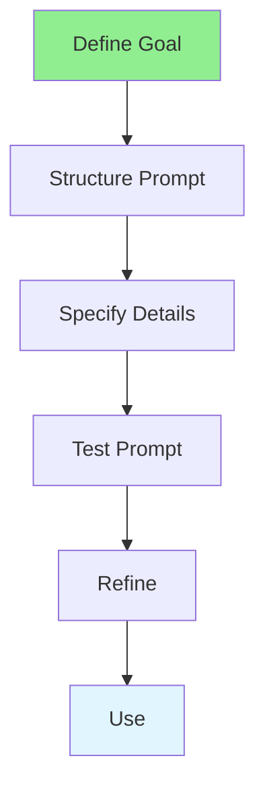

# 05.01 Prompt Engineering / Kỹ thuật nhắc nhở

## Table of Contents / Mục lục
1. [Introduction / Giới thiệu](#introduction--giới-thiệu)
2. [Prompt Engineering Techniques / Kỹ thuật nhắc nhở](#prompt-engineering-techniques--kỹ-thuật-nhắc-nhở)
3. [Best Practices / Thực hành tốt nhất](#best-practices--thực-hành-tốt-nhất)
4. [Summary / Tóm tắt](#summary--tóm-tắt)

---

## Introduction / Giới thiệu

### Overview / Tổng quan

**English**: Prompt engineering crafts effective prompts for AI tools. Learn to write prompts that generate accurate, useful code and explanations.

**Vietnamese**: Kỹ thuật nhắc nhở tạo prompt hiệu quả cho công cụ AI. Học cách viết prompt tạo code và giải thích chính xác, hữu ích.

### Prompt Engineering Process / Quy trình kỹ thuật nhắc nhở



---

## Prompt Engineering Techniques / Kỹ thuật nhắc nhở

### Example 1: Basic Prompt Structure / Ví dụ 1: Cấu trúc prompt cơ bản

```markdown
# Good Prompt Structure / Cấu trúc prompt tốt

## Context
I'm building a user authentication system using Node.js and Express.

## Task
Create a function to validate user passwords.

## Requirements
- Minimum 8 characters
- Must contain uppercase and lowercase letters
- Must contain at least one number
- Must contain at least one special character

## Constraints
- Use TypeScript
- Return validation result object with isValid and errors array

## Example Output Format
```typescript
{
  isValid: boolean;
  errors: string[];
}
```
```

### Example 2: Advanced Prompting / Ví dụ 2: Nhắc nhở nâng cao

```markdown
# Advanced Prompt / Prompt nâng cao

## Role
You are an expert TypeScript developer specializing in secure authentication systems.

## Context
Building a REST API for user management. Using Express.js, Prisma ORM, and bcrypt for password hashing.

## Task
Implement a complete user registration endpoint with:
1. Input validation (email, password)
2. Password hashing
3. Database storage
4. Error handling
5. Response formatting

## Requirements
- Follow RESTful conventions
- Use async/await
- Include proper error handling
- Add input sanitization
- Return appropriate HTTP status codes

## Code Style
- Use TypeScript strict mode
- Follow ESLint rules
- Add JSDoc comments
- Use meaningful variable names

## Test Cases to Consider
- Valid registration
- Duplicate email
- Invalid email format
- Weak password
- Database connection error
```

---

## Best Practices / Thực hành tốt nhất

1. **Be specific** - Clearly define what you want
2. **Provide context** - Give background information
3. **Specify format** - Define output format
4. **Include examples** - Show desired output
5. **Iterate** - Refine prompts based on results

---

## Summary / Tóm tắt

### Key Takeaways / Điểm chính

- **Structure**: Context, task, requirements, format
- **Specificity**: Be clear and detailed
- **Context**: Provide background
- **Examples**: Show desired output
- **Iteration**: Refine based on results

### Next Steps / Bước tiếp theo

- [05.02 Code Generation](./05.02_Code_Generation.md) - Next: Code Generation

---

**Last Updated / Cập nhật lần cuối**: 2024

