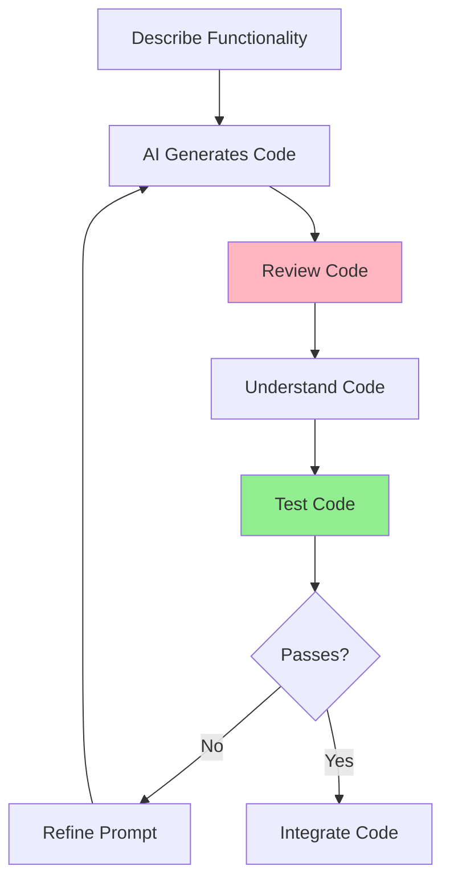

# 05.02 Code Generation / Dùng AI để Generate Code

## Table of Contents / Mục lục
1. [Introduction / Giới thiệu](#introduction--giới-thiệu)
2. [Code Generation Process / Quy trình tạo code](#code-generation-process--quy-trình-tạo-code)
3. [Reviewing AI Code / Xem xét code AI](#reviewing-ai-code--xem-xét-code-ai)
4. [Best Practices / Thực hành tốt nhất](#best-practices--thực-hành-tốt-nhất)
5. [Summary / Tóm tắt](#summary--tóm-tắt)

---

## Introduction / Giới thiệu

### Overview / Tổng quan

**English**: AI can generate code from descriptions, but it requires careful review and understanding. Learn to use AI-generated code effectively while maintaining quality.

**Vietnamese**: AI có thể tạo code từ mô tả, nhưng cần xem xét và hiểu cẩn thận. Học cách sử dụng code do AI tạo hiệu quả trong khi duy trì chất lượng.

### Code Generation Workflow / Quy trình tạo code



---

## Code Generation Process / Quy trình tạo code

### Example 1: Generating Code / Ví dụ 1: Tạo code

```typescript
// Prompt for code generation / Prompt để tạo code
const codeGenerationPrompt = `
Create a TypeScript function for user registration in a NestJS application.

Requirements:
- Function name: registerUser
- Parameters: email (string), password (string), name (string)
- Validate email format
- Validate password (min 8 chars, at least one number, one letter)
- Hash password using bcrypt
- Save user to database using Prisma
- Return user object (without password)
- Handle errors: duplicate email, validation errors

Use NestJS best practices and TypeScript strict mode.
`;

// AI-generated code (example) / Code do AI tạo (ví dụ)
import { Injectable, ConflictException, BadRequestException } from '@nestjs/common';
import { PrismaService } from '../prisma/prisma.service';
import * as bcrypt from 'bcrypt';

@Injectable()
export class UserService {
  constructor(private prisma: PrismaService) {}

  async registerUser(
    email: string,
    password: string,
    name: string
  ): Promise<Omit<User, 'password'>> {
    // Validate email
    const emailRegex = /^[^\s@]+@[^\s@]+\.[^\s@]+$/;
    if (!emailRegex.test(email)) {
      throw new BadRequestException('Invalid email format');
    }

    // Validate password
    if (password.length < 8) {
      throw new BadRequestException('Password must be at least 8 characters');
    }
    if (!/\d/.test(password) || !/[a-zA-Z]/.test(password)) {
      throw new BadRequestException('Password must contain at least one number and one letter');
    }

    // Check if user exists
    const existingUser = await this.prisma.user.findUnique({
      where: { email }
    });
    if (existingUser) {
      throw new ConflictException('Email already registered');
    }

    // Hash password
    const hashedPassword = await bcrypt.hash(password, 10);

    // Create user
    const user = await this.prisma.user.create({
      data: {
        email,
        password: hashedPassword,
        name
      },
      select: {
        id: true,
        email: true,
        name: true,
        createdAt: true
      }
    });

    return user;
  }
}
```

---

## Reviewing AI Code / Xem xét code AI

### Example 2: Code Review Checklist / Ví dụ 2: Danh sách kiểm tra code

```typescript
// Code review checklist / Danh sách kiểm tra code
interface CodeReviewChecklist {
  security: {
    checked: boolean;
    items: string[];
  };
  performance: {
    checked: boolean;
    items: string[];
  };
  errorHandling: {
    checked: boolean;
    items: string[];
  };
  codeQuality: {
    checked: boolean;
    items: string[];
  };
}

const reviewChecklist: CodeReviewChecklist = {
  security: {
    checked: false,
    items: [
      'Password is properly hashed',
      'No SQL injection vulnerabilities',
      'Input validation is present',
      'Sensitive data is not logged'
    ]
  },
  performance: {
    checked: false,
    items: [
      'Database queries are optimized',
      'No N+1 query problems',
      'Proper indexing is used',
      'No unnecessary operations'
    ]
  },
  errorHandling: {
    checked: false,
    items: [
      'All errors are handled',
      'Appropriate error types are used',
      'Error messages are clear',
      'No sensitive info in errors'
    ]
  },
  codeQuality: {
    checked: false,
    items: [
      'Code follows project conventions',
      'TypeScript types are correct',
      'Code is readable and maintainable',
      'No hard-coded values'
    ]
  }
};
```

---

## Best Practices / Thực hành tốt nhất

1. **Review thoroughly** - Don't blindly copy code
2. **Understand code** - Know what it does
3. **Test extensively** - Verify functionality
4. **Check security** - Look for vulnerabilities
5. **Adapt to project** - Match your codebase style

---

## Summary / Tóm tắt

### Key Takeaways / Điểm chính

- **Generate**: Use clear, specific prompts
- **Review**: Check security, performance, quality
- **Understand**: Know what the code does
- **Test**: Verify before using
- **Adapt**: Match project standards

### Next Steps / Bước tiếp theo

- [05.03 AI Debugging](./05.03_AI_Debugging.md) - Next: AI Debugging

---

**Last Updated / Cập nhật lần cuối**: 2024

