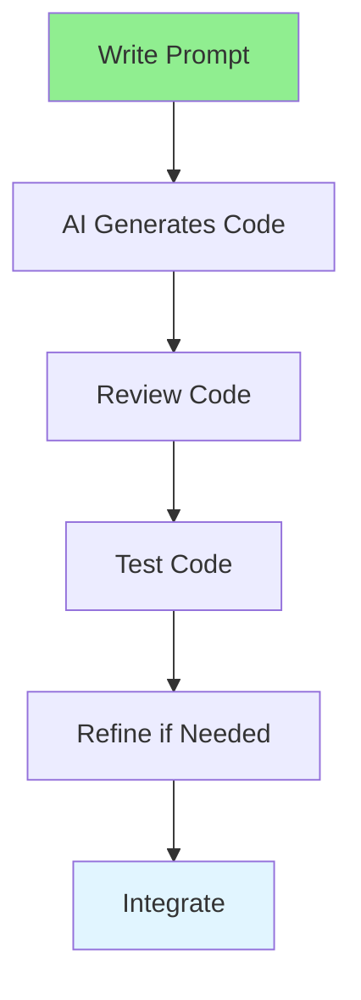

# 05.02 Code Generation / Tạo code

## Table of Contents / Mục lục
1. [Introduction / Giới thiệu](#introduction--giới-thiệu)
2. [AI Code Generation Flow / Luồng tạo code AI](#ai-code-generation-flow--luồng-tạo-code-ai)
3. [Best Practices / Thực hành tốt nhất](#best-practices--thực-hành-tốt-nhất)
4. [Summary / Tóm tắt](#summary--tóm-tắt)

---

## Introduction / Giới thiệu

### Overview / Tổng quan

**English**: AI code generation creates code from natural language descriptions. Learn to use AI tools to generate, complete, and improve code effectively.

**Vietnamese**: Tạo code AI tạo code từ mô tả ngôn ngữ tự nhiên. Học cách sử dụng công cụ AI để tạo, hoàn thiện và cải thiện code hiệu quả.

### AI Code Generation Flow / Luồng tạo code AI



---

## AI Code Generation Flow / Luồng tạo code AI

### Example 1: Generating Functions / Ví dụ 1: Tạo hàm

```markdown
# Prompt for Code Generation

Create a TypeScript function that validates an email address.
The function should:
- Check if email contains @ symbol
- Verify domain format (e.g., example.com)
- Return boolean indicating validity
- Handle edge cases like empty strings

## Generated Code
```typescript
function isValidEmail(email: string): boolean {
  if (!email || typeof email !== 'string') {
    return false;
  }
  
  const emailRegex = /^[^\s@]+@[^\s@]+\.[^\s@]+$/;
  return emailRegex.test(email);
}
```
```

### Example 2: Generating Complete Features / Ví dụ 2: Tạo tính năng hoàn chỉnh

```markdown
# Prompt for Complete Feature

Create a complete user authentication service in TypeScript using Express.js.
Include:
- User registration with email/password
- Password hashing with bcrypt
- JWT token generation
- Login endpoint
- Error handling
- Input validation

## Generated Code Structure
- UserService class
- Registration method
- Login method
- Password hashing utilities
- JWT token utilities
- Error handling
```

---

## Best Practices / Thực hành tốt nhất

1. **Be specific** - Clearly describe what you need
2. **Provide context** - Include technology stack
3. **Specify requirements** - List all requirements
4. **Review generated code** - Always review and test
5. **Iterate** - Refine prompts for better results

---

## Summary / Tóm tắt

### Key Takeaways / Điểm chính

- **Clear prompts**: Specific requirements
- **Context**: Technology stack and constraints
- **Review**: Always review generated code
- **Test**: Test generated code thoroughly
- **Refine**: Improve prompts iteratively

### Next Steps / Bước tiếp theo

- [05.03 AI Debugging](./05.03_AI_Debugging.md) - Next: AI Debugging

---

**Last Updated / Cập nhật lần cuối**: 2024


