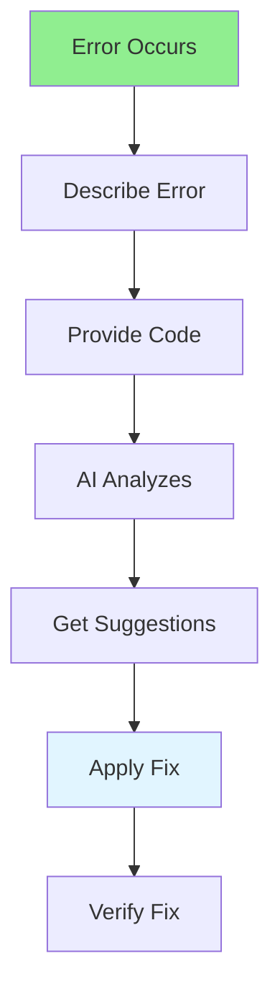

# 05.03 AI Debugging / Debug với AI

## Table of Contents / Mục lục
1. [Introduction / Giới thiệu](#introduction--giới-thiệu)
2. [AI Debugging Flow / Luồng debug AI](#ai-debugging-flow--luồng-debug-ai)
3. [Techniques / Kỹ thuật](#techniques--kỹ-thuật)
4. [Best Practices / Thực hành tốt nhất](#best-practices--thực-hành-tốt-nhất)
5. [Summary / Tóm tắt](#summary--tóm-tắt)

---

## Introduction / Giới thiệu

### Overview / Tổng quan

**English**: AI can help debug code by analyzing errors and suggesting fixes. Learn to use AI tools to identify and resolve bugs effectively.

**Vietnamese**: AI có thể giúp debug code bằng cách phân tích lỗi và đề xuất sửa chữa. Học cách sử dụng công cụ AI để xác định và giải quyết bug hiệu quả.

### AI Debugging Flow / Luồng debug AI



---

## AI Debugging Flow / Luồng debug AI

### Example 1: Error Analysis / Ví dụ 1: Phân tích lỗi

```markdown
# Prompt for Debugging

I'm getting this error:
```
TypeError: Cannot read property 'name' of undefined
at UserService.getUser (UserService.ts:15:23)
```

Here's my code:
```typescript
class UserService {
  async getUser(id: string): Promise<User> {
    const user = await this.repository.findById(id);
    return user.name; // Error here
  }
}
```

What's wrong and how do I fix it?

## AI Response
The error occurs because `findById` might return `undefined` if the user doesn't exist.
You're trying to access `name` on `undefined`.

Fix:
```typescript
async getUser(id: string): Promise<User> {
  const user = await this.repository.findById(id);
  if (!user) {
    throw new Error('User not found');
  }
  return user;
}
```
```

### Example 2: Complex Debugging / Ví dụ 2: Debug phức tạp

```markdown
# Prompt for Complex Issue

My API endpoint is returning 500 errors intermittently.
The error log shows:
- Database connection timeouts
- Memory usage spikes
- Slow response times

Code:
```typescript
app.get('/users', async (req, res) => {
  const users = await prisma.user.findMany({
    include: { orders: true }
  });
  res.json(users);
});
```

What could be causing this and how to fix?

## AI Analysis
Potential issues:
1. N+1 query problem with orders
2. Loading too much data at once
3. No pagination
4. Missing error handling

Suggested fixes:
- Add pagination
- Optimize queries
- Add error handling
- Implement connection pooling
```

---

## Best Practices / Thực hành tốt nhất

1. **Provide context** - Include error messages and code
2. **Describe symptoms** - What's happening vs expected
3. **Include stack traces** - Full error information
4. **Test suggestions** - Verify AI suggestions work
5. **Learn from fixes** - Understand why fixes work

---

## Summary / Tóm tắt

### Key Takeaways / Điểm chính

- **Context**: Provide error messages and code
- **Symptoms**: Describe what's happening
- **Stack traces**: Include full error info
- **Verify**: Test AI suggestions
- **Learn**: Understand the fixes

### Next Steps / Bước tiếp theo

- [05.04 AI Code Review](./05.04_AI_Code_Review.md) - Next: AI Code Review

---

**Last Updated / Cập nhật lần cuối**: 2024


