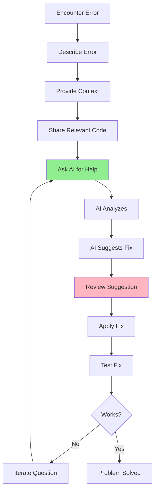

# 05.03 AI Debugging / Dùng AI để Debug Code

## Table of Contents / Mục lục
1. [Introduction / Giới thiệu](#introduction--giới-thiệu)
2. [Debugging Prompts / Prompt debug](#debugging-prompts--prompt-debug)
3. [Error Analysis / Phân tích lỗi](#error-analysis--phân-tích-lỗi)
4. [Best Practices / Thực hành tốt nhất](#best-practices--thực-hành-tốt-nhất)
5. [Summary / Tóm tắt](#summary--tóm-tắt)

---

## Introduction / Giới thiệu

### Overview / Tổng quan

**English**: AI can help debug code by analyzing errors, suggesting fixes, and explaining issues. Learn effective debugging prompts and techniques.

**Vietnamese**: AI có thể giúp debug code bằng cách phân tích lỗi, đề xuất sửa chữa và giải thích vấn đề. Học các prompt và kỹ thuật debug hiệu quả.

### Debugging Process / Quy trình debug



---

## Debugging Prompts / Prompt debug

### Example 1: Error Analysis Prompt / Ví dụ 1: Prompt phân tích lỗi

```typescript
// Error analysis prompt template / Mẫu prompt phân tích lỗi
const errorAnalysisPrompt = `
I'm getting this error in my TypeScript/NestJS application:

Error Message:
TypeError: Cannot read property 'id' of undefined
    at UserService.getUserById (user.service.ts:25:12)

Context:
- I'm trying to get a user by ID from the database
- Using Prisma ORM
- The error occurs when the user doesn't exist

Relevant Code:
\`\`\`typescript
async getUserById(id: string): Promise<User> {
  const user = await this.prisma.user.findUnique({
    where: { id }
  });
  return user.id; // Line 25 - Error here
}
\`\`\`

Please:
1. Explain what's causing the error
2. Suggest the fix
3. Explain why the fix works
`;

// Logic error prompt / Prompt lỗi logic
const logicErrorPrompt = `
I have a function that's not working as expected:

Function: calculateTotalPrice
Expected: Should calculate total price with 10% tax
Actual: Returns price without tax

Code:
\`\`\`typescript
function calculateTotalPrice(price: number): number {
  const tax = 0.1;
  return price * tax; // This seems wrong
}
\`\`\`

Please identify the logic error and provide the correct implementation.
`;

// Performance issue prompt / Prompt vấn đề hiệu năng
const performancePrompt = `
My API endpoint is slow. Here's the code:

\`\`\`typescript
@Get('/users/:id/orders')
async getUserOrders(@Param('id') id: string) {
  const user = await this.userService.findById(id);
  const orders = [];
  for (const orderId of user.orderIds) {
    const order = await this.orderService.findById(orderId);
    orders.push(order);
  }
  return orders;
}
\`\`\`

Please:
1. Identify the performance issue
2. Explain why it's slow
3. Suggest an optimized solution
`;
```

---

## Error Analysis / Phân tích lỗi

### Example 2: Comprehensive Error Report / Ví dụ 2: Báo cáo lỗi toàn diện

```typescript
interface ErrorReport {
  errorMessage: string;
  stackTrace: string;
  context: {
    whatWereYouDoing: string;
    expectedBehavior: string;
    actualBehavior: string;
  };
  code: {
    file: string;
    function: string;
    relevantCode: string;
  };
  environment: {
    framework: string;
    version: string;
    dependencies: string[];
  };
}

// Example error report / Ví dụ báo cáo lỗi
const errorReport: ErrorReport = {
  errorMessage: 'PrismaClientKnownRequestError: Unique constraint failed',
  stackTrace: `
PrismaClientKnownRequestError: Unique constraint failed on the fields: (email)
    at PrismaClient._executeRequest
    at UserService.createUser
  `,
  context: {
    whatWereYouDoing: 'Trying to create a new user with email user@example.com',
    expectedBehavior: 'User should be created successfully',
    actualBehavior: 'Error thrown about unique constraint'
  },
  code: {
    file: 'user.service.ts',
    function: 'createUser',
    relevantCode: `
async createUser(data: CreateUserDto) {
  return this.prisma.user.create({ data });
}
    `
  },
  environment: {
    framework: 'NestJS',
    version: '10.0.0',
    dependencies: ['@prisma/client', 'prisma']
  }
};
```

---

## Best Practices / Thực hành tốt nhất

1. **Provide full context** - Error message, stack trace, code
2. **Explain what you tried** - Show your debugging attempts
3. **Include environment** - Framework, versions, dependencies
4. **Be specific** - Clear description of the problem
5. **Iterate questions** - Follow up for clarification

---

## Summary / Tóm tắt

### Key Takeaways / Điểm chính

- **Context**: Provide full error details
- **Code**: Share relevant code snippets
- **Environment**: Include framework/version info
- **Iterate**: Ask follow-up questions

### Next Steps / Bước tiếp theo

- [05.04 AI Code Review](./05.04_AI_Code_Review.md) - Next: Code Review

---

**Last Updated / Cập nhật lần cuối**: 2024

