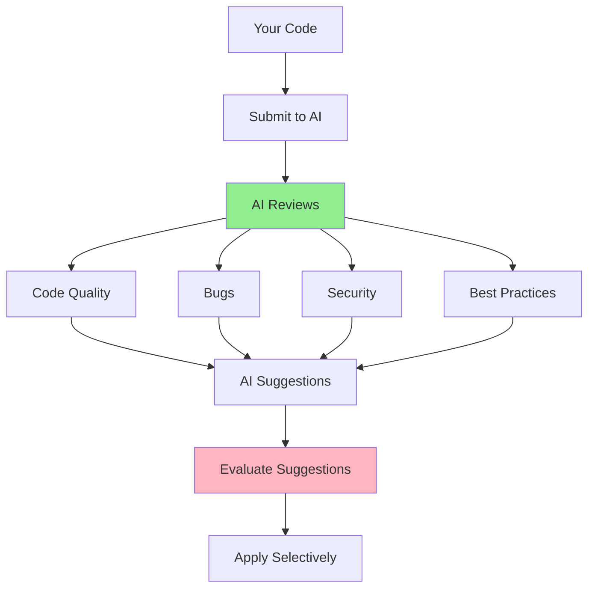

# 05.04 AI Code Review / Review Code với AI

## Table of Contents / Mục lục
1. [Introduction / Giới thiệu](#introduction--giới-thiệu)
2. [Code Review Prompts / Prompt review code](#code-review-prompts--prompt-review-code)
3. [Reviewing AI Suggestions / Xem xét gợi ý AI](#reviewing-ai-suggestions--xem-xét-gợi-ý-ai)
4. [Best Practices / Thực hành tốt nhất](#best-practices--thực-hành-tốt-nhất)
5. [Summary / Tóm tắt](#summary--tóm-tắt)

---

## Introduction / Giới thiệu

### Overview / Tổng quan

**English**: AI can review code for quality, bugs, best practices, and security issues. Learn to use AI code review effectively while maintaining critical thinking.

**Vietnamese**: AI có thể review code về chất lượng, bug, best practices và vấn đề bảo mật. Học cách sử dụng AI code review hiệu quả trong khi duy trì tư duy phản biện.

### Code Review Process / Quy trình review code



---

## Code Review Prompts / Prompt review code

### Example 1: Code Review Prompt Templates / Ví dụ 1: Mẫu prompt review code

```typescript
// General code review prompt / Prompt review code tổng quát
const generalReviewPrompt = `
Please review this TypeScript code for:
1. Code quality and readability
2. Potential bugs
3. Security vulnerabilities
4. Performance issues
5. Best practices adherence
6. TypeScript best practices

Code:
\`\`\`typescript
${codeSnippet}
\`\`\`

Provide:
- Issues found (with severity: High/Medium/Low)
- Suggestions for improvement
- Code examples for fixes
`;

// Security-focused review / Review tập trung bảo mật
const securityReviewPrompt = `
Review this code for security vulnerabilities:

Focus on:
- SQL injection
- XSS vulnerabilities
- Authentication/Authorization issues
- Input validation
- Sensitive data exposure
- CSRF protection

Code:
\`\`\`typescript
${codeSnippet}
\`\`\`
`;

// Performance review / Review hiệu năng
const performanceReviewPrompt = `
Analyze this code for performance issues:

Check for:
- N+1 queries
- Inefficient algorithms
- Memory leaks
- Unnecessary operations
- Missing indexes
- Caching opportunities

Code:
\`\`\`typescript
${codeSnippet}
\`\`\`
`;
```

---

## Reviewing AI Suggestions / Xem xét gợi ý AI

### Example 2: Evaluating Suggestions / Ví dụ 2: Đánh giá gợi ý

```typescript
interface AISuggestion {
  issue: string;
  severity: 'High' | 'Medium' | 'Low';
  description: string;
  suggestion: string;
  codeExample?: string;
  shouldApply: boolean; // Your decision / Quyết định của bạn
  reason?: string; // Why apply or not / Tại sao áp dụng hoặc không
}

// Example: Evaluating suggestions / Ví dụ: Đánh giá gợi ý
const suggestions: AISuggestion[] = [
  {
    issue: 'Missing input validation',
    severity: 'High',
    description: 'Email input is not validated before database query',
    suggestion: 'Add email format validation using regex or validator library',
    codeExample: `
// Add validation
if (!/^[^\\s@]+@[^\\s@]+\\.[^\\s@]+$/.test(email)) {
  throw new BadRequestException('Invalid email format');
}
    `,
    shouldApply: true,
    reason: 'Security and data integrity concern'
  },
  {
    issue: 'Code style inconsistency',
    severity: 'Low',
    description: 'Function uses camelCase but project uses PascalCase for services',
    suggestion: 'Rename function to match project conventions',
    shouldApply: false,
    reason: 'Project actually uses camelCase, AI misunderstood'
  }
];
```

---

## Best Practices / Thực hành tốt nhất

1. **Review critically** - Don't blindly accept suggestions
2. **Understand context** - Consider project-specific needs
3. **Apply selectively** - Choose relevant suggestions
4. **Verify fixes** - Test after applying changes
5. **Learn patterns** - Understand why suggestions are made

---

## Summary / Tóm tắt

### Key Takeaways / Điểm chính

- **Review**: Quality, bugs, security, performance
- **Evaluate**: Consider context and project needs
- **Apply**: Selectively, with understanding
- **Verify**: Test changes before committing

### Next Steps / Bước tiếp theo

- [05.05 AI Security Check](./05.05_AI_Security_Check.md) - Next: Security Analysis

---

**Last Updated / Cập nhật lần cuối**: 2024

