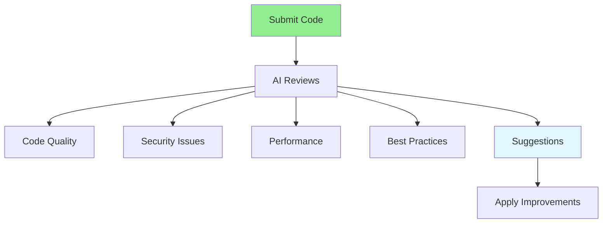

# 05.04 AI Code Review / Review code với AI

## Table of Contents / Mục lục
1. [Introduction / Giới thiệu](#introduction--giới-thiệu)
2. [AI Code Review Flow / Luồng review code AI](#ai-code-review-flow--luồng-review-code-ai)
3. [Review Areas / Lĩnh vực review](#review-areas--lĩnh-vực-review)
4. [Best Practices / Thực hành tốt nhất](#best-practices--thực-hành-tốt-nhất)
5. [Summary / Tóm tắt](#summary--tóm-tắt)

---

## Introduction / Giới thiệu

### Overview / Tổng quan

**English**: AI code review analyzes code quality, security, and best practices. Learn to use AI tools for automated code review and improvement suggestions.

**Vietnamese**: Review code AI phân tích chất lượng code, bảo mật và thực hành tốt nhất. Học cách sử dụng công cụ AI cho review code tự động và đề xuất cải thiện.

### AI Code Review Flow / Luồng review code AI



---

## AI Code Review Flow / Luồng review code AI

### Example 1: Code Review Prompt / Ví dụ 1: Prompt review code

```markdown
# Prompt for Code Review

Please review this TypeScript code for:
- Code quality and readability
- Security vulnerabilities
- Performance issues
- Best practices
- Potential bugs

```typescript
app.post('/users', async (req, res) => {
  const user = await prisma.user.create({
    data: req.body
  });
  res.json(user);
});
```

## AI Review Response

### Issues Found:
1. **Security**: No input validation - SQL injection risk
2. **Security**: No authentication check
3. **Error Handling**: No try-catch block
4. **Best Practice**: Should use DTO for type safety

### Suggested Improvements:
```typescript
app.post('/users', 
  authenticate,
  validate(CreateUserDto),
  async (req, res) => {
    try {
      const user = await prisma.user.create({
        data: req.body
      });
      res.status(201).json(user);
    } catch (error) {
      res.status(500).json({ error: 'Failed to create user' });
    }
  }
);
```
```

---

## Review Areas / Lĩnh vực review

### Example 2: Comprehensive Review / Ví dụ 2: Review toàn diện

```markdown
# Review Checklist

## Code Quality
- [ ] Readable and maintainable
- [ ] Follows naming conventions
- [ ] Proper error handling
- [ ] No code duplication

## Security
- [ ] Input validation
- [ ] Authentication/authorization
- [ ] SQL injection prevention
- [ ] XSS prevention

## Performance
- [ ] Efficient algorithms
- [ ] No N+1 queries
- [ ] Proper indexing
- [ ] Caching where appropriate

## Best Practices
- [ ] SOLID principles
- [ ] DRY principle
- [ ] Proper error handling
- [ ] Type safety
```

---

## Best Practices / Thực hành tốt nhất

1. **Review regularly** - Use AI review before commits
2. **Focus on security** - Pay attention to security issues
3. **Consider suggestions** - Evaluate AI recommendations
4. **Learn patterns** - Understand why suggestions are made
5. **Combine with human review** - AI + human review is best

---

## Summary / Tóm tắt

### Key Takeaways / Điểm chính

- **Automated review**: AI can review code quickly
- **Multiple areas**: Quality, security, performance
- **Suggestions**: AI provides improvement suggestions
- **Learning**: Understand why changes are suggested
- **Combination**: AI + human review is most effective

### Next Steps / Bước tiếp theo

- [05.05 AI Security Check](./05.05_AI_Security_Check.md) - Next: Security Check

---

**Last Updated / Cập nhật lần cuối**: 2024

