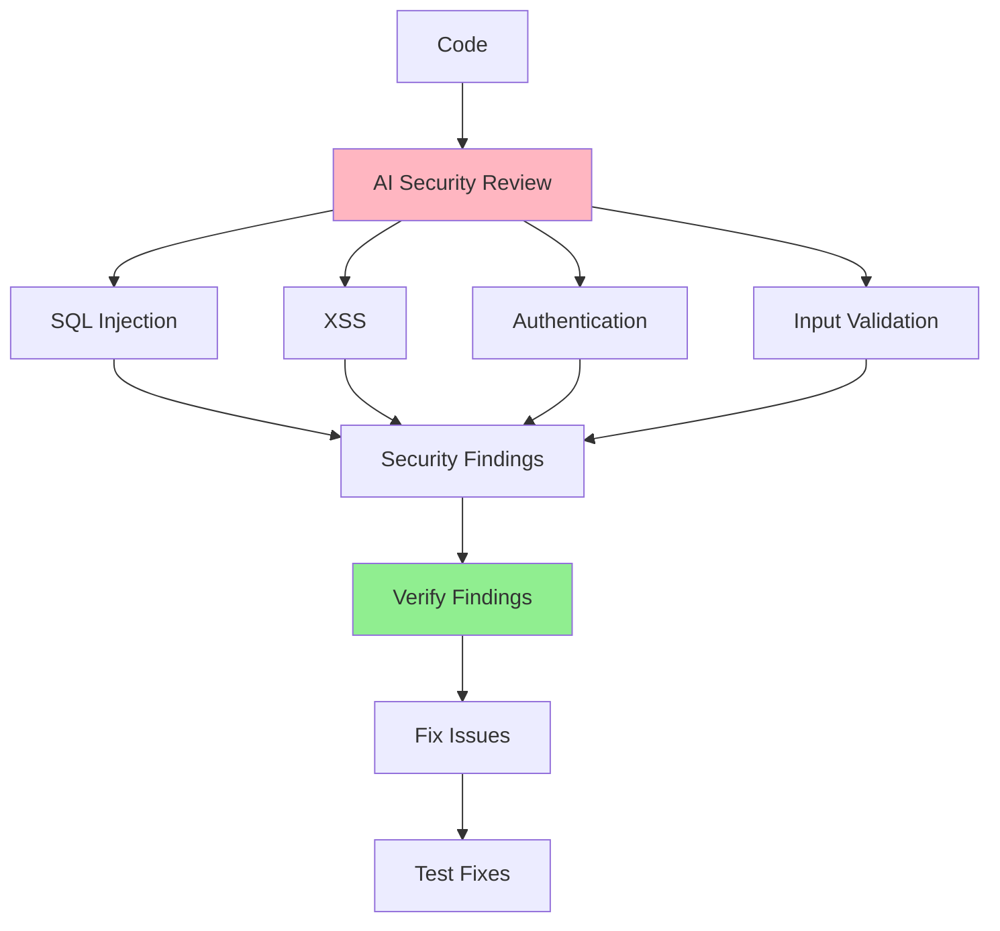

# 05.05 AI Security Check / Kiểm tra bảo mật với AI

## Table of Contents / Mục lục
1. [Introduction / Giới thiệu](#introduction--giới-thiệu)
2. [Security Review Prompts / Prompt review bảo mật](#security-review-prompts--prompt-review-bảo-mật)
3. [Common Vulnerabilities / Lỗ hổng phổ biến](#common-vulnerabilities--lỗ-hổng-phổ-biến)
4. [Best Practices / Thực hành tốt nhất](#best-practices--thực-hành-tốt-nhất)
5. [Summary / Tóm tắt](#summary--tóm-tắt)

---

## Introduction / Giới thiệu

### Overview / Tổng quan

**English**: AI can help identify security vulnerabilities in code. Learn to use AI for security reviews while understanding that AI findings need verification.

**Vietnamese**: AI có thể giúp xác định lỗ hổng bảo mật trong code. Học cách sử dụng AI để review bảo mật trong khi hiểu rằng phát hiện của AI cần được xác minh.

### Security Review Process / Quy trình review bảo mật



---

## Security Review Prompts / Prompt review bảo mật

### Example 1: Security Review Templates / Ví dụ 1: Mẫu review bảo mật

```typescript
// Comprehensive security review / Review bảo mật toàn diện
const securityReviewPrompt = `
Review this code for security vulnerabilities:

Check for:
1. SQL Injection vulnerabilities
2. XSS (Cross-Site Scripting) vulnerabilities
3. CSRF (Cross-Site Request Forgery) protection
4. Authentication and Authorization issues
5. Input validation problems
6. Sensitive data exposure
7. Insecure dependencies

Code:
\`\`\`typescript
${codeSnippet}
\`\`\`

For each vulnerability found, provide:
- Severity (Critical/High/Medium/Low)
- Description of the issue
- Potential impact
- Recommended fix with code example
`;

// SQL Injection check / Kiểm tra SQL Injection
const sqlInjectionPrompt = `
Check this code for SQL injection vulnerabilities:

\`\`\`typescript
async getUserByEmail(email: string) {
  const query = \`SELECT * FROM users WHERE email = '\${email}'\`;
  return this.db.query(query);
}
\`\`\`

Identify the vulnerability and provide a secure alternative using parameterized queries.
`;

// Authentication review / Review xác thực
const authReviewPrompt = `
Review this authentication code for security issues:

\`\`\`typescript
${authCode}
\`\`\`

Check for:
- Password hashing
- Session management
- Token security
- Rate limiting
- Account lockout mechanisms
`;
```

---

## Common Vulnerabilities / Lỗ hổng phổ biến

### Example 2: Vulnerability Examples / Ví dụ 2: Ví dụ lỗ hổng

```typescript
// ❌ Vulnerable code / Code có lỗ hổng
const vulnerableCode = {
  sqlInjection: `
// ❌ Bad: SQL Injection
app.get('/user', (req, res) => {
  const email = req.query.email;
  const query = \`SELECT * FROM users WHERE email = '\${email}'\`;
  db.query(query);
});
  `,
  xss: `
// ❌ Bad: XSS vulnerability
app.get('/search', (req, res) => {
  const query = req.query.q;
  res.send(\`<h1>Results for: \${query}</h1>\`);
});
  `,
  weakAuth: `
// ❌ Bad: Weak authentication
if (password === storedPassword) { // Plain text comparison
  login();
}
  `
};

// ✅ Secure code / Code an toàn
const secureCode = {
  sqlInjection: `
// ✅ Good: Parameterized query
app.get('/user', async (req, res) => {
  const email = req.query.email;
  const user = await prisma.user.findUnique({
    where: { email } // Parameterized
  });
});
  `,
  xss: `
// ✅ Good: Sanitized output
app.get('/search', (req, res) => {
  const query = DOMPurify.sanitize(req.query.q);
  res.send(\`<h1>Results for: \${query}</h1>\`);
});
  `,
  strongAuth: `
// ✅ Good: Secure password comparison
const isValid = await bcrypt.compare(password, hashedPassword);
if (isValid) {
  login();
}
  `
};
```

---

## Best Practices / Thực hành tốt nhất

1. **Verify findings** - Don't trust AI blindly
2. **Fix properly** - Understand the fix before applying
3. **Test fixes** - Verify vulnerabilities are resolved
4. **Regular reviews** - Review code regularly
5. **Stay updated** - Keep up with security best practices

---

## Summary / Tóm tắt

### Key Takeaways / Điểm chính

- **Review**: SQL injection, XSS, CSRF, Auth, Input validation
- **Verify**: Always verify AI findings
- **Fix**: Understand and properly fix issues
- **Test**: Verify fixes work

### Next Steps / Bước tiếp theo

- [05.06 AI Performance Optimization](./05.06_AI_Performance_Optimization.md) - Next: Performance

---

**Last Updated / Cập nhật lần cuối**: 2024

