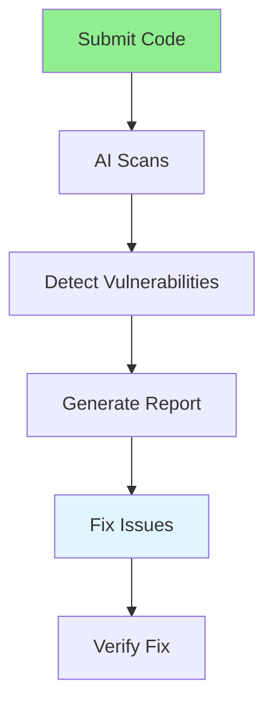

# 05.05 AI Security Check / Kiểm tra bảo mật AI

## Table of Contents / Mục lục
1. [Introduction / Giới thiệu](#introduction--giới-thiệu)
2. [Security Check Process / Quy trình kiểm tra bảo mật](#security-check-process--quy-trình-kiểm-tra-bảo-mật)
3. [Common Vulnerabilities / Lỗ hổng phổ biến](#common-vulnerabilities--lỗ-hổng-phổ-biến)
4. [Best Practices / Thực hành tốt nhất](#best-practices--thực-hành-tốt-nhất)
5. [Summary / Tóm tắt](#summary--tóm-tắt)

---

## Introduction / Giới thiệu

### Overview / Tổng quan

**English**: AI security checks identify vulnerabilities in code. Learn to use AI tools to detect security issues like SQL injection, XSS, and authentication flaws.

**Vietnamese**: Kiểm tra bảo mật AI xác định lỗ hổng trong code. Học cách sử dụng công cụ AI để phát hiện vấn đề bảo mật như SQL injection, XSS và lỗ hổng xác thực.

### AI Security Check Flow / Luồng kiểm tra bảo mật AI



---

## Security Check Process / Quy trình kiểm tra bảo mật

### Example 1: Security Review Prompt / Ví dụ 1: Prompt review bảo mật

```markdown
# Security Review Request

Please review this code for security vulnerabilities:

```typescript
app.post('/login', async (req, res) => {
  const { username, password } = req.body;
  const query = `SELECT * FROM users WHERE username='${username}' AND password='${password}'`;
  const user = await db.query(query);
  if (user) {
    res.json({ token: jwt.sign({ id: user.id }, 'secret') });
  }
});
```

## AI Security Analysis

### Critical Vulnerabilities:
1. **SQL Injection**: Direct string interpolation in query
2. **Weak Secret**: Hardcoded JWT secret
3. **Plaintext Password**: No password hashing
4. **No Input Validation**: No validation of inputs

### Secure Implementation:
```typescript
app.post('/login', 
  validate(LoginDto),
  async (req, res) => {
    const { username, password } = req.body;
    const user = await prisma.user.findUnique({
      where: { username }
    });
    
    if (!user || !await bcrypt.compare(password, user.passwordHash)) {
      return res.status(401).json({ error: 'Invalid credentials' });
    }
    
    const token = jwt.sign(
      { id: user.id },
      process.env.JWT_SECRET!,
      { expiresIn: '24h' }
    );
    
    res.json({ token });
  }
);
```
```

---

## Common Vulnerabilities / Lỗ hổng phổ biến

### Example 2: Vulnerability Checklist / Ví dụ 2: Checklist lỗ hổng

```markdown
# Security Vulnerability Checklist

## Authentication & Authorization
- [ ] Strong password requirements
- [ ] Password hashing (bcrypt, argon2)
- [ ] Secure session management
- [ ] JWT secret in environment variables
- [ ] Token expiration

## Input Validation
- [ ] All inputs validated
- [ ] SQL injection prevention (parameterized queries)
- [ ] XSS prevention (input sanitization)
- [ ] CSRF protection

## Data Protection
- [ ] Sensitive data encrypted
- [ ] HTTPS in production
- [ ] Secure headers (CORS, CSP)
- [ ] No sensitive data in logs

## Error Handling
- [ ] No sensitive info in error messages
- [ ] Proper error logging
- [ ] Rate limiting
```

---

## Best Practices / Thực hành tốt nhất

1. **Scan regularly** - Check code before deployment
2. **Fix critical issues** - Address high-severity vulnerabilities
3. **Stay updated** - Keep dependencies updated
4. **Follow OWASP** - Follow OWASP Top 10 guidelines
5. **Combine tools** - Use multiple security tools

---

## Summary / Tóm tắt

### Key Takeaways / Điểm chính

- **Automated scanning**: AI can detect vulnerabilities
- **Common issues**: SQL injection, XSS, weak auth
- **Fix promptly**: Address critical vulnerabilities
- **Best practices**: Follow security guidelines
- **Regular checks**: Scan code regularly

### Next Steps / Bước tiếp theo

- [05.06 AI Performance Optimization](./05.06_AI_Performance_Optimization.md) - Next: Performance

---

**Last Updated / Cập nhật lần cuối**: 2024

